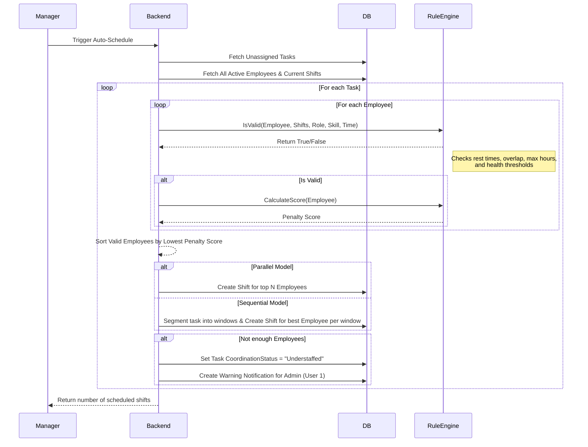
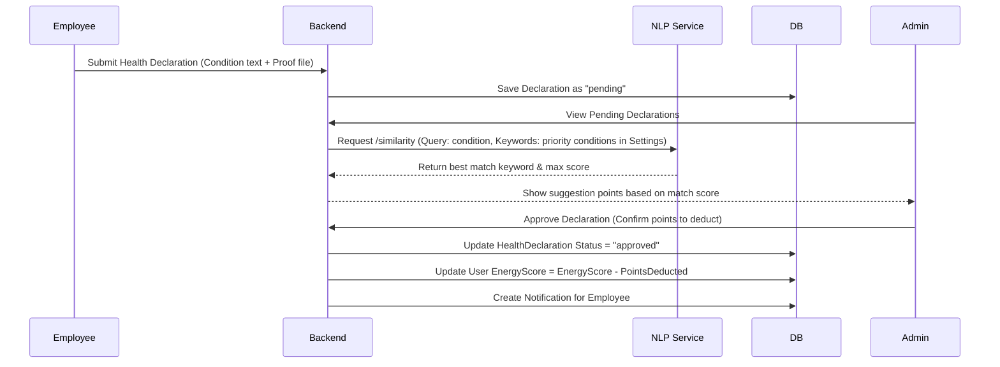
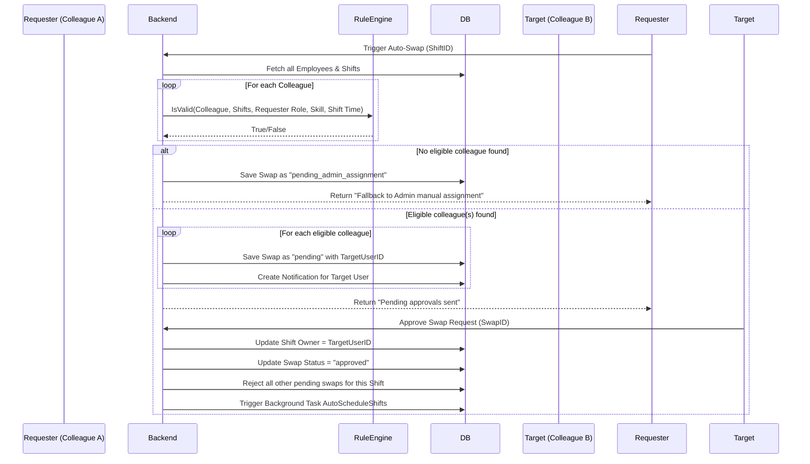

# Project Analysis: Shift Management System

This document provides a comprehensive analysis of the **Shift Management System**, detailing the system architecture, roles, functions, data structures, business rules, and user flows as confirmed by the codebase.

---

## 1. System Overview

The **Shift Management System** is an enterprise-grade platform designed to automate and optimize employee scheduling, task assignment, attendance tracking, payroll processing, and health-based risk management. The system is designed to handle complex rules (such as minimum rest hours and energy-score-based scheduling limits) and uses machine learning / semantic embedding matching to assist managers in resolving understaffed shifts or handling employee health declarations.

The system is composed of:
1. **Go Backend**: A robust server using the Gin web framework, GORM, and an SQLite database handling scheduling algorithms, connection pooling, transactions, and business rules.
2. **React Web Frontend**: A management dashboard built with React 19, Vite, and Bootstrap 5, featuring interactive calendars, reports, and administration panels.
3. **Flutter Mobile App**: A mobile client styled using Cupertino (iOS-like) widgets for employees to view schedules, clock-in/out, submit health declarations, and request swaps.
4. **Python NLP Service**: A semantic similarity microservice using FastAPI and Sentence-Transformers (`AITeamVN/Vietnamese_Embedding`) to automatically map natural-language employee health reports to predefined system conditions.

---

## 2. Actors & User Roles

Confirmed in the codebase (refer to [domain/user.go](file:///d:/Workspace/TBDD/shift-management-system/domain/user.go#L8-L14)):

*   **Admin (`RoleAdmin` / "admin")**: Has full access to manage employees, modify global system settings, approve/reject health declarations, assign manual shift swaps, view KPIs, compute payrolls, and import/export CSV files.
*   **Manager (`RoleManager` / "manager")**: Can manage tasks, manually schedule shifts, trigger auto-scheduling or re-scheduling, view analytics, and approve shift swaps.
*   **Employee (`RoleEmployee` / "employee")**: Can check their scheduled shifts, record attendance via Clock-In and Clock-Out, request shift swaps, submit health declarations (with proof images), request time-off, and view personal notifications.

---

## 3. Architecture Overview

```
                      +-------------------+
                      |   React Web App   | (Managers & Admins)
                      +---------+---------+
                                | REST APIs
                                v
+-------------+       +---------+---------+       +---------------------+
| Flutter App |------>|    Go Backend     |<----->| Python NLP Service  |
+-------------+       |   (Gin, GORM)     |       | (FastAPI, Sentence- |
 (Employees)          +---------+---------+       |    Transformers)    |
                                |                 +---------------------+
                                v
                      +---------+---------+
                      | SQLite Database   |
                      | (Connection Pool) |
                      +-------------------+
```

### 3.1 Backend Service Layer (Go)
*   **Database connection & pooling** configured in [config/config.go](file:///d:/Workspace/TBDD/shift-management-system/config/config.go#L23-L35) with `MaxOpenConns(100)` and `MaxIdleConns(10)` to support high concurrency under SQLite.
*   **Routing and Authentication Middleware** defined in [ui/router.go](file:///d:/Workspace/TBDD/shift-management-system/ui/router.go) and [ui/middleware.go](file:///d:/Workspace/TBDD/shift-management-system/ui/middleware.go), enforcing JWT Bearer token authentication for all protected endpoints.
*   **Automated Background Scheduler** runs concurrently every 5 seconds in [main.go](file:///d:/Workspace/TBDD/shift-management-system/main.go#L47-L55) to attempt to schedule any unassigned tasks.

### 3.2 NLP Microservice (Python)
*   FastAPI application hosted on port 8000 in [nlp-service/main.py](file:///d:/Workspace/TBDD/shift-management-system/nlp-service/main.py).
*   Utilizes `SentenceTransformer("AITeamVN/Vietnamese_Embedding")` to encode natural language query strings and calculate dot-product similarity matrixes against an array of system keywords.

### 3.3 Frontend Layer (React + Vite)
*   Vite configuration in [frontend/vite.config.js](file:///d:/Workspace/TBDD/shift-management-system/frontend/vite.config.js).
*   Admin shell interface implemented in [frontend/src/AdminDashboard.jsx](file:///d:/Workspace/TBDD/shift-management-system/frontend/src/AdminDashboard.jsx).
*   UI components located in [frontend/src/components/](file:///d:/Workspace/TBDD/shift-management-system/frontend/src/components/).

### 3.4 Mobile Layer (Flutter)
*   CupertinoApp structure initiated in [mobile/lib/main.dart](file:///d:/Workspace/TBDD/shift-management-system/mobile/lib/main.dart).
*   REST API communication interface in [mobile/lib/services/api_service.dart](file:///d:/Workspace/TBDD/shift-management-system/mobile/lib/services/api_service.dart).

---

## 4. Database Entities

All tables and schemas are declared as Go structures mapping to SQLite via GORM:

### 4.1 User
*   **File Path**: [domain/user.go](file:///d:/Workspace/TBDD/shift-management-system/domain/user.go)
*   **Properties**: `ID`, `Name`, `Email` (unique index), `Username` (unique index), `PasswordHash`, `Phone`, `Role` (`admin`, `manager`, `employee`), `EnergyScore` (default 100), `SkillLevel` (default 1), `BaseHourlyRate` (default 20.0), `MaxWeeklyHours` (default 40).
*   **Relations**: HasMany `Shifts`, HasMany `TimeOffRequests`.

### 4.2 Location
*   **File Path**: [domain/location.go](file:///d:/Workspace/TBDD/shift-management-system/domain/location.go)
*   **Properties**: `ID`, `Name`, `Address`.
*   **Relations**: HasMany `Shifts`.

### 4.3 Shift
*   **File Path**: [domain/shift.go](file:///d:/Workspace/TBDD/shift-management-system/domain/shift.go)
*   **Properties**: `ID`, `UserID` (index), `LocationID` (index), `TaskID` (index, nullable), `StartTime` (index), `EndTime`, `ClockInTime` (nullable), `ClockOutTime` (nullable), `Notes`, `Status` (default `'scheduled'`, values: `scheduled`, `assigned`, `completed`, `cancelled`).

### 4.4 Task
*   **File Path**: [domain/task.go](file:///d:/Workspace/TBDD/shift-management-system/domain/task.go)
*   **Properties**: `ID`, `Title`, `Description`, `LocationID`, `RequiredRole`, `RequiredSkill`, `Headcount`, `WorkModel` (`Sequential` or `Parallel`), `StartTime`, `EndTime`, `IsScheduled`, `IsAssigned`, `AssignedTo` (nullable), `UrgencyLevel` (`Low`, `Medium`, `High`, `Critical`), `CoordinationStatus` (`Pending`, `Understaffed`, `Resolved`).

### 4.5 SystemSetting
*   **File Path**: [domain/setting.go](file:///d:/Workspace/TBDD/shift-management-system/domain/setting.go)
*   **Properties**: `MaxShiftHours`, `MinRestHours` (default 11.0), `StandardShiftHours` (default 4.0), `FullShiftHours` (default 8.0), `MaxOvertimeHours` (default 4.0), `MorningShiftStart`/`End`, `AfternoonShiftStart`/`End`, `HealthThresholdModerate` (default 70), `ModerateHealthMaxOTPerWeek` (default 1), `HealthThresholdLow` (default 50), `DefaultBaseHourlyRate`, `PrioritizedHealthConditions`, `PriorityConditionDeduction`.

### 4.6 ShiftSwap
*   **File Path**: [domain/shift_swap.go](file:///d:/Workspace/TBDD/shift-management-system/domain/shift_swap.go)
*   **Properties**: `ID`, `RequesterID`, `TargetUserID`, `ShiftID`, `Status` (`pending`, `approved`, `rejected`, `pending_admin_assignment`).

### 4.7 HealthDeclaration
*   **File Path**: [domain/health.go](file:///d:/Workspace/TBDD/shift-management-system/domain/health.go#L5-L14)
*   **Properties**: `ID`, `UserID` (index), `Condition`, `ProofFile` (path to disk), `Status` (`pending`, `approved`, `rejected`), `PointsDeducted`, `AdminNotes`.

### 4.8 KnownCondition
*   **File Path**: [domain/health.go](file:///d:/Workspace/TBDD/shift-management-system/domain/health.go#L16-L20)
*   **Properties**: `ID`, `Condition` (unique index), `PointsDeducted`.

### 4.9 CoordinationSuggestion
*   **File Path**: [domain/coordination.go](file:///d:/Workspace/TBDD/shift-management-system/domain/coordination.go)
*   **Properties**: `ID`, `TaskID`, `Type` (`Replacement`, `Reschedule`, `Overtime`), `SuggestedUser` (nullable), `SuggestedStart`/`End` (nullable), `Reasoning`, `RiskScore`, `IsApproved`.

### 4.10 UserKPI
*   **File Path**: [domain/kpi.go](file:///d:/Workspace/TBDD/shift-management-system/domain/kpi.go)
*   **Properties**: `ID`, `UserID`, `Month`, `Year` (composite unique index `idx_user_month_year`), `Score` (0-100, default 50), `Multiplier` (default 1.0), `Notes`.

### 4.11 PayrollRecord
*   **File Path**: [domain/payroll.go](file:///d:/Workspace/TBDD/shift-management-system/domain/payroll.go)
*   **Properties**: `ID`, `UserID`, `Month`, `Year` (composite unique index `idx_payroll_user_month`), `TotalHours`, `BaseRate`, `BasePay`, `BonusPay`, `TotalPay`, `IsPaid`.

### 4.12 Notification
*   **File Path**: [domain/notification.go](file:///d:/Workspace/TBDD/shift-management-system/domain/notification.go)
*   **Properties**: `ID`, `UserID`, `Message`, `IsRead`.

---

## 5. Main Features & Code Evidence

### 5.1 Authentication (JWT)
*   **Description**: Custom JWT generation and verification for secure login and request validation.
*   **Evidence**: 
    - Password hashing & token generation: [service/auth_service.go](file:///d:/Workspace/TBDD/shift-management-system/service/auth_service.go)
    - Parsing & validating JWT: [util/jwt.go](file:///d:/Workspace/TBDD/shift-management-system/util/jwt.go)
    - Authentication interceptor: [ui/middleware.go](file:///d:/Workspace/TBDD/shift-management-system/ui/middleware.go)

### 5.2 Auto-Scheduling Engine
*   **Description**: Matches unassigned tasks to eligible users using a custom rule engine that calculates weekly work limit, required roles, required skills, rest limits, and energy thresholds.
*   **Evidence**: 
    - Constraint checking: [service/rule_engine.go#L18-L111](file:///d:/Workspace/TBDD/shift-management-system/service/rule_engine.go#L18-L111)
    - Work scoring: [service/rule_engine.go#L113-L135](file:///d:/Workspace/TBDD/shift-management-system/service/rule_engine.go#L113-L135)
    - Parallel and Sequential logic scheduling: [service/task_service.go#L99-L317](file:///d:/Workspace/TBDD/shift-management-system/service/task_service.go#L99-L317)
    - Frontend trigger UI: [frontend/src/components/TaskManagement.jsx](file:///d:/Workspace/TBDD/shift-management-system/frontend/src/components/TaskManagement.jsx)

### 5.3 Intelligent Swap & Auto-Swap
*   **Description**: Permits employees to request a shift swap. Auto-Swap evaluates colleagues to find matching roles, skills, and energy levels, sending them direct pending request notifications, with fallback to administrator manual assignment if no matching colleague is found.
*   **Evidence**: 
    - Swap request & auto-swap logic: [service/shift_swap_service.go](file:///d:/Workspace/TBDD/shift-management-system/service/shift_swap_service.go)
    - HTTP endpoint handlers: [ui/handlers.go#L353-L478](file:///d:/Workspace/TBDD/shift-management-system/ui/handlers.go#L353-L478)
    - Web UI panel: [frontend/src/components/SwapManagement.jsx](file:///d:/Workspace/TBDD/shift-management-system/frontend/src/components/SwapManagement.jsx)

### 5.4 Smart Coordination (Understaffed Task Resolutions)
*   **Description**: Periodically checks for tasks that lack working staff (e.g., when assigned employees take approved leave or call off). Recommends best alternative replacements, overtime covers, or task rescheduling based on urgency levels.
*   **Evidence**:
    - Scanning & Suggestion engine: [service/coordination_service.go](file:///d:/Workspace/TBDD/shift-management-system/service/coordination_service.go)
    - API router definitions: [ui/router.go#L68-L70](file:///d:/Workspace/TBDD/shift-management-system/ui/router.go#L68-L70)
    - Web UI: [frontend/src/components/CoordinationDashboard.jsx](file:///d:/Workspace/TBDD/shift-management-system/frontend/src/components/CoordinationDashboard.jsx)

### 5.5 Health Management & AI Similarity Checking
*   **Description**: Employees report sickness/declarations on web or mobile with medical papers. The system leverages the Python NLP microservice to analyze description semantic similarity to map it to known database rules and auto-recommend deduction weights.
*   **Evidence**:
    - Backend Health declaration service: [service/health_service.go](file:///d:/Workspace/TBDD/shift-management-system/service/health_service.go)
    - Similarity query implementation: [service/health_service.go#L99-L141](file:///d:/Workspace/TBDD/shift-management-system/service/health_service.go#L99-L141)
    - Python FastAPI server: [nlp-service/main.py](file:///d:/Workspace/TBDD/shift-management-system/nlp-service/main.py)
    - Health panel UI: [frontend/src/components/HealthManagement.jsx](file:///d:/Workspace/TBDD/shift-management-system/frontend/src/components/HealthManagement.jsx)
    - Flutter Health reporting: [mobile/lib/screens/profile_screen.dart#L125-L270](file:///d:/Workspace/TBDD/shift-management-system/mobile/lib/screens/profile_screen.dart#L125-L270)

### 5.6 Succession Planning & Attrition Analysis
*   **Description**: Tracks work burnout levels based on overtime hours relative to contract limits. Provides managers with a dashboard suggesting the top 3 optimal backup employees (sorted by lowest workload) for critical roles.
*   **Evidence**:
    - Risk scoring and backups recommendation: [service/analytics_service.go](file:///d:/Workspace/TBDD/shift-management-system/service/analytics_service.go)
    - Web Analytics UIs: [frontend/src/components/AttritionDashboard.jsx](file:///d:/Workspace/TBDD/shift-management-system/frontend/src/components/AttritionDashboard.jsx) & [frontend/src/components/SuccessionPlanning.jsx](file:///d:/Workspace/TBDD/shift-management-system/frontend/src/components/SuccessionPlanning.jsx)

### 5.7 Attendance Logging (Clock-in / Clock-out)
*   **Description**: Tracks physical shift attendance with check-in and check-out timestamps.
*   **Evidence**:
    - Backend check-in/out logic: [service/shift_service.go#L44-L90](file:///d:/Workspace/TBDD/shift-management-system/service/shift_service.go#L44-L90)
    - Mobile check-in UI: [mobile/lib/screens/home_screen.dart#L240-L360](file:///d:/Workspace/TBDD/shift-management-system/mobile/lib/screens/home_screen.dart#L240-L360)

### 5.8 Payroll & KPI Processing
*   **Description**: Calculates employees' base salary, bonus multiplier, and total pay on a monthly basis using clock-in/out hours and performance evaluation records.
*   **Evidence**:
    - KPI service: [service/kpi_service.go](file:///d:/Workspace/TBDD/shift-management-system/service/kpi_service.go)
    - Payroll calculator: [service/payroll_service.go](file:///d:/Workspace/TBDD/shift-management-system/service/payroll_service.go)
    - Dashboard UI: [frontend/src/components/PayrollDashboard.jsx](file:///d:/Workspace/TBDD/shift-management-system/frontend/src/components/PayrollDashboard.jsx) & [frontend/src/components/KPIDashboard.jsx](file:///d:/Workspace/TBDD/shift-management-system/frontend/src/components/KPIDashboard.jsx)

### 5.9 Data Import/Export (CSV)
*   **Description**: Permits managers to backup and restore work schedules, and upload lists of employees via CSV templates.
*   **Evidence**:
    - Backend import/export parser: [service/data_service.go](file:///d:/Workspace/TBDD/shift-management-system/service/data_service.go)
    - CSV UI management panel: [frontend/src/components/DataManagement.jsx](file:///d:/Workspace/TBDD/shift-management-system/frontend/src/components/DataManagement.jsx)

---

## 6. Business Rules

### 6.1 Shift Assignment Rules
*   **Role Constraint**: A user can only be assigned to a task if their `Role` exactly matches the task's `RequiredRole` (e.g., `employee`, `manager`, `admin`).
*   **Skill Constraint**: The user's `SkillLevel` must be greater than or equal to the task's `RequiredSkill` level.
*   **Max Workload Constraint**: An employee cannot exceed their maximum weekly hours (`MaxWeeklyHours`, default 40) unless overtime is explicitly enabled for that assignment.
*   **Minimum Rest Constraint**: There must be at least `MinRestHours` (default 11.0 hours) of resting time between any consecutive shifts for the same user.
*   **Shift Overlap**: A user cannot be assigned to overlapping shifts.

### 6.2 Health-Based Rest Restrictions
*   **Low Energy Rule**: If a user's `EnergyScore` is below the system's low health threshold (`HealthThresholdLow`, default 50), they can work at most **1 shift per day**.
*   **Moderate Energy Rules**: If their energy is below `HealthThresholdModerate` (default 70):
    - *Alternating heavy shifts*: If yesterday they worked a heavy shift (2 or more segments/shifts), they cannot work any shift today.
    - *Max weekly overtime*: They are limited to a maximum number of overtime shifts per week (`ModerateHealthMaxOTPerWeek`, default 1).

### 6.3 Scheduling Priority & Selection Scoring
To pick the best candidate among multiple eligible users, the scheduler calculates a penalty score. The candidate with the **lowest** penalty is selected:
$$\text{Penalty} = (\text{WeeklyHours} \times 10) + \text{SkillPenalty}$$
*   **Weekly Hours Penalty**: $10 \text{ points}$ per hour already worked in the target week (ensures equal workload distribution).
*   **Skill Penalty**: If the user's skill level is higher than required, a penalty of $1000 \times (\text{SkillLevel} - \text{RequiredSkill})$ is applied (saves highly skilled personnel for more demanding tasks).

### 6.4 Coordination & Urgent Staffing Rules
*   **Understaffed Status**: If a scheduled task has an expected headcount > 0 but has 0 active shifts (due to employee cancellations/time-offs), it is flagged as `Understaffed`.
*   **Overtime Suggestion**: If a task is critical (urgency level `High` or `Critical`) and no normal replacement exists, the coordination engine will suggest overtime (allowing candidates to bypass weekly hour limits) with a high risk score.

### 6.5 Swap Rules
*   **Same Shift Swapping**: The target user of a swap must satisfy the role and skill requirement of the requester, and must not violate any rest or conflict rules.
*   **Auto-Swap fallback**: If a user requests an auto-swap and no matching colleague is found, the request status becomes `pending_admin_assignment`, alerting administrators to perform a manual allocation.

### 6.6 KPI & Payroll Rules
*   **Hours Calculation**: Working hours are computed using the difference between `ClockOutTime` and `ClockInTime`. If they haven't clocked in or out, they earn no hours for that ca.
*   **Salary Calculation**:
    $$\text{BasePay} = \text{TotalHours} \times \text{BaseHourlyRate}$$
    $$\text{BonusPay} = \text{BasePay} \times (\text{KPI\_Multiplier} - 1.0) + \text{OvertimeBonus}$$
    $$\text{TotalPay} = \text{BasePay} + \text{BonusPay}$$
    *(Where the KPI multiplier is assigned in the `UserKPI` record for that month/year).*

---

## 7. Screen List

### 7.1 Web Management Interface
1.  **Dashboard Shell (`AdminDashboard.jsx`)**: Responsive navigation shell with Sidebar, header, notification center dropdown, and content section.
2.  **Employees (`UserList.jsx`)**: User registration/update dialogs, tabular user records, search filters, and delete confirmations.
3.  **Task Management (`TaskManagement.jsx`)**: Tabular task lists, new task creation forms (title, location, role, skill level, headcount, work model [sequential/parallel], urgency, start/end dates), and controls to trigger auto-scheduling.
4.  **Shift Management (`ShiftDashboard.jsx`)**: Calendar and list views of active employee shifts, manual scheduling controls, and check-in/out simulation buttons.
5.  **Shift Calendar (`ShiftCalendar.jsx`)**: Week and month calendar grid displaying schedule blocks colored by status.
6.  **Swap Management (`SwapManagement.jsx`)**: Panel listing pending user swap requests, swap details, approval triggers, and manual assignment selectors.
7.  **Smart Coordination (`CoordinationDashboard.jsx`)**: Panel displaying understaffed tasks, reasons, and lists of AI recommendations (replacements, reschedule dates, overtime) with immediate apply triggers.
8.  **Health Management (`HealthManagement.jsx`)**: Form to upload conditions, list of pending declarations with image preview for proof files, approval dialog with points deduction slider, and known conditions rules manager.
9.  **Attrition Analysis (`AttritionDashboard.jsx`)**: Visual list of users with high work overload, weekly hours, total shifts, and color-coded risk indicators (low, medium, high).
10. **Succession Planning (`SuccessionPlanning.jsx`)**: Form to query optimal backups for any employee, listing candidates sorted by lowest workload and highest availability.
11. **KPI Dashboard (`KPIDashboard.jsx`)**: Grid showing employee efficiency scores and multipliers for the selected month, with edit buttons.
12. **Payroll Dashboard (`PayrollDashboard.jsx`)**: Calculates and lists payroll summaries, base pay, overtime bonuses, and payment status, with a "Calculate Payroll" run button.
13. **Data Backup (`DataManagement.jsx`)**: CSV export buttons, file drop areas for importing users and shifts, and sample CSV template downloads.
14. **Settings (`Settings.jsx`)**: Form controls to modify standard shift hours, minimum rest hours, shift timings, health threshold scores, and priority health keywords.

### 7.2 Mobile Interface
1.  **Login (`login_screen.dart`)**: Login credentials input and API server IP/Port config dialog.
2.  **Navigation Scaffold (`main_screen.dart`)**: Cupertino Tab scaffold switching home, notifications, and profile tabs.
3.  **My Schedule (`home_screen.dart`)**: Chronological listing of shifts assigned to the user, with Clock-In/Clock-Out action triggers, and one-tap request for Auto-Swap.
4.  **Notifications (`notification_screen.dart`)**: List of user messages (e.g. swap requests, assignment warnings) with read toggles.
5.  **My Profile (`profile_screen.dart`)**: View current energy score, skill level, and list of time-off requests. Contains:
    - *Time Off Request Form*: Select start/end dates and reason text to request leave.
    - *Health Declaration Form*: Type current illness/condition and snap or choose a medical paper image to upload.

---

## 8. Critical User Flows

### 8.1 Auto-Scheduling Flow


### 8.2 Health Declaration & Point Deduction Flow


### 8.3 Auto-Swap Request Flow

