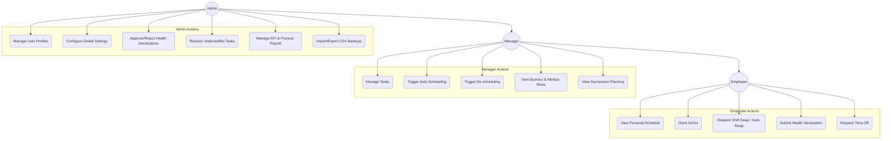
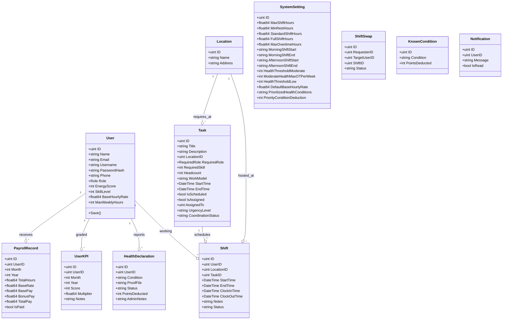
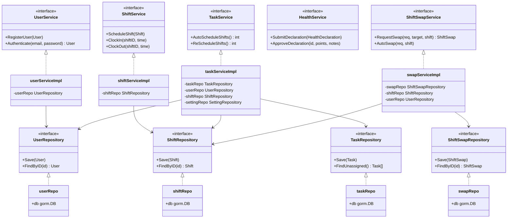
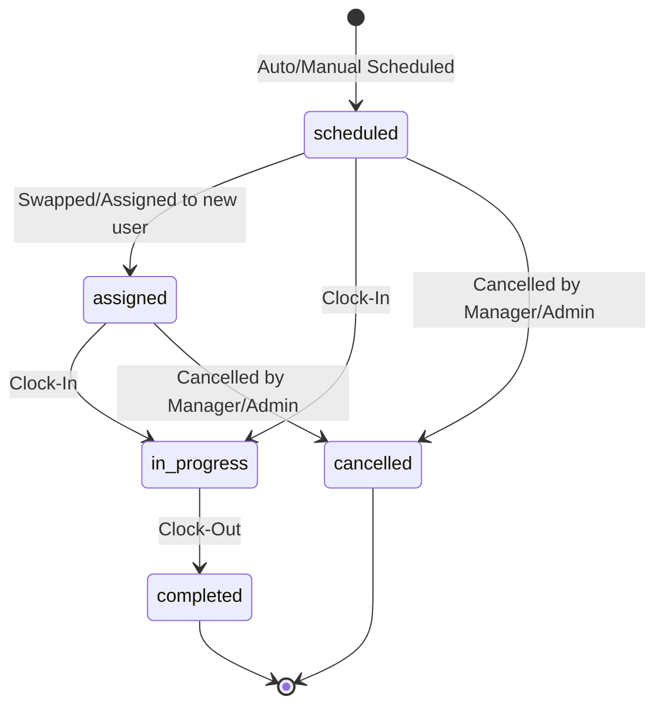
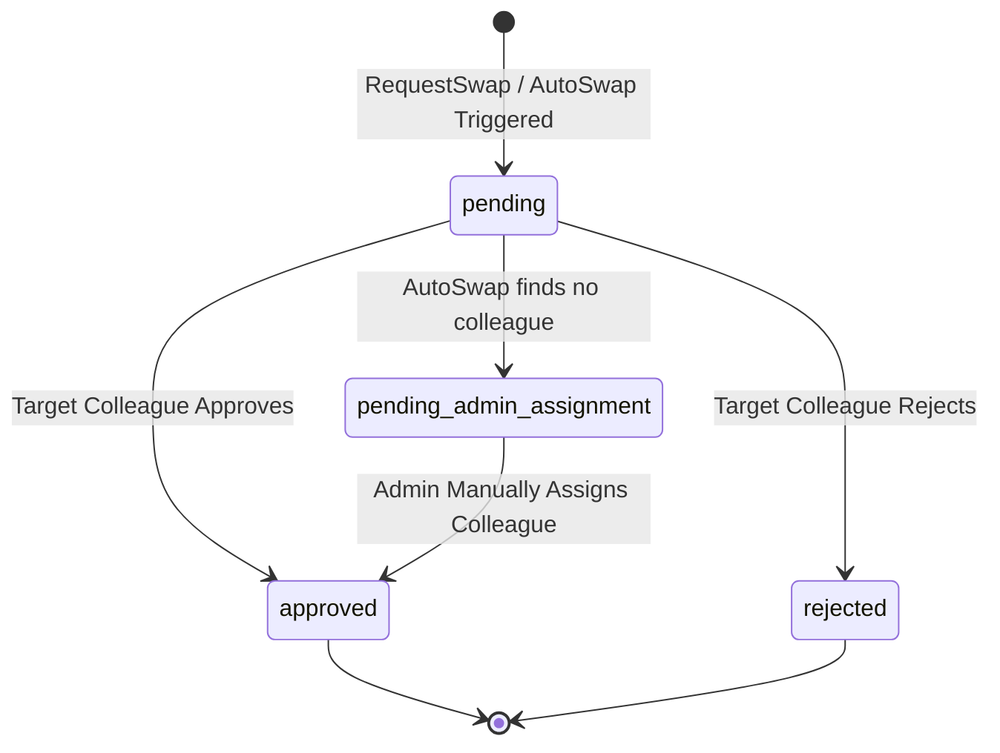
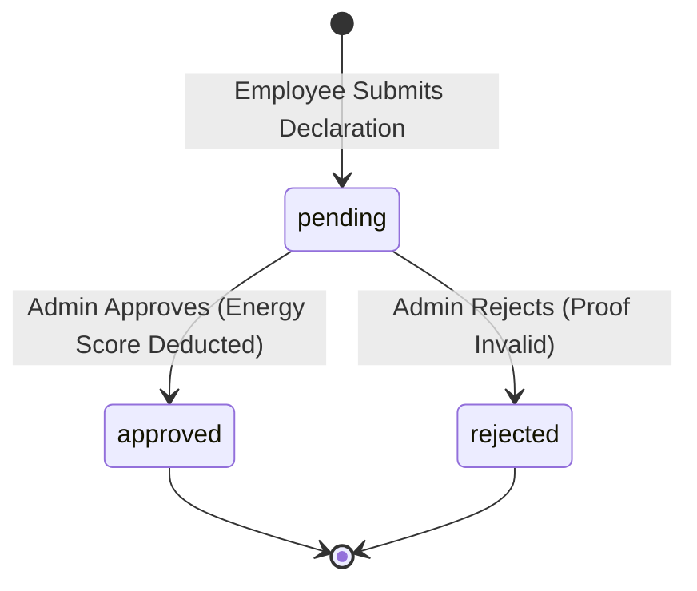
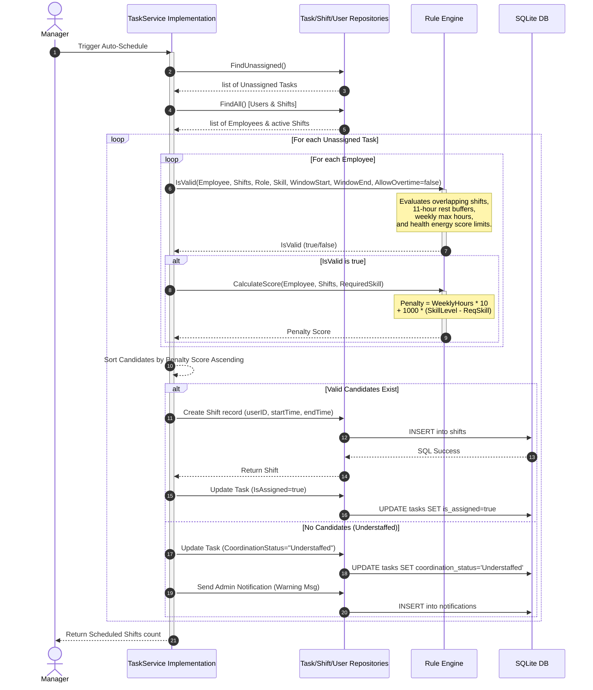

# UML Source Code: Shift Management System

This document contains the structural and behavioral UML models for the **Shift Management System** written in **Mermaid** notation. These UML sources can be rendered directly in GitHub Markdown or tools that support Mermaid.

---

## 1. Use Case Diagram

### 1.1 Candidate Actors
*   **Employee (`employee`)**: A shift worker executing daily operations.
*   **Manager (`manager`)**: Coordinates staffing levels, work models, and plans schedules.
*   **Admin (`admin`)**: Exercises master control over data, settings, compliance, and payroll.

### 1.2 Use Case Model

---

## 2. Class Diagram: Core Entities

Representing models defined in the [domain/](file:///d:/Workspace/TBDD/shift-management-system/domain/) folder.

---

## 3. Class Diagram: Services & Repositories

Defines the dependency injection hierarchy mapping [repository/](file:///d:/Workspace/TBDD/shift-management-system/repository/) and [service/](file:///d:/Workspace/TBDD/shift-management-system/service/) packages.

---

## 4. State Machine Diagrams

### 4.1 Shift Lifecycle

### 4.2 ShiftSwap Request Lifecycle

### 4.3 Health Declaration Lifecycle

---

## 5. Sequence Diagram: Auto-Scheduling Engine Process

Illustrating the GORM transaction workflow mapping [service/task_service.go#L99-L317](file:///d:/Workspace/TBDD/shift-management-system/service/task_service.go#L99-L317).

