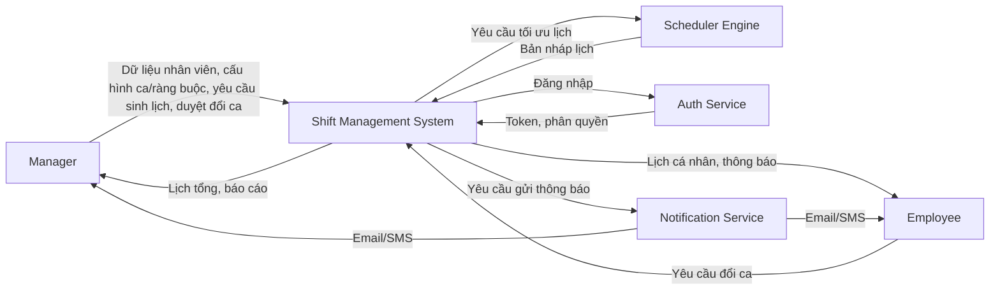

# SRS Tuần 1 - Hệ Thống Quản Lý Nhân Sự Theo Ca

## 1. Giới thiệu

### 1.1 Mục đích
Tài liệu SRS này xác định đầy đủ yêu cầu cho Hệ thống Quản lý Nhân sự theo ca, làm cơ sở thống nhất giữa nhóm phát triển và giảng viên về phạm vi, chức năng, chất lượng hệ thống và tiêu chí nghiệm thu giai đoạn đầu.

### 1.2 Phạm vi
Hệ thống phục vụ doanh nghiệp có nhu cầu phân ca cho nhân viên theo ngày, tuần, tháng; hỗ trợ lập lịch tự động theo ràng buộc và cho phép điều chỉnh thủ công khi cần.

### 1.3 Đối tượng sử dụng tài liệu
- Thành viên nhóm dự án
- Giảng viên hướng dẫn
- Người kiểm thử và đánh giá

### 1.4 Thuật ngữ
- Actor: Tác nhân tương tác với hệ thống.
- Use Case: Kịch bản nghiệp vụ.
- FR (Functional Requirement): Yêu cầu chức năng.
- NFR (Non-Functional Requirement): Yêu cầu phi chức năng.

## 2. Mô tả tổng thể hệ thống

### 2.1 Bối cảnh nghiệp vụ
Việc phân ca thủ công dễ gây trùng ca, mất cân bằng công việc và khó đảm bảo thời gian nghỉ. Hệ thống được xây dựng nhằm tự động hóa việc phân ca, kiểm soát ràng buộc và tối ưu lịch làm việc.

### 2.2 Mục tiêu hệ thống
- Tự động sinh lịch làm việc.
- Giảm sai sót thủ công.
- Minh bạch lịch làm việc.
- Hỗ trợ quản lý và báo cáo.

### 2.3 Context Diagram
Hệ thống Quản lý Nhân sự Theo Ca (Shift Management System) là trung tâm. Các tác nhân và hệ thống phụ trợ tương tác qua các luồng dữ liệu chính như sau:
- Manager: Cung cấp dữ liệu nhân viên, thiết lập ca/ràng buộc, kích hoạt sinh lịch, yêu cầu hoặc phê duyệt đổi ca. Nhận báo cáo và lịch tổng thể.
- Employee: Gửi yêu cầu đổi ca. Nhận lịch cá nhân và thông báo.
- Scheduler Engine (hệ thống phụ): Nhận đầu vào ràng buộc và yêu cầu lịch từ hệ thống, trả về bản nháp lịch tối ưu.
- Auth Service (hệ thống phụ): Nhận yêu cầu đăng nhập, trả về token và thông tin phân quyền.
- Notification Service (hệ thống phụ): Nhận yêu cầu gửi thông báo (Email, SMS), thực hiện gửi tới Manager/Employee.

### 2.4 Giả định và phụ thuộc
- Có kết nối internet ổn định.
- Dữ liệu nhân viên đầy đủ.
- Có thể tích hợp API bên ngoài.

### 2.5 Mô hình dữ liệu đề xuất
Để hỗ trợ phân quyền (FR-02) và quản lý phòng ban (FR-04), mô hình dữ liệu cần được chuẩn hóa như sau:
- Role (id, name, description)
- Location (id, name, address)
- Employee (id, role_id (FK), department_id (FK), name, email, phone, hire_date, is_active)
- Shift (id, name, start_time, end_time)
- Schedule (id, date, user_id (FK), shift_id (FK), status)
- Constraint (id, name, type, value)
  Ví dụ: (1, "Giới hạn ca tuần", "WEEKLY_MAX_SHIFT", "6")
- SwapRequest (id, requester_id (FK), receiver_id (FK), schedule_id (FK), status, manager_note)
- SystemLog (id, user_id, action, module, timestamp)

## 3. Actor

### 3.1 Actor chính
- Manager
- Employee

### 3.2 Actor phụ
- Scheduler Engine
- Auth Service
- Notification Service

## 4. Use Case

### 4.1 Quản trị
- UC-01: Đăng nhập
- UC-02: Quản lý nhân viên
- UC-03: Quản lý phòng ban
- UC-04: Thiết lập ca
- UC-05: Thiết lập ràng buộc
- UC-06: Tạo kỳ lập lịch

### 4.2 Lập lịch
- UC-07: Sinh lịch tự động
- UC-08: Chỉnh sửa lịch thủ công
- UC-09: Duyệt đổi ca
- UC-10: Xem lịch tổng
- UC-11: Xem báo cáo
- UC-12: Xuất báo cáo

### 4.3 Nhân viên
- UC-13: Xem lịch cá nhân
- UC-14: Gửi yêu cầu đổi ca
- UC-15: Nhận thông báo

### 4.4 Quan hệ include và extend
Quan hệ include (bắt buộc):
- UC-07 (Sinh lịch tự động) include UC-05 (Thiết lập ràng buộc).
- UC-07 (Sinh lịch tự động) include UC-06 (Tạo kỳ lập lịch).
- UC-14 (Gửi yêu cầu đổi ca) include UC-13 (Xem lịch cá nhân).
- UC-09 (Duyệt đổi ca) include UC-15 (Nhận thông báo).

Quan hệ extend (tùy điều kiện):
- UC-08 (Chỉnh sửa lịch thủ công) extend UC-07 (Sinh lịch tự động), chỉ xảy ra khi Manager cần điều chỉnh kết quả sinh lịch.

## 5. Yêu cầu chức năng

### 5.1 Xác thực và phân quyền
- FR-01: Hệ thống phải xác thực người dùng khi họ đăng nhập vào hệ thống.
- FR-02: Hệ thống phải phân quyền người dùng theo vai trò khi thao tác trên hệ thống.

### 5.2 Quản lý nhân sự
- FR-03: Hệ thống phải cho phép Manager quản lý nhân viên (thêm, sửa, xóa, tìm kiếm).
- FR-04: Hệ thống phải cho phép Manager quản lý phòng ban (thêm, sửa, xóa, tìm kiếm).

### 5.3 Quản lý ca
- FR-05: Hệ thống phải cho phép Manager tạo các ca làm việc khi cấu hình lịch.
- FR-06: Hệ thống phải cho phép Manager thiết lập các ràng buộc khi làm đầu vào cho thuật toán sinh lịch tự động.

### 5.4 Lập lịch
- FR-07: Hệ thống phải cho phép Manager tạo kỳ lập lịch mới khi chuẩn bị phân ca.
- FR-08: Hệ thống phải tự động sinh lịch làm việc khi Manager yêu cầu.
- FR-09: Hệ thống phải tránh phân trùng ca cho cùng một nhân viên khi sinh lịch.
- FR-10: Hệ thống phải đảm bảo nhân viên được nghỉ sau ca đêm khi phân lịch.
- FR-11: Hệ thống phải cân bằng số lượng ca làm việc giữa các nhân viên khi phân bổ.

### 5.5 Vận hành
- FR-12: Hệ thống phải cho phép Manager chỉnh sửa lịch làm việc khi cần thiết.
- FR-13: Hệ thống phải cho phép Employee xem lịch làm việc cá nhân khi họ truy cập trang cá nhân.
- FR-14: Hệ thống phải cho phép Employee gửi yêu cầu đổi ca khi họ không thể làm việc.
- FR-15: Hệ thống phải cho phép Manager duyệt yêu cầu đổi ca khi nhận được yêu cầu từ Employee.
- FR-16: Hệ thống phải ghi lại lịch sử thao tác khi người dùng thực hiện các hành động quan trọng.
- FR-17: Hệ thống phải gửi thông báo cho người dùng khi có thay đổi liên quan đến lịch làm việc.
- FR-18: Hệ thống phải tạo báo cáo tổng hợp khi Manager có nhu cầu xem tổng quan.
- FR-19: Hệ thống phải cho phép Manager xuất dữ liệu lịch làm việc khi cần thiết.

## 6. Yêu cầu phi chức năng

### 6.1 Bảo mật
- Mật khẩu người dùng phải được mã hóa bằng Bcrypt hoặc Argon2.
- Hệ thống phải kiểm tra quyền trước khi cho phép truy cập chức năng quản trị.
- Phiên làm việc phải tự động kết thúc sau 15 phút không hoạt động.

### 6.2 Hiệu năng
- Thời gian phản hồi cho thao tác xem và thêm/sửa dữ liệu cơ bản phải nhỏ hơn 3 giây.
- Thuật toán phải hoàn thành sinh lịch tự động cho một tháng với 100 nhân viên trong vòng tối đa 30 giây.

### 6.3 Khả dụng
- Uptime lớn hơn 99%.
- Có cơ chế sao lưu dữ liệu định kỳ.

### 6.4 Dễ sử dụng
- Các tác vụ nghiệp vụ chính của Manager (Sinh lịch tự động, Duyệt yêu cầu đổi ca) phải hoàn thành trong tối đa 5 lần nhấp chuột.
- Mọi thao tác thành công, lỗi hoặc cảnh báo phải hiển thị thông báo ngắn gọn, dễ hiểu và có chỉ dẫn hành động tiếp theo nếu cần.

## 7. Quy tắc nghiệp vụ
- BR-01: Không trùng ca.
- BR-02: Nghỉ sau ca đêm.
- BR-03: Giới hạn số ca.
- BR-04: Manager duyệt đổi ca.

## 8. Ràng buộc hệ thống
- Chỉ Manager được phép sinh lịch.
- Không vượt số ca tối đa theo ràng buộc đã cấu hình.
- Mọi thay đổi phải được lưu log.

## 9. Tiêu chí nghiệm thu Tuần 1
- Có đủ 15 Use Case (UC-01 đến UC-15).
- Có từ 15 FR trở lên (hiện tại: 19 FR).
- Có tập NFR đầy đủ và định lượng.
- Có Context Diagram.
- Có Actor-Use Case Matrix.
- Có biên bản họp nhóm.
