# SRS - Hệ Thống Quản Lý Nhân Sự Theo Ca

## 1. Giới thiệu

### 1.1. Mục đích
Tài liệu Đặc tả Yêu cầu Phần mềm (SRS) này xác định đầy đủ các yêu cầu cho dự án **Hệ thống Quản lý Nhân sự Theo Ca (Shift Management System)**. Tài liệu là cơ sở thỏa thuận chính thức giữa nhóm phát triển dự án và giảng viên hướng dẫn về phạm vi, chức năng, phi chức năng, các ràng buộc thiết kế và tiêu chí nghiệm thu của sản phẩm phần mềm. Đối tượng sử dụng tài liệu bao gồm giảng viên chấm điểm, kiểm thử viên (QA/Tester), và các nhà phát triển phần mềm trong dự án để định hướng thiết kế chi tiết ở các giai đoạn tiếp theo.

### 1.2. Phạm vi
Hệ thống Shift Management System được thiết kế nhằm phục vụ các doanh nghiệp, tổ chức vận hành theo ca làm việc (như chuỗi bán lẻ, nhà hàng, cơ sở sản xuất). Hệ thống hỗ trợ:
- Quản lý thông tin tài khoản nhân sự và phân quyền sử dụng.
- Lập lịch tự động dựa trên Rule Engine kiểm tra ràng buộc cứng và ràng buộc mềm về sức khỏe.
- Chấm công vào/ra ca (Clock-In/Clock-Out) thực tế.
- Đổi ca thông minh (Auto-Swap) và xin nghỉ phép (Time-Off).
- Khai báo sức khỏe y tế kết hợp phân tích tương đồng ngữ nghĩa bệnh lý bằng AI/NLP.
- Tính toán hiệu năng KPI và tự động chốt bảng lương tổng hợp cuối tháng.
- Phát hiện ca thiếu người (Understaffed Tasks) và điều phối phục hồi ca làm việc.

### 1.3. Thuật ngữ và viết tắt

| Thuật ngữ / Viết tắt | Ý nghĩa |
| :--- | :--- |
| **SRS** | Software Requirements Specification - Đặc tả yêu cầu phần mềm. |
| **UC** | Use Case - Ca sử dụng, kịch bản tương tác giữa tác nhân và hệ thống. |
| **FR** | Functional Requirement - Yêu cầu chức năng của hệ thống. |
| **NFR** | Non-Functional Requirement - Yêu cầu phi chức năng (chất lượng hệ thống). |
| **Admin** | Quản trị viên hệ thống, có quyền quản lý cao nhất. |
| **Manager** | Quản lý bộ phận, phụ trách công việc phân ca, điều phối và giám sát. |
| **Employee** | Nhân viên làm việc theo ca, đối tượng trực tiếp thực hiện công việc và chấm công. |
| **Energy Score** | Điểm năng lượng sức khỏe của nhân viên (từ 0-100), dùng làm ràng buộc mềm lập lịch. |
| **Burnout Score** | Điểm kiệt sức của nhân viên, tính toán dựa trên tỉ lệ giờ làm thêm giờ thực tế. |
| **AI/NLP Service** | Dịch vụ phụ trợ xử lý ngôn ngữ tự nhiên để phân tích độ tương đồng ngữ nghĩa bệnh trạng. |
| **Bcrypt** | Thuật toán băm một chiều bảo mật dùng để mã hóa mật khẩu người dùng trong cơ sở dữ liệu. |
| **JWT** | JSON Web Token - Phương thức xác thực người dùng phi trạng thái qua chuỗi token mã hóa. |

### 1.4. Tài liệu tham khảo
Tài liệu được xây dựng dựa trên việc tham chiếu các tài liệu thiết kế nội bộ của dự án bao gồm:
- Tài liệu Đặc tả Kịch bản Sử dụng: [UseCase_Scenarios_Tuan_2.md](file:///d:/Workspace/TBDD/shift-management-system/docs/week2/UseCase_Scenarios_Tuan_2.md)
- Sơ đồ Ca sử dụng Tổng quan: [UseCase_Diagram_Tuan_2.md](file:///d:/Workspace/TBDD/shift-management-system/docs/week2/UseCase_Diagram_Tuan_2.md)
- Biểu đồ Hoạt động Nghiệp vụ: [Activity_Diagram.md](file:///d:/Workspace/TBDD/shift-management-system/docs/week5/Activity_Diagram.md)
- Biểu đồ Trình tự Tương tác: [Sequence_Diagram.md](file:///d:/Workspace/TBDD/shift-management-system/docs/week4/Sequence_Diagram.md)
- Thiết kế Cơ sở Dữ liệu (CDM/PDM): [Class_Diagram.md](file:///d:/Workspace/TBDD/shift-management-system/docs/week3/Class_Diagram.md)
- Ma trận Truy vết Yêu cầu: [Actor_UseCase_Matrix.csv](file:///d:/Workspace/TBDD/shift-management-system/docs/week1/Actor_UseCase_Matrix.csv)
- Kho lưu trữ mã nguồn của dự án (Source code repository).

---

## 2. Mô tả Tổng quan

### 2.1. Bối cảnh hệ thống
Hệ thống Shift Management System hoạt động độc lập, hỗ trợ giao diện đa nền tảng gồm ứng dụng Web dành cho Quản trị viên/Quản lý để thiết lập cấu hình và lập lịch, cùng ứng dụng di động (Mobile App) dành cho Nhân viên để theo dõi lịch cá nhân, chấm công và báo bệnh. Hệ thống tương tác với một dịch vụ AI NLP phụ trợ độc lập (chạy trên cổng 8000) để phân tích ngôn ngữ tự nhiên tiếng Việt cho phần khai báo sức khỏe y tế.

### 2.2. Tác nhân hệ thống

| Actor | Vai trò | Nhóm chức năng sử dụng |
| :--- | :--- | :--- |
| **Admin** | Quản trị viên hệ thống. | Quản lý nhân viên, cấu hình danh mục bệnh, duyệt sức khỏe, duyệt đơn nghỉ phép, phê duyệt bảng lương. |
| **Manager** | Quản lý bộ phận phân ca. | Thiết lập ca, cấu hình ràng buộc, sinh lịch tự động, chỉnh sửa lịch thủ công, duyệt đổi ca, xem báo cáo rủi ro kiệt sức, chấm điểm KPI. |
| **Employee** | Nhân viên làm việc ca trực. | Xem lịch biểu cá nhân, gửi yêu cầu đổi ca, chấm công vào/ra ca, gửi khai báo sức khỏe, gửi yêu cầu nghỉ phép. |
| **AI/NLP Service** | Hệ thống phụ trợ (System Actor). | Phân tích và tính toán độ tương đồng ngữ nghĩa bệnh lý y khoa để hỗ trợ đề xuất điểm trừ năng lượng. |

### 2.3. Sơ đồ ngữ cảnh

Sơ đồ ngữ cảnh thể hiện luồng trao đổi thông tin ở mức nghiệp vụ giữa các tác nhân và hệ thống:

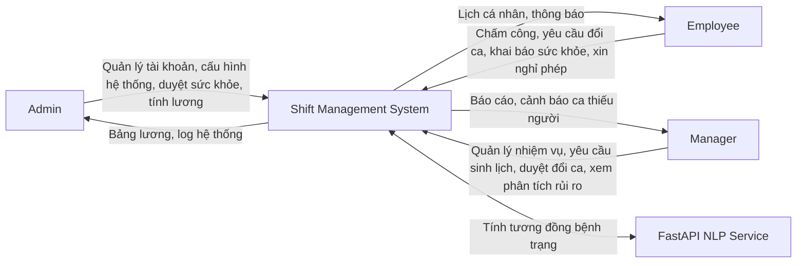
```mermaid
flowchart LR
    A[Admin] -->|Quản lý tài khoản, cấu hình hệ thống, duyệt sức khỏe, tính lương| SMS[Shift Management System]
    M[Manager] -->|Quản lý nhiệm vụ, yêu cầu sinh lịch, duyệt đổi ca, xem phân tích rủi ro| SMS
    E[Employee] -->|Chấm công, yêu cầu đổi ca, khai báo sức khỏe, xin nghỉ phép| SMS
    
    SMS -->|Lịch cá nhân, thông báo| E
    SMS -->|Báo cáo, cảnh báo ca thiếu người| M
    SMS -->|Bảng lương, log hệ thống| A

    SMS <-->|Tính tương đồng bệnh trạng| NLP[FastAPI NLP Service]
```

### 2.4. Sơ đồ Use Case tổng quát

Sơ đồ thể hiện ranh giới hệ thống và mối liên kết giữa các tác nhân đối với 29 ca sử dụng:

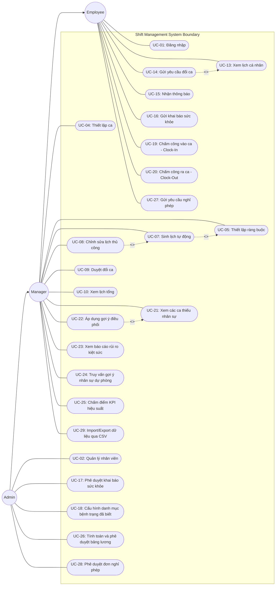
```mermaid
flowchart LR
    Admin((Admin))
    Manager((Manager))
    Employee((Employee))

    Manager --> Employee
    Admin --> Manager

    subgraph System [Shift Management System Boundary]
        direction TB
        
        UC01([UC-01: Đăng nhập])
        UC02([UC-02: Quản lý nhân viên])
        
        UC04([UC-04: Thiết lập ca])
        UC05([UC-05: Thiết lập ràng buộc])
        UC07([UC-07: Sinh lịch tự động])
        UC08([UC-08: Chỉnh sửa lịch thủ công])
        UC10([UC-10: Xem lịch tổng])
        
        UC09([UC-09: Duyệt đổi ca])
        UC13([UC-13: Xem lịch cá nhân])
        UC14([UC-14: Gửi yêu cầu đổi ca])
        UC15([UC-15: Nhận thông báo])
        
        UC16([UC-16: Gửi khai báo sức khỏe])
        UC17([UC-17: Phê duyệt khai báo sức khỏe])
        UC18([UC-18: Cấu hình danh mục bệnh trạng đã biết])
        UC19([UC-19: Chấm công vào ca - Clock-In])
        UC20([UC-20: Chấm công ra ca - Clock-Out])
        
        UC21([UC-21: Xem các ca thiếu nhân sự])
        UC22([UC-22: Áp dụng gợi ý điều phối])
        UC23([UC-23: Xem báo cáo rủi ro kiệt sức])
        UC24([UC-24: Truy vấn gợi ý nhân sự dự phòng])
        
        UC25([UC-25: Chấm điểm KPI hiệu suất])
        UC26([UC-26: Tính toán và phê duyệt bảng lương])
        UC27([UC-27: Gửi yêu cầu nghỉ phép])
        UC28([UC-28: Phê duyệt đơn nghỉ phép])
        UC29([UC-29: Import/Export dữ liệu qua CSV])
    end

    Employee --- UC01
    Employee --- UC13
    Employee --- UC14
    Employee --- UC15
    Employee --- UC16
    Employee --- UC19
    Employee --- UC20
    Employee --- UC27

    Manager --- UC04
    Manager --- UC05
    Manager --- UC07
    Manager --- UC08
    Manager --- UC09
    Manager --- UC10
    Manager --- UC21
    Manager --- UC22
    Manager --- UC23
    Manager --- UC24
    Manager --- UC25
    Manager --- UC29

    Admin --- UC02
    Admin --- UC17
    Admin --- UC18
    Admin --- UC26
    Admin --- UC28

    UC07 -.->|"<<include>>"| UC05
    UC14 -.->|"<<include>>"| UC13
    UC22 -.->|"<<include>>"| UC21
    UC08 -.->|"<<extend>>"| UC07
```

### 2.5. Giả định và phụ thuộc
- **Giả định**: Người dùng đã được cấp tài khoản hợp lệ để đăng nhập. Thiết bị di động của nhân viên có khả năng kết nối mạng Internet ổn định và có camera hoặc bộ nhớ để tải ảnh minh chứng sức khỏe.
- **Phụ thuộc**: Hệ thống phụ thuộc vào sự sẵn sàng hoạt động của dịch vụ FastAPI NLP phụ trợ phục vụ so khớp bệnh trạng. Nếu dịch vụ này ngoại tuyến, hệ thống sẽ rơi vào cơ chế dự phòng so khớp từ khóa cơ bản.

---

## 3. Yêu cầu Chức năng

### 3.1. Nhóm Xác thực và Quản lý nhân sự

#### UC-01: Đăng nhập
- **Mã Use Case**: `UC-01`
- **Tên Use Case**: Đăng nhập
- **Tác nhân**: Admin, Manager, Employee
- **Mục tiêu**: Người dùng truy cập vào hệ thống thành công và nhận token xác thực.
- **Tiền điều kiện**: Tài khoản người dùng đã được tạo và lưu trữ mã hóa mật khẩu trong cơ sở dữ liệu.
- **Activities flow**: Người dùng nhập tên đăng nhập và mật khẩu. Hệ thống so khớp Bcrypt mật khẩu, cấp JWT token chứa quyền hạn và chuyển hướng về giao diện Dashboard tương ứng. *(Xem chi tiết lưu đồ hoạt động tại Phụ lục 6.3)*.
- **Business Rules**: Mật khẩu phải được mã hóa bằng thuật toán Bcrypt. Token JWT phải được đính kèm vào header xác thực ở các yêu cầu tiếp theo. *(Xem chi tiết tại Phụ lục 6.4)*.
- **Kết quả đầu ra**: Đăng nhập thành công, phiên làm việc được thiết lập.

#### UC-02: Quản lý nhân viên
- **Mã Use Case**: `UC-02`
- **Tên Use Case**: Quản lý nhân viên
- **Tác nhân**: Admin
- **Mục tiêu**: Quản lý thông tin hồ sơ nhân viên trong tổ chức.
- **Tiền điều kiện**: Đăng nhập với quyền Admin.
- **Activities flow**: Cần bổ sung từ tài liệu thiết kế chi tiết.
- **Business Rules**: Cần bổ sung từ tài liệu thiết kế chi tiết.
- **Kết quả đầu ra**: Bản ghi thông tin nhân viên được cập nhật (Thêm/Sửa/Xóa).

#### UC-03: [DEPRECATED]
*(Lưu ý: Use Case này đã hủy bỏ trong quá trình đồng bộ hóa thiết kế và mã nguồn thực tế).*

---

### 3.2. Nhóm Thiết lập ca và Lập lịch

#### UC-04: Thiết lập ca
- **Mã Use Case**: `UC-04`
- **Tên Use Case**: Thiết lập ca
- **Tác nhân**: Admin, Manager
- **Mục tiêu**: Khai báo các loại ca trực mẫu của doanh nghiệp.
- **Tiền điều kiện**: Đăng nhập dưới quyền Admin hoặc Manager.
- **Activities flow**: Cần bổ sung từ tài liệu thiết kế chi tiết.
- **Business Rules**: Cần bổ sung từ tài liệu thiết kế chi tiết.
- **Kết quả đầu ra**: Các ca trực mẫu được lưu vào cơ sở dữ liệu.

#### UC-05: Thiết lập ràng buộc
- **Mã Use Case**: `UC-05`
- **Tên Use Case**: Thiết lập ràng buộc
- **Tác nhân**: Admin, Manager
- **Mục tiêu**: Cấu hình các tham số vận hành hệ thống (ngưỡng nghỉ ngơi, giờ ca trực, ngưỡng sức khỏe).
- **Tiền điều kiện**: Đăng nhập dưới quyền Admin hoặc Manager.
- **Activities flow**: Cần bổ sung từ tài liệu thiết kế chi tiết.
- **Business Rules**: Cần bổ sung từ tài liệu thiết kế chi tiết.
- **Kết quả đầu ra**: Cấu hình tham số hệ thống được lưu trữ.

#### UC-06: [DEPRECATED]
*(Lưu ý: Use Case này đã hủy bỏ trong quá trình đồng bộ hóa thiết kế và mã nguồn thực tế).*

#### UC-07: Sinh lịch tự động
- **Mã Use Case**: `UC-07`
- **Tên Use Case**: Sinh lịch tự động
- **Tác nhân**: Manager, Admin
- **Mục tiêu**: Tự động tạo lịch trực tối ưu cho các nhiệm vụ chưa phân bổ.
- **Tiền điều kiện**: Có ít nhất một nhiệm vụ chưa được phân công.
- **Activities flow**: Manager nhấn nút kích hoạt sinh lịch tự động. Hệ thống tải các nhiệm vụ, kiểm tra ràng buộc thông qua Rule Engine (không trùng giờ, khoảng nghỉ 11h, giới hạn giờ tối đa tuần, Energy Score) và chọn nhân sự tốt nhất. *(Xem chi tiết lưu đồ hoạt động tại Phụ lục 6.3)*.
- **Business Rules**: Kiểm tra ràng buộc cứng và ràng buộc mềm sức khỏe (Energy Score < 50 giới hạn 1 ca/ngày; Energy Score < 70 giới hạn không phân ca nặng kề nhau và không overtime quá 1 ca/tuần). *(Xem chi tiết tại Phụ lục 6.4)*.
- **Kết quả đầu ra**: Lịch trực mới được tạo và lưu vào CSDL.

#### UC-08: Chỉnh sửa lịch thủ công
- **Mã Use Case**: `UC-08`
- **Tên Use Case**: Chỉnh sửa lịch thủ công
- **Tác nhân**: Manager, Admin
- **Mục tiêu**: Cho phép quản lý tự phân công hoặc thay đổi nhân sự trực ca bằng tay.
- **Tiền điều kiện**: Đăng nhập với quyền Manager hoặc Admin.
- **Activities flow**: Cần bổ sung từ tài liệu thiết kế chi tiết.
- **Business Rules**: Cần bổ sung từ tài liệu thiết kế chi tiết.
- **Kết quả đầu ra**: Lịch trực của nhiệm vụ được cập nhật thủ công.

#### UC-10: Xem lịch tổng
- **Mã Use Case**: `UC-10`
- **Tên Use Case**: Xem lịch tổng
- **Tác nhân**: Admin, Manager
- **Mục tiêu**: Theo dõi lịch trực toàn diện của toàn bộ tổ chức.
- **Tiền điều kiện**: Đăng nhập dưới quyền Admin hoặc Manager.
- **Activities flow**: Cần bổ sung từ tài liệu thiết kế chi tiết.
- **Business Rules**: Cần bổ sung từ tài liệu thiết kế chi tiết.
- **Kết quả đầu ra**: Giao diện lịch biểu tổng hợp hiển thị.

---

### 3.3. Nhóm Vận hành và Đổi ca

#### UC-09: Duyệt đổi ca
- **Mã Use Case**: `UC-09`
- **Tên Use Case**: Duyệt đổi ca
- **Tác nhân**: Employee, Manager, Admin
- **Mục tiêu**: Cho phép đổi ca trực thông minh tự động (Auto-Swap) hoặc chỉ định thủ công.
- **Tiền điều kiện**: Nhân viên yêu cầu có một ca trực sắp diễn ra trong lịch cá nhân.
- **Activities flow**: Nhân viên gửi yêu cầu đổi ca. Hệ thống tự động đề xuất và gửi lời mời đến đồng nghiệp đáp ứng điều kiện. Nếu đồng nghiệp đồng ý, hệ thống tự động đổi quyền sở hữu ca làm việc. *(Xem chi tiết lưu đồ hoạt động tại Phụ lục 6.3)*.
- **Business Rules**: Đồng nghiệp nhận đổi ca trực phải rảnh rỗi và đáp ứng khoảng nghỉ tối thiểu 11.0 giờ. Nếu không tìm được đồng nghiệp, chuyển đơn sang trạng thái chờ Admin gán ca thủ công. *(Xem chi tiết tại Phụ lục 6.4)*.
- **Kết quả đầu ra**: Quyền sở hữu ca trực được chuyển giao và cập nhật trong CSDL.

#### UC-11: Xem báo cáo kiệt sức
- **Mã Use Case**: `UC-11`
- **Tên Use Case**: Xem báo cáo kiệt sức
- **Tác nhân**: Admin, Manager
- **Mục tiêu**: Theo dõi chỉ số kiệt sức của nhân viên để tránh quá tải.
- **Tiền điều kiện**: Đăng nhập dưới quyền Admin hoặc Manager.
- **Activities flow**: Cần bổ sung từ tài liệu thiết kế chi tiết.
- **Business Rules**: Cần bổ sung từ tài liệu thiết kế chi tiết.
- **Kết quả đầu ra**: Biểu đồ/báo cáo Burnout Score được hiển thị.

#### UC-12: [DEPRECATED]
*(Lưu ý: Use Case này đã hủy bỏ trong quá trình đồng bộ hóa thiết kế và mã nguồn thực tế).*

#### UC-13: Xem lịch cá nhân
- **Mã Use Case**: `UC-13`
- **Tên Use Case**: Xem lịch cá nhân
- **Tác nhân**: Employee
- **Mục tiêu**: Nhân viên theo dõi lịch làm việc được phân công của riêng mình.
- **Tiền điều kiện**: Đăng nhập dưới quyền Employee.
- **Activities flow**: Cần bổ sung từ tài liệu thiết kế chi tiết.
- **Business Rules**: Cần bổ sung từ tài liệu thiết kế chi tiết.
- **Kết quả đầu ra**: Giao diện lịch biểu cá nhân của nhân viên hiển thị.

#### UC-14: Gửi yêu cầu đổi ca
- **Mã Use Case**: `UC-14`
- **Tên Use Case**: Gửi yêu cầu đổi ca
- **Tác nhân**: Employee
- **Mục tiêu**: Nhân viên tạo yêu cầu trao đổi ca trực của mình với đồng nghiệp.
- **Tiền điều kiện**: Đăng nhập dưới quyền Employee, chọn ca trực chưa diễn ra trên lịch cá nhân.
- **Activities flow**: Cần bổ sung từ tài liệu thiết kế chi tiết.
- **Business Rules**: Cần bổ sung từ tài liệu thiết kế chi tiết.
- **Kết quả đầu ra**: Yêu cầu đổi ca được tạo ở trạng thái chờ xử lý.

#### UC-15: Nhận thông báo
- **Mã Use Case**: `UC-15`
- **Tên Use Case**: Nhận thông báo
- **Tác nhân**: Employee, Manager, Admin
- **Mục tiêu**: Người dùng nhận thông báo kịp thời về các sự kiện trong hệ thống (đổi ca, xin nghỉ, duyệt phép, cảnh báo).
- **Tiền điều kiện**: Tài khoản đang trực tuyến hoặc đăng nhập vào hệ thống.
- **Activities flow**: Cần bổ sung từ tài liệu thiết kế chi tiết.
- **Business Rules**: Cần bổ sung từ tài liệu thiết kế chi tiết.
- **Kết quả đầu ra**: Danh sách thông báo được hiển thị và cập nhật trạng thái đã đọc.

#### UC-19: Chấm công vào ca - Clock-In
- **Mã Use Case**: `UC-19`
- **Tên Use Case**: Chấm công vào ca - Clock-In
- **Tác nhân**: Employee
- **Mục tiêu**: Ghi nhận thời điểm bắt đầu ca làm việc thực tế của nhân viên.
- **Tiền điều kiện**: Nhân viên có ca trực đang ở trạng thái `scheduled` và thời gian hiện tại nằm trong khung cho phép.
- **Activities flow**: Nhân viên nhấn "Clock In" tại giao diện di động. Hệ thống lưu thời gian thực tế và đổi trạng thái ca trực thành `in_progress`. *(Xem chi tiết lưu đồ hoạt động tại Phụ lục 6.3)*.
- **Business Rules**: Thời gian chấm công thực tế làm căn cứ đo lường độ lệch giờ và tính toán lương thực tế. *(Xem chi tiết tại Phụ lục 6.4)*.
- **Kết quả đầu ra**: Trạng thái ca trực đổi thành `in_progress`, thời gian ClockInTime được ghi nhận.

#### UC-20: Chấm công ra ca - Clock-Out
- **Mã Use Case**: `UC-20`
- **Tên Use Case**: Chấm công ra ca - Clock-Out
- **Tác nhân**: Employee
- **Mục tiêu**: Ghi nhận thời điểm kết thúc ca làm việc thực tế của nhân viên.
- **Tiền điều kiện**: Ca trực của nhân viên đang ở trạng thái `in_progress`.
- **Activities flow**: Nhân viên nhấn "Clock Out" tại giao diện di động. Hệ thống ghi nhận thời gian thực tế và cập nhật trạng thái ca trực thành `completed`. *(Xem chi tiết lưu đồ hoạt động tại Phụ lục 6.3)*.
- **Business Rules**: Thời gian Clock-Out bắt buộc phải sau thời gian Clock-In. Sau khi Clock-Out, trạng thái ca trực là `completed` và không thể chỉnh sửa thêm. *(Xem chi tiết tại Phụ lục 6.4)*.
- **Kết quả đầu ra**: Trạng thái ca trực đổi thành `completed`, thời gian ClockOutTime được ghi nhận.

---

### 3.4. Nhóm Sức khỏe và Nghỉ phép

#### UC-16: Gửi khai báo sức khỏe
- **Mã Use Case**: `UC-16`
- **Tên Use Case**: Gửi khai báo sức khỏe
- **Tác nhân**: Employee
- **Mục tiêu**: Khai báo tình trạng bệnh y tế đột xuất kèm ảnh minh chứng để xin giảm ca trực.
- **Tiền điều kiện**: Đăng nhập dưới quyền Employee.
- **Activities flow**: Nhân viên nhập mô tả bệnh lý, tải tệp ảnh minh chứng y tế và gửi đơn. Hệ thống lưu tệp ảnh cục bộ và tạo bản ghi trạng thái `pending`. *(Xem chi tiết lưu đồ hoạt động tại Phụ lục 6.3)*.
- **Business Rules**: Yêu cầu bắt buộc phải đính kèm tệp ảnh minh chứng hợp lệ. *(Xem chi tiết tại Phụ lục 6.4)*.
- **Kết quả đầu ra**: Bản khai báo y tế được tạo ở trạng thái chờ duyệt.

#### UC-17: Phê duyệt khai báo sức khỏe
- **Mã Use Case**: `UC-17`
- **Tên Use Case**: Phê duyệt khai báo sức khỏe
- **Tác nhân**: Admin
- **Mục tiêu**: Admin duyệt đơn báo bệnh và khấu trừ điểm năng lượng tương ứng.
- **Tiền điều kiện**: Có bản khai báo sức khỏe ở trạng thái `pending`.
- **Activities flow**: Admin mở đơn chờ xử lý. Hệ thống gọi AI NLP so khớp tương đồng ngữ nghĩa bệnh và đưa ra điểm trừ gợi ý. Admin xác nhận duyệt để khấu trừ điểm Energy Score của nhân viên. *(Xem chi tiết lưu đồ hoạt động tại Phụ lục 6.3)*.
- **Business Rules**: Cơ chế giới hạn tự động (clamp) bảo vệ sức khỏe nhân sự khi điểm Energy Score hiện tại < 50. *(Xem chi tiết tại Phụ lục 6.4)*.
- **Kết quả đầu ra**: Khai báo được duyệt (status `approved`), điểm Energy Score của nhân viên bị trừ tương ứng.

#### UC-18: Cấu hình danh mục bệnh trạng
- **Mã Use Case**: `UC-18`
- **Tên Use Case**: Cấu hình danh mục bệnh trạng đã biết
- **Tác nhân**: Admin
- **Mục tiêu**: Thiết lập danh mục bệnh và mức điểm trừ năng lượng mặc định.
- **Tiền điều kiện**: Đăng nhập dưới quyền Admin.
- **Activities flow**: Cần bổ sung từ tài liệu thiết kế chi tiết.
- **Business Rules**: Cần bổ sung từ tài liệu thiết kế chi tiết.
- **Kết quả đầu ra**: Danh mục bệnh trạng đã biết được lưu trữ.

#### UC-27: Gửi yêu cầu nghỉ phép
- **Mã Use Case**: `UC-27`
- **Tên Use Case**: Gửi yêu cầu nghỉ phép
- **Tác nhân**: Employee
- **Mục tiêu**: Nhân viên nộp đơn xin nghỉ phép trong khoảng thời gian xác định.
- **Tiền điều kiện**: Đăng nhập dưới quyền Employee.
- **Activities flow**: Cần bổ sung từ tài liệu thiết kế chi tiết.
- **Business Rules**: Cần bổ sung từ tài liệu thiết kế chi tiết.
- **Kết quả đầu ra**: Đơn nghỉ phép được gửi ở trạng thái chờ duyệt.

#### UC-28: Phê duyệt đơn nghỉ phép
- **Mã Use Case**: `UC-28`
- **Tên Use Case**: Phê duyệt đơn nghỉ phép
- **Tác nhân**: Admin
- **Mục tiêu**: Phê duyệt hoặc từ chối đơn nghỉ phép của nhân viên.
- **Tiền điều kiện**: Có đơn nghỉ phép ở trạng thái `pending`.
- **Activities flow**: Cần bổ sung từ tài liệu thiết kế chi tiết.
- **Business Rules**: Khi đơn nghỉ phép được duyệt, hệ thống tự động hủy các ca trực bị trùng lịch trong khoảng thời gian nghỉ phép của nhân sự đó.
- **Kết quả đầu ra**: Đơn nghỉ phép cập nhật trạng thái `approved` hoặc `denied`.

---

### 3.5. Nhóm Điều phối, KPI và Lương

#### UC-21: Xem ca thiếu nhân sự
- **Mã Use Case**: `UC-21`
- **Tên Use Case**: Xem các tác vụ thiếu nhân sự
- **Tác nhân**: Manager, Admin
- **Mục tiêu**: Theo dõi danh sách các nhiệm vụ công việc bị thiếu định biên nhân sự.
- **Tiền điều kiện**: Có nhiệm vụ bị thiếu hụt nhân sự do không lập được lịch hoặc có nhân viên nghỉ đột xuất.
- **Activities flow**: Cần bổ sung từ tài liệu thiết kế chi tiết.
- **Business Rules**: Cần bổ sung từ tài liệu thiết kế chi tiết.
- **Kết quả đầu ra**: Danh sách các tác vụ `Understaffed` hiển thị trên bảng điều phối.

#### UC-22: Áp dụng gợi ý điều phối
- **Mã Use Case**: `UC-22`
- **Tên Use Case**: Áp dụng gợi ý điều phối thông minh
- **Tác nhân**: Manager, Admin
- **Mục tiêu**: Duyệt và thực thi các phương án điều phối do hệ thống gợi ý để khôi phục ca thiếu người.
- **Tiền điều kiện**: Có nhiệm vụ ở trạng thái `Understaffed` và hệ thống đã sinh gợi ý.
- **Activities flow**: Manager chọn phương án điều phối phù hợp (bù ca, làm thêm giờ, dời lịch) và nhấn duyệt để hệ thống tự tạo ca trực hoặc dời lịch tương ứng. *(Xem chi tiết lưu đồ hoạt động tại Phụ lục 6.3)*.
- **Business Rules**: Gợi ý làm thêm giờ (Overtime) chỉ được áp dụng nếu nhiệm vụ thiếu người có độ khẩn cấp là `High` hoặc `Critical`. *(Xem chi tiết tại Phụ lục 6.4)*.
- **Kết quả đầu ra**: Ca trực thiếu người được phục hồi, trạng thái nhiệm vụ chuyển sang `Resolved`.

#### UC-23: Xem báo cáo rủi ro
- **Mã Use Case**: `UC-23`
- **Tên Use Case**: Xem báo cáo rủi ro nghỉ việc
- **Tác nhân**: Manager, Admin
- **Mục tiêu**: Theo dõi nguy cơ kiệt sức và nghỉ việc của nhân viên dựa trên khối lượng công việc.
- **Tiền điều kiện**: Đăng nhập dưới quyền Manager hoặc Admin.
- **Activities flow**: Cần bổ sung từ tài liệu thiết kế chi tiết.
- **Business Rules**: Cần bổ sung từ tài liệu thiết kế chi tiết.
- **Kết quả đầu ra**: Danh sách nhân viên có rủi ro kiệt sức cao được hiển thị.

#### UC-24: Truy vấn nhân sự dự phòng
- **Mã Use Case**: `UC-24`
- **Tên Use Case**: Truy vấn gợi ý nhân sự dự phòng
- **Tác nhân**: Manager, Admin
- **Mục tiêu**: Truy vấn các ứng viên dự phòng tốt nhất để thay thế cho một nhân sự.
- **Tiền điều kiện**: Có yêu cầu tìm người dự phòng cho một nhân sự cụ thể.
- **Activities flow**: Cần bổ sung từ tài liệu thiết kế chi tiết.
- **Business Rules**: Đề xuất tối đa 3 nhân sự dự phòng, sắp xếp theo thứ tự ưu tiên lượng giờ làm việc thấp nhất trong tuần để cân bằng tải.
- **Kết quả đầu ra**: Danh sách 3 nhân sự dự phòng phù hợp nhất.

#### UC-25: Chấm điểm KPI
- **Mã Use Case**: `UC-25`
- **Tên Use Case**: Chấm điểm KPI hiệu suất
- **Tác nhân**: Manager, Admin
- **Mục tiêu**: Đánh giá hiệu quả công việc hàng tháng của nhân viên.
- **Tiền điều kiện**: Đăng nhập dưới quyền Manager hoặc Admin.
- **Activities flow**: Cần bổ sung từ tài liệu thiết kế chi tiết.
- **Business Rules**: Cần bổ sung từ tài liệu thiết kế chi tiết.
- **Kết quả đầu ra**: Bản ghi KPI tháng của nhân viên được lưu trữ.

#### UC-26: Tính toán và phê duyệt bảng lương
- **Mã Use Case**: `UC-26`
- **Tên Use Case**: Tính toán và phê duyệt bảng lương
- **Tác nhân**: Admin
- **Mục tiêu**: Tự động tổng hợp giờ công thực tế, tính lương cơ bản, lương thêm giờ và nhân hệ số thưởng KPI để ra bảng lương.
- **Tiền điều kiện**: Đăng nhập dưới quyền Admin.
- **Activities flow**: Admin chọn tháng/năm cần tính và nhấn nút tính lương. Hệ thống tải ca trực completed, tổng hợp giờ làm, nhân hệ số thưởng KPI và lưu bản ghi PayrollRecord. *(Xem chi tiết lưu đồ hoạt động tại Phụ lục 6.3)*.
- **Business Rules**: Lương thực lĩnh = Lương cơ bản + Lương thưởng (dựa trên KPI tháng). Không tính lương đối với tài khoản Admin. *(Xem chi tiết tại Phụ lục 6.4)*.
- **Kết quả đầu ra**: Bảng lương tháng được chốt thành công trong CSDL.

#### UC-29: Import/Export CSV
- **Mã Use Case**: `UC-29`
- **Tên Use Case**: Import/Export dữ liệu qua CSV
- **Tác nhân**: Admin, Manager
- **Mục tiêu**: Nhập hoặc xuất dữ liệu nhân viên/lịch trực hàng loạt từ tệp CSV.
- **Tiền điều kiện**: Đăng nhập dưới quyền Admin hoặc Manager.
- **Activities flow**: Cần bổ sung từ tài liệu thiết kế chi tiết.
- **Business Rules**: Cần bổ sung từ tài liệu thiết kế chi tiết.
- **Kết quả đầu ra**: Dữ liệu được nhập vào hệ thống hoặc tệp CSV báo cáo được tải về.

---

## 4. Yêu cầu Phi Chức Năng

Bảng dưới đây mô tả các yêu cầu chất lượng của hệ thống cùng tiêu chí đánh giá đo lường cụ thể:

| Mã NFR | Tên yêu cầu | Mô tả yêu cầu chất lượng | Tiêu chí đánh giá / Đo lường |
| :--- | :--- | :--- | :--- |
| **NFR-01** | Hiệu năng | Tốc độ phản hồi của hệ thống đối với các thao tác người dùng. | Thời gian phản hồi API trung bình dưới 500ms đối với các tác vụ thông thường. Thời gian sinh lịch tự động (`UC-07`) dưới 3 giây cho tối đa 100 nhiệm vụ. |
| **NFR-02** | Bảo mật | Đảm bảo an toàn thông tin tài khoản và phân quyền truy cập. | Mật khẩu bắt buộc mã hóa Bcrypt trong DB. Phân quyền chặt chẽ thông qua xác thực token JWT được lưu trữ an toàn phía client. |
| **NFR-03** | Khả dụng | Tỉ lệ thời gian hệ thống sẵn sàng phục vụ người dùng. | Đảm bảo tỉ lệ sẵn sàng hoạt động (Uptime) đạt tối thiểu 99.5% thời gian trong năm. |
| **NFR-04** | Dễ bảo trì | Cấu trúc mã nguồn dễ hiểu, dễ sửa lỗi hoặc cập nhật tính năng. | Mã nguồn tuân thủ kiến trúc phân tầng 3 lớp rõ ràng. Thiết lập đầy đủ các Interfaces trừu tượng giữa tầng Service và Repository. |
| **NFR-05** | Khả năng mở rộng | Khả năng đáp ứng khi số lượng nhân sự hoặc ca trực gia tăng. | Cơ sở dữ liệu và thuật toán Rule Engine có khả năng xử lý mượt mà khi tăng quy mô dữ liệu nhân sự lên đến 1,000 nhân viên mà không suy giảm hiệu năng đáng kể. |
| **NFR-06** | Tương thích đa nền tảng | Hệ thống hoạt động tốt trên các loại thiết bị khác nhau. | Ứng dụng Web hiển thị tốt trên các trình duyệt hiện đại (Chrome, Edge, Safari). Ứng dụng di động hoạt động ổn định trên cả hệ điều hành Android và iOS. |
| **NFR-07** | An toàn dữ liệu | Tránh mất mát thông tin khi có sự cố hệ thống. | Thiết lập cơ chế sao lưu (backup) cơ sở dữ liệu định kỳ. Đảm bảo tính toàn vẹn dữ liệu thông qua cơ chế Transaction của GORM đối với các tác vụ cập nhật nhiều bảng. |
| **NFR-08** | Dễ sử dụng | Độ thân thiện của giao diện người dùng đối với các nhóm đối tượng. | Nhân viên thông thường chỉ cần tối đa 3 lần thao tác chạm trên màn hình di động để thực hiện thành công các chức năng chấm công hoặc gửi tờ khai bệnh. |

---

## 5. Ràng buộc

### 5.1. Ràng buộc nghiệp vụ
- **Tránh trùng lịch**: Một nhân viên không được phép phân công vào hai ca làm việc có thời gian trùng nhau hoặc đè lên nhau.
- **Đảm bảo nghỉ ngơi**: Hệ thống phải đảm bảo khoảng cách thời gian nghỉ ngơi tối thiểu giữa 2 ca trực liên tiếp của một nhân viên là 11.0 giờ.
- **Ràng buộc sức khỏe yếu**: Nhân viên có điểm Energy Score hiện tại dưới 50 (sức khỏe yếu) chỉ được phép xếp tối đa 1 ca làm việc trong một ngày.
- **Ràng buộc sức khỏe trung bình**: Nhân viên có điểm Energy Score hiện tại dưới 70 không được xếp làm ca nặng liên tiếp sau một ngày làm nặng (lớn hơn hoặc bằng 2 ca) và bị giới hạn làm ca làm thêm giờ (Overtime) tối đa 1 ca trong một tuần.
- **Quyền phê duyệt**: Chỉ tài khoản có vai trò `admin` mới được phê duyệt tờ khai sức khỏe y tế y khoa và chốt bảng lương tổng hợp.

### 5.2. Ràng buộc kỹ thuật
- **Kiến trúc phân tầng**: Hệ thống phải tuân thủ nghiêm ngặt mô hình kiến trúc 3 lớp, các phụ thuộc chỉ được phép đi một chiều từ ngoài vào trong: `ui` $\rightarrow$ `service` $\rightarrow$ `repository` $\rightarrow$ `domain`.
- **Cơ sở dữ liệu**: Dữ liệu của hệ thống phải được lưu trữ tập trung trong cơ sở dữ liệu SQLite và sử dụng GORM làm thư viện ORM giao tiếp.
- **Liên kết AI/NLP**: Chức năng tính toán gợi ý điểm y tế bắt buộc phải giao tiếp ổn định với dịch vụ phụ trợ FastAPI NLP qua giao thức HTTP POST tại cổng 8000.

### 5.3. Ràng buộc giao diện
- **Phân tách nền tảng**: Giao diện Web được thiết kế chuyên biệt phục vụ các tác vụ quản trị, lập lịch phức tạp của Admin/Manager. Giao diện ứng dụng di động thiết kế tối giản, tập trung vào thao tác nhanh của Employee.
- **Hiển thị rõ ràng**: Giao diện lịch biểu tuần phải hiển thị dạng Grid trực quan giúp dễ dàng nhận biết ca làm trống hoặc nhân viên được gán. Các thông báo lỗi hoặc thành công phải hiển thị rõ thông tin phản hồi cho người dùng.

### 5.4. Ràng buộc dữ liệu
- **Toàn vẹn vai trò**: Mỗi người dùng (User) chỉ được gắn duy nhất một vai trò hợp lệ (`admin`, `manager`, hoặc `employee`) tại một thời điểm.
- **Toàn vẹn ca trực**: Một ca trực (Shift) bắt buộc phải liên kết hợp lệ với một người dùng (UserID), một nhiệm vụ (TaskID) và một địa điểm (LocationID) xác định.
- **Dữ liệu bảng lương**: Bản ghi bảng lương (PayrollRecord) phải liên kết chặt chẽ với tháng và năm chốt lương cụ thể.
- **Dữ liệu báo bệnh**: Tờ khai sức khỏe (HealthDeclaration) bắt buộc phải gắn với người gửi (UserID) và lưu đường dẫn ảnh minh chứng hợp lệ.

---

## 6. Phụ lục

### 6.1. Danh sách Use Case đầy đủ

| Mã UC | Tên Use Case | Tác nhân chính | Trạng thái |
| :--- | :--- | :--- | :--- |
| **UC-01** | Đăng nhập | Admin, Manager, Employee | Hoạt động |
| **UC-02** | Quản lý nhân viên | Admin | Hoạt động |
| **UC-03** | Quản lý phòng quan | - | **Deprecated (Đã hủy)** |
| **UC-04** | Thiết lập ca | Admin, Manager | Hoạt động |
| **UC-05** | Thiết lập ràng buộc | Admin, Manager | Hoạt động |
| **UC-06** | Tạo kỳ lập lịch | - | **Deprecated (Đã hủy)** |
| **UC-07** | Sinh lịch tự động | Manager, Admin | Hoạt động |
| **UC-08** | Chỉnh sửa lịch thủ công | Manager, Admin | Hoạt động |
| **UC-09** | Duyệt đổi ca | Employee, Manager, Admin | Hoạt động |
| **UC-10** | Xem lịch tổng | Admin, Manager | Hoạt động |
| **UC-11** | Xem báo cáo kiệt sức | Admin, Manager | Hoạt động |
| **UC-12** | Xuất báo cáo | - | **Deprecated (Đã hủy)** |
| **UC-13** | Xem lịch cá nhân | Employee | Hoạt động |
| **UC-14** | Gửi yêu cầu đổi ca | Employee | Hoạt động |
| **UC-15** | Nhận thông báo | Employee, Manager, Admin | Hoạt động |
| **UC-16** | Gửi khai báo sức khỏe | Employee | Hoạt động |
| **UC-17** | Phê duyệt khai báo sức khỏe | Admin | Hoạt động |
| **UC-18** | Cấu hình danh mục bệnh trạng đã biết | Admin | Hoạt động |
| **UC-19** | Chấm công vào ca - Clock-In | Employee | Hoạt động |
| **UC-20** | Chấm công ra ca - Clock-Out | Employee | Hoạt động |
| **UC-21** | Xem các tác vụ thiếu nhân sự | Manager, Admin | Hoạt động |
| **UC-22** | Áp dụng gợi ý điều phối thông minh | Manager, Admin | Hoạt động |
| **UC-23** | Xem báo cáo rủi ro nghỉ việc | Manager, Admin | Hoạt động |
| **UC-24** | Truy vấn gợi ý nhân sự dự phòng | Manager, Admin | Hoạt động |
| **UC-25** | Chấm điểm KPI hiệu suất | Manager, Admin | Hoạt động |
| **UC-26** | Tính toán và phê duyệt bảng lương | Admin | Hoạt động |
| **UC-27** | Gửi yêu cầu nghỉ phép | Employee | Hoạt động |
| **UC-28** | Phê duyệt đơn nghỉ phép | Admin | Hoạt động |
| **UC-29** | Import/Export dữ liệu qua CSV | Admin, Manager | Hoạt động |

### 6.2. Bảng ánh xạ Use Case - Functional Requirement

| Mã UC | Tên Use Case | Mã Functional Requirement | Mô tả yêu cầu chức năng tương ứng |
| :--- | :--- | :--- | :--- |
| **UC-01** | Đăng nhập | FR-01 | Xác thực tài khoản người dùng và cấp token JWT. |
| **UC-02** | Quản lý nhân viên | FR-02 | Cho phép Admin tạo, sửa, xóa, tìm kiếm thông tin nhân viên. |
| **UC-04** | Thiết lập ca | FR-03 | Cho phép cấu hình các loại ca làm việc và thời gian làm việc mẫu. |
| **UC-05** | Thiết lập ràng buộc | FR-04 | Lưu trữ các tham số cấu hình ràng buộc hệ thống. |
| **UC-07** | Sinh lịch tự động | FR-05 | Chạy thuật toán tự động phân ca dựa trên Rule Engine kiểm tra ràng buộc. |
| **UC-08** | Chỉnh sửa lịch thủ công | FR-06 | Cho phép gán trực tiếp hoặc thay đổi người trực ca bằng tay. |
| **UC-09** | Duyệt đổi ca | FR-07 | Xử lý phê duyệt/từ chối và tự động trao đổi ca (Auto-Swap). |
| **UC-10** | Xem lịch tổng | FR-08 | Hiển thị bảng lịch trực tổng hợp của toàn bộ tổ chức. |
| **UC-11** | Xem báo cáo kiệt sức | FR-09 | Tổng hợp và hiển thị biểu đồ rủi ro quá tải của nhân sự. |
| **UC-13** | Xem lịch cá nhân | FR-10 | Hiển thị lịch làm việc riêng của từng nhân viên. |
| **UC-14** | Gửi yêu cầu đổi ca | FR-11 | Cho phép tạo yêu cầu đổi ca trực gửi tới đồng nghiệp. |
| **UC-15** | Nhận thông báo | FR-12 | Gửi thông tin cảnh báo/cập nhật thời gian thực đến tài khoản đích. |
| **UC-16** | Gửi khai báo sức khỏe | FR-13 | Cho phép nộp tờ khai bệnh kèm tải lên hình ảnh minh chứng. |
| **UC-17** | Phê duyệt khai báo sức khỏe | FR-14 | Nhận gợi ý từ AI NLP, duyệt tờ khai và khấu trừ Energy Score. |
| **UC-18** | Cấu hình danh mục bệnh | FR-15 | Cấu hình danh mục bệnh trạng đã biết và điểm trừ mặc định. |
| **UC-19** | Chấm công vào ca - Clock-In | FR-16 | Ghi nhận thời gian Clock-In thực tế bắt đầu làm việc. |
| **UC-20** | Chấm công ra ca - Clock-Out | FR-17 | Ghi nhận thời gian Clock-Out thực tế kết thúc ca làm. |
| **UC-21** | Xem ca thiếu nhân sự | FR-18 | Tự động phát hiện và hiển thị các nhiệm vụ bị thiếu định biên. |
| **UC-22** | Áp dụng gợi ý điều phối | FR-19 | Áp dụng các gợi ý bù ca, tăng ca hoặc dời lịch của hệ thống. |
| **UC-23** | Xem báo cáo rủi ro nghỉ việc | FR-20 | Phân tích Attrition Risks dựa trên mức độ làm thêm giờ của nhân sự. |
| **UC-24** | Truy vấn gợi ý nhân sự dự phòng | FR-21 | Gợi ý 3 nhân sự dự phòng có khối lượng công việc thấp nhất. |
| **UC-25** | Chấm điểm KPI hiệu suất | FR-22 | Đánh giá và lưu điểm KPI hàng tháng của nhân viên. |
| **UC-26** | Tính toán và phê duyệt bảng lương | FR-23 | Tính toán tổng giờ, lương cơ bản, thưởng KPI để ra bảng lương. |
| **UC-27** | Gửi yêu cầu nghỉ phép | FR-24 | Cho phép nộp đơn xin nghỉ phép trong một khoảng thời gian. |
| **UC-28** | Phê duyệt đơn nghỉ phép | FR-25 | Phê duyệt nghỉ phép và giải phóng các ca làm bị trùng lịch. |
| **UC-29** | Import/Export dữ liệu qua CSV | FR-26 | Nhập/Xuất danh sách nhân viên và lịch trực qua tệp CSV. |

### 6.3. Activities flow chi tiết

#### 6.3.1. UC-01: Đăng nhập (Login)
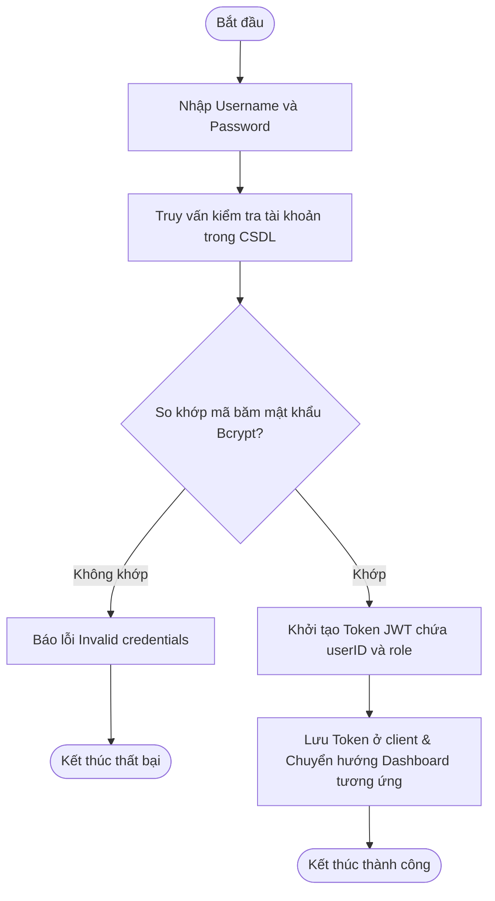
```mermaid
flowchart TD
    Start([Bắt đầu]) --> Input[Nhập Username và Password]
    Input --> DBCheck[Truy vấn kiểm tra tài khoản trong CSDL]
    DBCheck --> HashCheck{So khớp mã băm mật khẩu Bcrypt?}
    HashCheck -- Không khớp --> Error[Báo lỗi Invalid credentials] --> EndFail([Kết thúc thất bại])
    HashCheck -- Khớp --> TokenGen[Khởi tạo Token JWT chứa userID và role]
    TokenGen --> Redirect[Lưu Token ở client & Chuyển hướng Dashboard tương ứng]
    Redirect --> EndSuccess([Kết thúc thành công])
```

#### 6.3.2. UC-07: Sinh lịch tự động (Auto-scheduling)
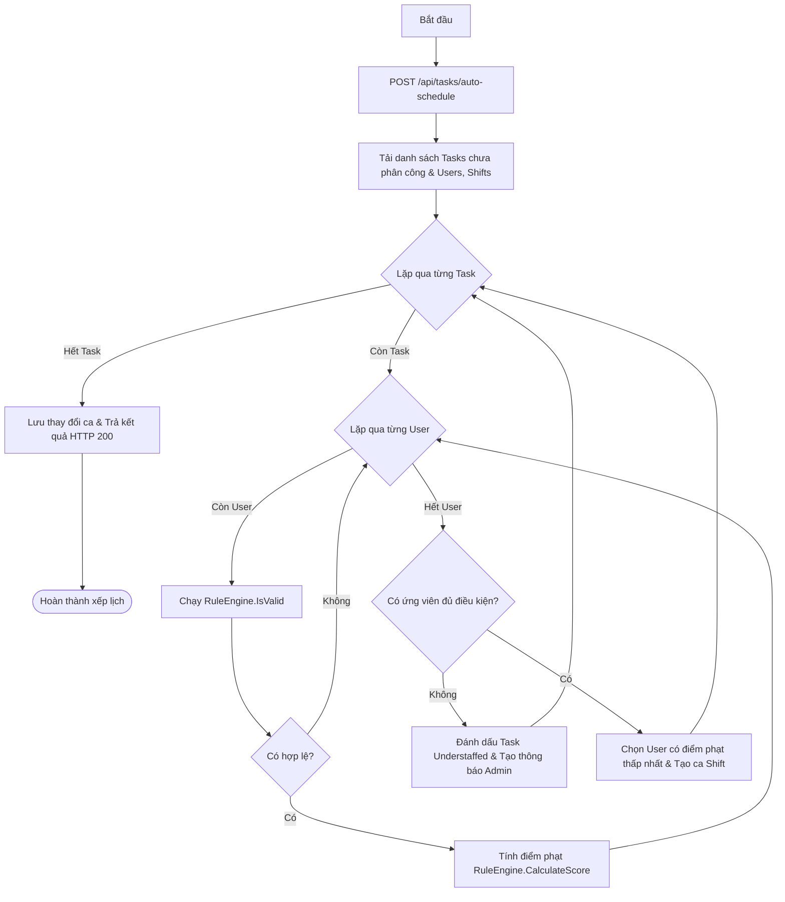
```mermaid
flowchart TD
    A[Bắt đầu] --> B[POST /api/tasks/auto-schedule]
    B --> C[Tải danh sách Tasks chưa phân công & Users, Shifts]
    C --> D{Lặp qua từng Task}
    D -->|Hết Task| E[Lưu thay đổi ca & Trả kết quả HTTP 200] --> F([Hoàn thành xếp lịch])
    D -->|Còn Task| G{Lặp qua từng User}
    G -->|Còn User| H[Chạy RuleEngine.IsValid]
    H --> I{Có hợp lệ?}
    I -->|Có| J[Tính điểm phạt RuleEngine.CalculateScore] --> G
    I -->|Không| G
    G -->|Hết User| K{Có ứng viên đủ điều kiện?}
    K -->|Không| L[Đánh dấu Task Understaffed & Tạo thông báo Admin] --> D
    K -->|Có| M[Chọn User có điểm phạt thấp nhất & Tạo ca Shift] --> D
```

#### 6.3.3. UC-09: Duyệt đổi ca & Auto-Swap
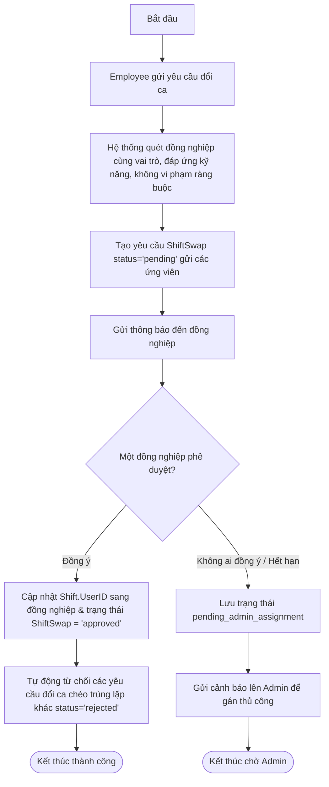
```mermaid
flowchart TD
    A[Bắt đầu] --> B[Employee gửi yêu cầu đổi ca]
    B --> C[Hệ thống quét đồng nghiệp cùng vai trò, đáp ứng kỹ năng, không vi phạm ràng buộc]
    C --> D[Tạo yêu cầu ShiftSwap status='pending' gửi các ứng viên]
    D --> E[Gửi thông báo đến đồng nghiệp]
    E --> F{Một đồng nghiệp phê duyệt?}
    F -- Đồng ý --> G[Cập nhật Shift.UserID sang đồng nghiệp & trạng thái ShiftSwap = 'approved']
    G --> H[Tự động từ chối các yêu cầu đổi ca chéo trùng lặp khác status='rejected']
    H --> I([Kết thúc thành công])
    F -- Không ai đồng ý / Hết hạn --> J[Lưu trạng thái pending_admin_assignment]
    J --> K[Gửi cảnh báo lên Admin để gán thủ công]
    K --> L([Kết thúc chờ Admin])
```

#### 6.3.4. UC-16: Gửi khai báo sức khỏe (Submit Health Declaration)
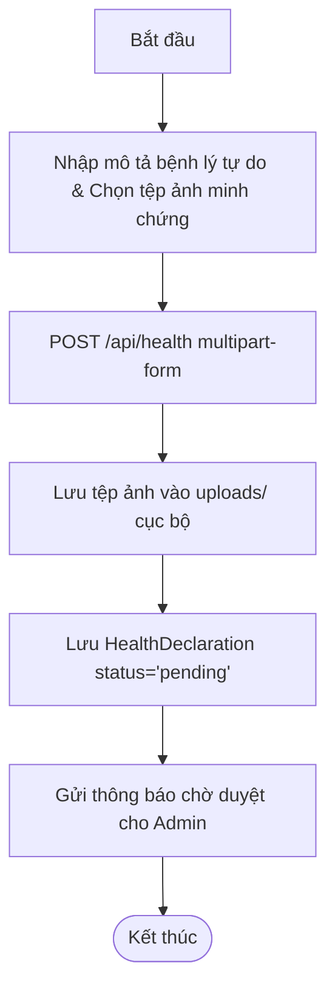
```mermaid
flowchart TD
    A[Bắt đầu] --> B[Nhập mô tả bệnh lý tự do & Chọn tệp ảnh minh chứng]
    B --> C[POST /api/health multipart-form]
    C --> D[Lưu tệp ảnh vào uploads/ cục bộ]
    D --> E[Lưu HealthDeclaration status='pending']
    E --> F[Gửi thông báo chờ duyệt cho Admin] --> G([Kết thúc])
```

#### 6.3.5. UC-17: Phê duyệt khai báo sức khỏe (Approve Health Declaration)
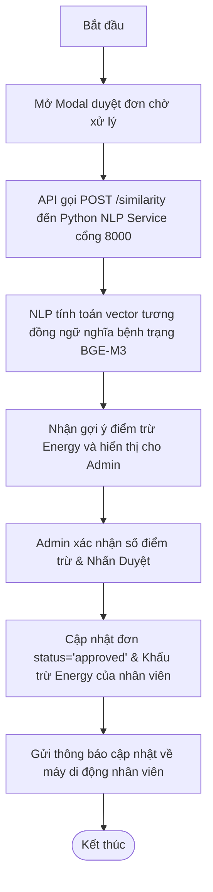
```mermaid
flowchart TD
    A[Bắt đầu] --> B[Mở Modal duyệt đơn chờ xử lý]
    B --> C[API gọi POST /similarity đến Python NLP Service cổng 8000]
    C --> D[NLP tính toán vector tương đồng ngữ nghĩa bệnh trạng BGE-M3]
    D --> E[Nhận gợi ý điểm trừ Energy và hiển thị cho Admin]
    E --> F[Admin xác nhận số điểm trừ & Nhấn Duyệt]
    F --> G[Cập nhật đơn status='approved' & Khấu trừ Energy của nhân viên]
    G --> H[Gửi thông báo cập nhật về máy di động nhân viên] --> I([Kết thúc])
```

#### 6.3.6. UC-19: Chấm công vào ca (Clock-In)
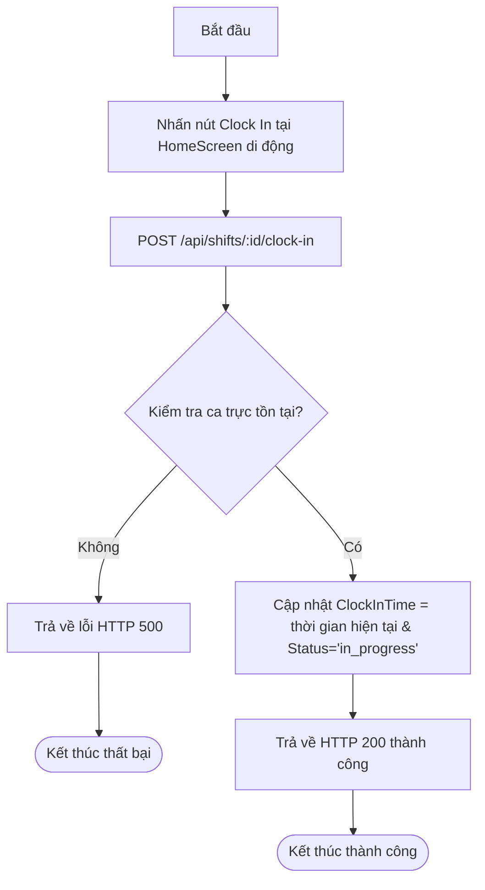
```mermaid
flowchart TD
    A[Bắt đầu] --> B[Nhấn nút Clock In tại HomeScreen di động]
    B --> C[POST /api/shifts/:id/clock-in]
    C --> D{Kiểm tra ca trực tồn tại?}
    D -- Không --> E[Trả về lỗi HTTP 500] --> F([Kết thúc thất bại])
    D -- Có --> G[Cập nhật ClockInTime = thời gian hiện tại & Status='in_progress']
    G --> H[Trả về HTTP 200 thành công] --> I([Kết thúc thành công])
```

#### 6.3.7. UC-20: Chấm công ra ca (Clock-Out)
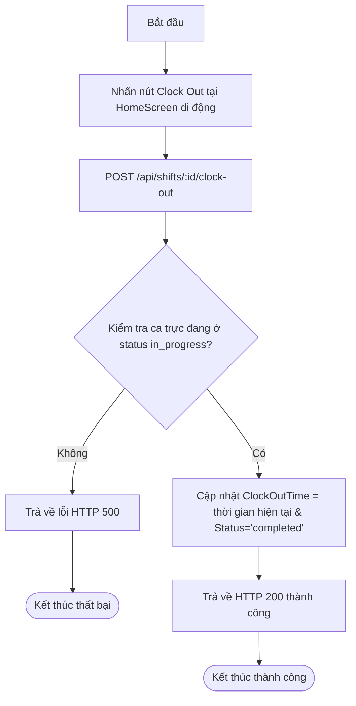
```mermaid
flowchart TD
    A[Bắt đầu] --> B[Nhấn nút Clock Out tại HomeScreen di động]
    B --> C[POST /api/shifts/:id/clock-out]
    C --> D{Kiểm tra ca trực đang ở status in_progress?}
    D -- Không --> E[Trả về lỗi HTTP 500] --> F([Kết thúc thất bại])
    D -- Có --> G[Cập nhật ClockOutTime = thời gian hiện tại & Status='completed']
    G --> H[Trả về HTTP 200 thành công] --> I([Kết thúc thành công])
```

#### 6.3.8. UC-22: Áp dụng gợi ý điều phối thông minh (Apply Coordination Suggestion)
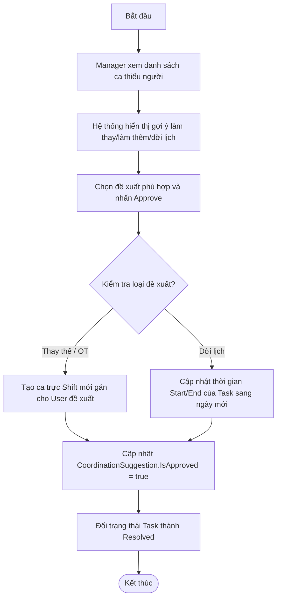
```mermaid
flowchart TD
    A[Bắt đầu] --> B[Manager xem danh sách ca thiếu người]
    B --> C[Hệ thống hiển thị gợi ý làm thay/làm thêm/dời lịch]
    C --> D[Chọn đề xuất phù hợp và nhấn Approve]
    D --> E{Kiểm tra loại đề xuất?}
    E -->|Thay thế / OT| F[Tạo ca trực Shift mới gán cho User đề xuất]
    E -->|Dời lịch| G[Cập nhật thời gian Start/End của Task sang ngày mới]
    F --> H[Cập nhật CoordinationSuggestion.IsApproved = true]
    G --> H
    H --> I[Đổi trạng thái Task thành Resolved] --> J([Kết thúc])
```

#### 6.3.9. UC-26: Tính toán và phê duyệt bảng lương (Calculate Payroll)
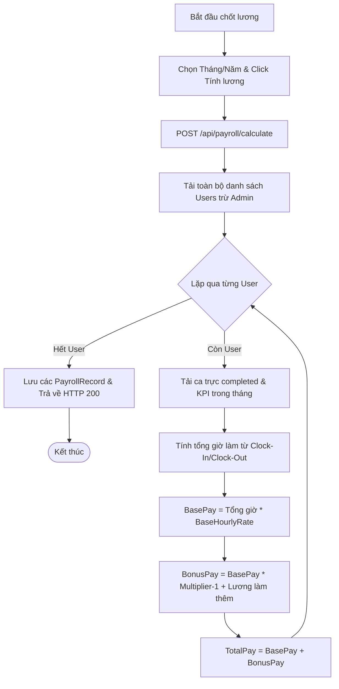
```mermaid
flowchart TD
    A[Bắt đầu chốt lương] --> B[Chọn Tháng/Năm & Click Tính lương]
    B --> C[POST /api/payroll/calculate]
    C --> D[Tải toàn bộ danh sách Users trừ Admin]
    D --> E{Lặp qua từng User}
    E -->|Hết User| F[Lưu các PayrollRecord & Trả về HTTP 200] --> G([Kết thúc])
    E -->|Còn User| H[Tải ca trực completed & KPI trong tháng]
    H --> I[Tính tổng giờ làm từ Clock-In/Clock-Out]
    I --> J[BasePay = Tổng giờ * BaseHourlyRate]
    J --> K[BonusPay = BasePay * Multiplier-1 + Lương làm thêm]
    K --> L[TotalPay = BasePay + BonusPay] --> E
```

### 6.4. Business Rules tổng hợp
1. **Quy tắc kiểm tra ca trực (Rule Engine)**:
   - Tránh trùng lặp thời gian làm việc của cùng một nhân viên trên mọi ca làm việc.
   - Khoảng cách thời gian trống giữa hai ca trực liên tiếp của một nhân sự tối thiểu phải là 11.0 giờ.
   - Tổng số giờ làm việc thực tế được gán trong một tuần của nhân viên không vượt quá 40 giờ.
2. **Quy tắc điều phối dựa trên điểm năng lượng (Energy Score)**:
   - Nhân viên có điểm Energy Score dưới 50 chỉ được phép gán tối đa 1 ca trực trong ngày.
   - Nhân viên có điểm Energy Score dưới 70 không được làm ca nặng (từ 2 ca/ngày) liên tiếp ở ngày tiếp theo, đồng thời bị giới hạn ca làm overtime tối đa 1 ca/tuần.
3. **Quy tắc đề xuất điểm trừ sức khỏe (AI NLP)**:
   - Hệ thống tự động so khớp ngữ nghĩa bệnh y khoa tiếng Việt. Nếu khớp từ khóa ưu tiên trong cài đặt hệ thống và đạt độ tương đồng từ 0.49 trở lên (ngưỡng BGE-M3), hệ thống sẽ đề xuất điểm trừ năng lượng cấu hình sẵn.
   - Cơ chế giới hạn (clamp) bảo vệ: Nếu điểm Energy Score hiện tại của nhân sự < 50 và điểm phạt đề xuất > 10, hệ thống tự động giới hạn mức phạt tối đa về 10. Nếu điểm Energy < 50 và điểm đề xuất từ 6 đến 10, tự động giới hạn mức phạt về 5.
4. **Quy tắc chấm công**:
   - Nhân viên chỉ được phép Clock-In khi ca trực ở trạng thái `scheduled` và thời gian hiện tại nằm trong khoảng thời gian cho phép của ca.
   - Thời gian Clock-Out bắt buộc phải sau Clock-In, ca trực sau khi Clock-Out sẽ chuyển trạng thái vĩnh viễn thành `completed` và không thể sửa đổi thời gian chấm công thêm.
5. **Quy tắc tính lương**:
   - Lương thực lĩnh = Lương cơ bản (Tổng giờ làm thực tế * Lương cơ bản theo giờ) + Thưởng hiệu suất (tính theo hệ số KPI tháng).
   - Không thực hiện tính toán bảng lương đối với tài khoản Admin của hệ thống.
6. **Quy tắc phê duyệt nghỉ phép**:
   - Khi đơn nghỉ phép được duyệt, hệ thống tự động hủy các ca trực bị trùng lịch trong khoảng thời gian nghỉ phép của nhân sự đó.

### 6.5. Lịch sử thay đổi tài liệu

| Phiên bản | Ngày | Nội dung thay đổi | Người thực hiện |
| :--- | :--- | :--- | :--- |
| **1.0** | 15/03/2026 | Khởi tạo tài liệu đặc tả yêu cầu phần mềm (SRS) ban đầu. | Trần Thị Thu Hường |
| **1.1** | 20/04/2026 | Đồng bộ hóa danh sách Use Case với ma trận và sơ đồ Use Case tuần 2. | Vũ Xuân Mai |
| **2.0** | 18/06/2026 | Tái cấu trúc toàn diện tài liệu theo bố cục chuẩn IEEE 830, bổ sung bảng thuật ngữ, bối cảnh hệ thống, ma trận ánh xạ UC-FR, và phụ lục. | Trần Thị Thu Hường |
