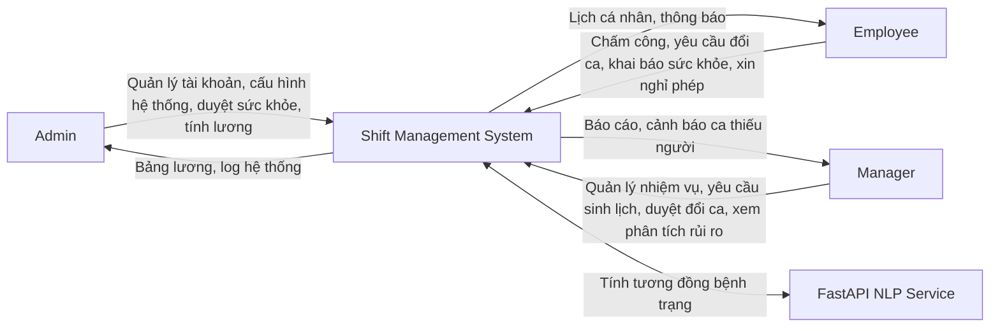

# SRS SRS Tuần 1 (Bản sửa đổi) - Hệ Thống Quản Lý Nhân Sự Theo Ca

## 1. Giới thiệu

### 1.1 Mục đích
Tài liệu SRS này xác định đầy đủ yêu cầu cho Hệ thống Quản lý Nhân sự theo ca, làm cơ sở thống nhất giữa nhóm phát triển và giảng viên về phạm vi, chức năng, chất lượng hệ thống và tiêu chí nghiệm thu. Bản sửa đổi này đồng bộ tài liệu đặc tả với mã nguồn thực tế của hệ thống.

### 1.2 Phạm vi
Hệ thống phục vụ doanh nghiệp có nhu cầu phân ca cho nhân viên; hỗ trợ lập lịch tự động dựa trên các ràng buộc cứng (vai trò, kỹ năng, thời gian nghỉ, giờ làm việc tối đa) và ràng buộc mềm sức khỏe (Energy Score), đồng thời cung cấp các công cụ chấm công, tính lương, đổi ca thông minh và điều phối phục hồi ca làm việc thiếu nhân sự.

### 1.3 Đối tượng sử dụng tài liệu
- Thành viên nhóm dự án
- Giảng viên hướng dẫn
- Người kiểm thử và đánh giá

### 1.4 Thuật ngữ
- Actor: Tác nhân tương tác trực tiếp với hệ thống.
- Use Case: Kịch bản nghiệp vụ.
- FR (Functional Requirement): Yêu cầu chức năng.
- NFR (Non-Functional Requirement): Yêu cầu phi chức năng.
- Energy Score: Điểm năng lượng đại diện cho mức độ sức khỏe của nhân viên (từ 0-100).
- Burnout Score: Điểm số đánh giá mức độ quá tải công việc của nhân viên.

---

## 2. Mô tả tổng thể hệ thống

### 2.1 Bối cảnh nghiệp vụ
Việc phân ca thủ công dễ gây trùng ca, mất cân bằng công việc và khó đảm bảo thời gian nghỉ ngơi hợp lý. Hệ thống được xây dựng nhằm tự động hóa việc phân ca, quản lý rủi ro kiệt sức của nhân viên thông qua điểm năng lượng, tự động phát hiện ca làm thiếu người và đề xuất các phương án tối ưu.

### 2.2 Mục tiêu hệ thống
- Tự động sinh lịch làm việc cân bằng tải và đúng kỹ năng.
- Hạn chế tối đa tình trạng kiệt sức của nhân viên bằng cách tích hợp quản lý sức khỏe và AI gợi ý.
- Hỗ trợ đổi ca thông minh và tự động điều phối nhân sự khi có sự cố thiếu người.
- Tự động chấm công và tính toán bảng lương hàng tháng dựa trên KPI.

### 2.3 Context Diagram
Hệ thống Shift Management System tương tác với các tác nhân con người thông qua giao tiếp API REST. Các dịch vụ như Lập lịch (Scheduler), Xác thực (Auth) và Thông báo (Notification) được tích hợp trực tiếp làm các hệ thống con bên trong ứng dụng chính. Dịch vụ AI/NLP xử lý nhúng ngữ nghĩa tiếng Việt hoạt động như một microservice phụ trợ.

```mermaid
flowchart LR
    A[Admin] -->|Quản lý tài khoản, cấu hình hệ thống, duyệt sức khỏe, tính lương| SMS[Shift Management System]
    M[Manager] -->|Quản lý nhiệm vụ, yêu cầu sinh lịch, duyệt đổi ca, xem phân tích rủi ro| SMS
    E[Employee] -->|Chấm công, yêu cầu đổi ca, khai báo sức khỏe, xin nghỉ phép| SMS
    
    SMS -->|Lịch cá nhân, thông báo| E
    SMS -->|Báo cáo, cảnh báo ca thiếu người| M
    SMS -->|Bảng lương, log hệ thống| A

    SMS <-->|Tính tương đồng bệnh trạng| NLP[FastAPI NLP Service]
```

### 2.4 Giả định và phụ thuộc
- Phía máy chủ cài đặt Go 1.25+ và Python 3.10+ (cho microservice NLP).
- Client web chạy trên trình duyệt hỗ trợ HTML5/Javascript.
- Client di động (Flutter) chạy trên thiết bị hệ điều hành iOS hoặc Android có camera để chụp ảnh bằng chứng.

### 2.5 Mô hình dữ liệu đề xuất
Mô hình dữ liệu quan hệ được triển khai trên SQLite bao gồm 13 bảng:
- `User`: Lưu thông tin tài khoản, vai trò (`admin`, `manager`, `employee`), `EnergyScore`, `SkillLevel`, `BaseHourlyRate`, `MaxWeeklyHours`.
- `Location`: Địa điểm/phòng ban làm việc.
- `Shift`: Ca làm việc thực tế (liên kết User, Location, Task).
- `Task`: Công việc cần làm (yêu cầu vai trò, kỹ năng, số lượng headcount, mô hình Sequential/Parallel).
- `SystemSetting`: Cài đặt thời gian nghỉ tối thiểu, ca sáng/chiều, các ngưỡng sức khỏe.
- `ShiftSwap`: Lưu yêu cầu đổi ca và trạng thái xét duyệt.
- `HealthDeclaration`: Tờ khai sức khỏe và đường dẫn ảnh minh chứng (`ProofFile`).
- `KnownCondition`: Danh mục bệnh và số điểm trừ năng lượng tương ứng.
- `CoordinationSuggestion`: Đề xuất điều phối (thay thế, đổi lịch, làm thêm).
- `UserKPI`: Điểm hiệu suất KPI tháng.
- `PayrollRecord`: Bảng lương chi tiết hàng tháng của nhân viên.
- `Notification`: Nhật ký thông báo người dùng.

---

## 3. Actor

### 3.1 Actor chính
- **Admin**: Quản trị viên hệ thống có toàn quyền quản trị dữ liệu, thiết lập cấu hình, duyệt sức khỏe, tính lương và xử lý đổi ca thủ công.
- **Manager**: Quản lý vận hành có quyền quản lý công việc (Task), chạy tự động xếp lịch, theo dõi rủi ro kiệt sức của nhân viên.
- **Employee**: Nhân viên thực hiện xem lịch, chấm công vào/ra ca, gửi yêu cầu đổi ca, khai báo bệnh trạng và gửi đơn xin nghỉ phép.

### 3.2 Hệ thống phụ trợ (Microservice)
- **FastAPI NLP Service**: Microservice phụ trợ tính toán độ tương đồng ngữ nghĩa để tự động ánh xạ bệnh trạng của nhân viên sang điểm trừ năng lượng.

---

## 4. Use Case

### 4.1 Quản trị & Cấu hình
- **UC-01**: Đăng nhập (Admin, Manager, Employee)
- **UC-02**: Quản lý nhân viên (Admin)
- **UC-03**: `[ĐÃ HỦY - Thay bằng UC-18]`
- **UC-04**: Thiết lập ca (Admin, Manager)
- **UC-05**: Thiết lập ràng buộc (Admin, Manager)
- **UC-06**: `[ĐÃ HỦY - Lập lịch trực tiếp theo mốc thời gian Task]`

### 4.2 Lập lịch & Điều phối
- **UC-07**: Sinh lịch tự động (Manager, Admin)
- **UC-08**: Chỉnh sửa lịch thủ công (Manager, Admin)
- **UC-09**: Duyệt đổi ca (Employee, Manager, Admin)
- **UC-10**: Xem lịch tổng (Admin, Manager)
- **UC-11**: Xem báo cáo kiệt sức (Admin, Manager)
- **UC-12**: `[ĐÃ HỦY - Thay bằng Import/Export CSV ở UC-29]`

### 4.3 Nhân viên & Vận hành
- **UC-13**: Xem lịch cá nhân (Employee)
- **UC-14**: Gửi yêu cầu đổi ca (Employee)
- **UC-15**: Nhận thông báo (Employee, Manager, Admin)

### 4.4 Các Use Case mới bổ sung (Đồng bộ Code)
- **UC-16**: Gửi khai báo sức khỏe (Employee)
- **UC-17**: Phê duyệt khai báo sức khỏe (Admin)
- **UC-18**: Cấu hình danh mục bệnh trạng đã biết (Admin)
- **UC-19**: Chấm công vào ca - Clock-In (Employee)
- **UC-20**: Chấm công ra ca - Clock-Out (Employee)
- **UC-21**: Xem các tác vụ thiếu nhân sự - Understaffed Tasks (Manager, Admin)
- **UC-22**: Áp dụng gợi ý điều phối thông minh (Manager, Admin)
- **UC-23**: Xem báo cáo rủi ro nghỉ việc - Attrition Risks (Manager, Admin)
- **UC-24**: Truy vấn gợi ý nhân sự dự phòng - Succession Planning (Manager, Admin)
- **UC-25**: Chấm điểm KPI hiệu suất (Manager, Admin)
- **UC-26**: Tính toán và phê duyệt bảng lương (Admin)
- **UC-27**: Gửi yêu cầu nghỉ phép - Time-Off Request (Employee)
- **UC-28**: Phê duyệt đơn nghỉ phép (Admin)
- **UC-29**: Import/Export dữ liệu qua CSV (Admin, Manager)

---

## 5. Yêu cầu chức năng

### 5.1 Xác thực và phân quyền
- **FR-01**: Hệ thống phải xác thực người dùng khi đăng nhập bằng tài khoản và mật khẩu thông qua mã token JWT.
- **FR-02**: Hệ thống phải phân quyền truy cập chặt chẽ theo 3 vai trò: Admin, Manager, Employee.

### 5.2 Quản lý nhân sự và địa điểm
- **FR-03**: Hệ thống phải cho phép Admin quản lý thông tin nhân viên (Thêm, Sửa, Xóa, Xem danh sách).
- **FR-04**: `[ĐÃ HỦY - Thay bằng quản lý thông tin Địa điểm Location trong DB]`

### 5.3 Quản lý ca làm việc và Thiết lập hệ thống
- **FR-05**: Hệ thống phải cho phép Manager/Admin tạo và quản lý các ca làm việc thực tế.
- **FR-06**: Hệ thống phải cho phép cấu hình các tham số hệ thống (Giờ làm ca tối đa, thời gian nghỉ tối thiểu, giờ ca sáng/chiều, các ngưỡng sức khỏe).
- **FR-07**: `[ĐÃ HỦY - Hệ thống phân ca trực tiếp dựa trên thời gian của Task]`

### 5.4 Lập lịch tự động và thủ công
- **FR-08**: Hệ thống phải tự động phân ca cho nhân sự khi kích hoạt sinh lịch tự động dựa trên thuật toán tối ưu hóa.
- **FR-09**: Hệ thống phải ngăn chặn việc phân ca trùng lặp thời gian cho cùng một nhân sự.
- **FR-10**: Hệ thống phải đảm bảo nhân sự có thời gian nghỉ tối thiểu giữa 2 ca làm việc liên tiếp.
- **FR-11**: Hệ thống phải cân bằng giờ làm việc hàng tuần giữa các nhân sự phù hợp.
- **FR-12**: Hệ thống phải cho phép Manager/Admin sửa đổi, điều chỉnh ca làm việc hoặc xóa ca làm việc thủ công.

### 5.5 Vận hành và Trao đổi ca
- **FR-13**: Hệ thống phải hiển thị lịch làm việc cá nhân cho Employee trên thiết bị Web và Mobile.
- **FR-14**: Hệ thống phải hỗ trợ nhân viên gửi yêu cầu đổi ca và tự động tìm kiếm đồng nghiệp phù hợp (Auto-Swap).
- **FR-15**: Hệ thống phải cho phép nhân viên được yêu cầu xác nhận đồng ý/từ chối đổi ca, hoặc cho phép Admin chỉ định đổi ca thủ công (Assign Swap) nếu không tìm thấy ứng viên tự động.
- **FR-16**: Hệ thống phải tự động lưu nhật ký lịch sử các thao tác quan trọng.
- **FR-17**: Hệ thống phải gửi thông báo thời gian thực khi nhân viên có thay đổi về ca làm hoặc có yêu cầu đổi ca cần xử lý.
- **FR-18**: `[ĐÃ HỦY - Thay thế bằng tính năng phân tích kiệt sức FR-31]`
- **FR-19**: `[ĐÃ HỦY - Thay thế bằng Import/Export dữ liệu CSV FR-36]`

### 5.6 Các yêu cầu chức năng mới bổ sung (Đồng bộ Code)
- **FR-20 (Clock-In)**: Hệ thống phải cho phép nhân viên chấm công vào ca thực tế (lưu thời gian bắt đầu).
- **FR-21 (Clock-Out)**: Hệ thống phải cho phép nhân viên chấm công ra ca thực tế (lưu thời gian kết thúc) để tính giờ làm.
- **FR-22 (Khai báo sức khỏe)**: Hệ thống phải cho phép nhân viên khai báo sức khỏe và tải lên hình ảnh minh chứng.
- **FR-23 (Phân tích ngữ nghĩa bệnh bằng AI)**: Hệ thống phải gọi dịch vụ NLP để tính độ tương đồng ngữ nghĩa giữa văn bản khai báo tự do của nhân viên và danh mục từ khóa bệnh.
- **FR-24 (Gợi ý điểm trừ sức khỏe)**: Hệ thống phải gợi ý điểm trừ năng lượng tự động dựa trên kết quả phân tích tương đồng của AI.
- **FR-25 (Ràng buộc sức khỏe yếu)**: Bộ máy xếp lịch phải giới hạn tối đa 1 ca làm/ngày nếu nhân viên có điểm năng lượng (Energy Score) dưới 50.
- **FR-26 (Ràng buộc sức khỏe trung bình)**: Bộ máy xếp lịch phải áp dụng nghỉ bù sau ngày làm ca nặng (2+ ca) và giới hạn làm thêm tối đa 1 ca/tuần nếu nhân viên có điểm năng lượng dưới 70.
- **FR-27 (Điểm phạt cân bằng tải)**: Thuật toán xếp lịch phải cộng điểm phạt (penalty) dựa trên số giờ đã làm trong tuần của nhân viên để ưu tiên người có giờ làm ít hơn.
- **FR-28 (Tránh lãng phí kỹ năng)**: Thuật toán xếp ca phải phạt nặng (1000 điểm phạt/cấp) đối với nhân viên có kỹ năng vượt trội so với yêu cầu của nhiệm vụ đơn giản để dành họ cho nhiệm vụ phức tạp hơn.
- **FR-29 (Tự động phát hiện ca thiếu người)**: Hệ thống phải tự động quét và đánh giá trạng thái ca làm việc là `Understaffed` nếu số lượng nhân sự thực tế bằng 0 trong khi headcount yêu cầu lớn hơn 0.
- **FR-30 (Đề xuất khôi phục ca thiếu)**: Hệ thống phải tự động đề xuất người làm thay rảnh rỗi, cho phép làm thêm giờ (chỉ áp dụng đối với công việc có mức độ khẩn cấp `High` hoặc `Critical`), hoặc dời lịch làm việc sang ngày hôm sau.
- **FR-31 (Phân tích kiệt sức)**: Hệ thống phải tính toán điểm kiệt sức (Burnout Score) của nhân viên dựa trên tỷ lệ giờ làm thêm của họ.
- **FR-32 (Nhân sự dự phòng)**: Hệ thống phải gợi ý danh sách tối đa 3 nhân sự dự phòng phù hợp có điểm kiệt sức thấp nhất để thay thế khi cần.
- **FR-33 (Chấm điểm hiệu suất KPI)**: Hệ thống phải cho phép chấm điểm hiệu suất KPI hàng tháng của nhân viên để làm cơ sở nhân lương.
- **FR-34 (Tính toán bảng lương)**: Hệ thống phải tự động tổng hợp giờ làm thực tế từ chấm công, nhân với lương cơ bản của nhân viên và áp dụng hệ số KPI kèm tiền làm thêm giờ để tính lương tháng.
- **FR-35 (Xin nghỉ phép)**: Hệ thống phải hỗ trợ nhân viên nộp đơn xin nghỉ phép và hiển thị danh sách chờ duyệt cho Admin phê duyệt hoặc từ chối.
- **FR-36 (Import/Export CSV)**: Hệ thống phải hỗ trợ xuất dữ liệu ca làm việc ra file CSV và nhập danh sách người dùng/ca làm việc hàng loạt từ file CSV mẫu.

---

## 6. Yêu cầu phi chức năng

### 6.1 Bảo mật
- Mật khẩu người dùng phải được mã hóa một chiều bằng thuật toán Bcrypt.
- Hệ thống phải kiểm tra tính hợp lệ của JWT token trước khi xử lý yêu cầu API.
- Tải file bằng chứng sức khỏe lên thư mục được phân quyền bảo mật riêng biệt.

### 6.2 Hiệu năng
- Thời gian phản hồi cho các truy vấn dữ liệu thông thường dưới 3 giây.
- Thiết lập giới hạn kết nối SQLite tối đa 100 kết nối mở đồng thời và 10 kết nối rảnh để tránh tắc nghẽn giao dịch khi ghi cơ sở dữ liệu.

### 6.3 Khả dụng
- Hoạt động ổn định trên cả giao diện Web và ứng dụng di động di động kết nối mạng nội bộ.
- Xử lý mượt mà việc upload file đính kèm dưới dạng multipart-form dữ liệu.

### 6.4 Dễ sử dụng
- Giao diện Web hiển thị lịch trực quan bằng lưới lịch màu sắc phân biệt trạng thái.
- Hệ thống thông báo tự động (Notification Bell) hiển thị cảnh báo tức thì ngay trên trang quản trị.

---

## 7. Quy tắc nghiệp vụ
- **BR-01**: Nhân viên không làm trùng giờ.
- **BR-02**: Nghỉ ngơi tối thiểu 11 giờ giữa các ca làm việc liên tiếp.
- **BR-03**: Giới hạn tối đa giờ làm việc trong tuần của nhân viên (mặc định 40 giờ).
- **BR-04**: Điều chỉnh lịch ca làm tự động dựa trên Điểm năng lượng (Energy Score) và mức độ kiệt sức của nhân viên.
- **BR-05**: Công thức tính lương tháng: Lương thực nhận = Lương cơ bản + Lương làm thêm + Thưởng hiệu suất (tính theo hệ số KPI).

---

## 8. Ràng buộc hệ thống
- Database SQLite yêu cầu thực hiện khóa tuần tự đối với các lệnh ghi nên toàn bộ thao tác tự động xếp lịch lớn phải được thiết kế tối ưu và tránh khóa chết (deadlock).
- Microservice NLP phải hoạt động trực tuyến tại cổng 8000 để phục vụ tính điểm tương đồng.
- Nhân viên di động chỉ có thể chấm công vào ca và ra ca khi đã xác thực tài khoản thành công trên thiết bị di động.
