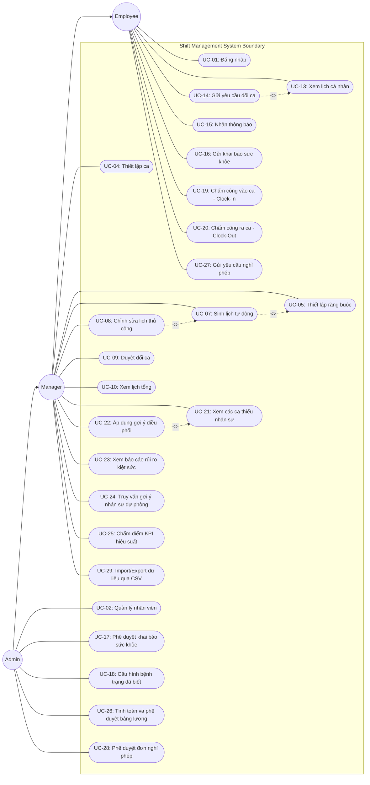
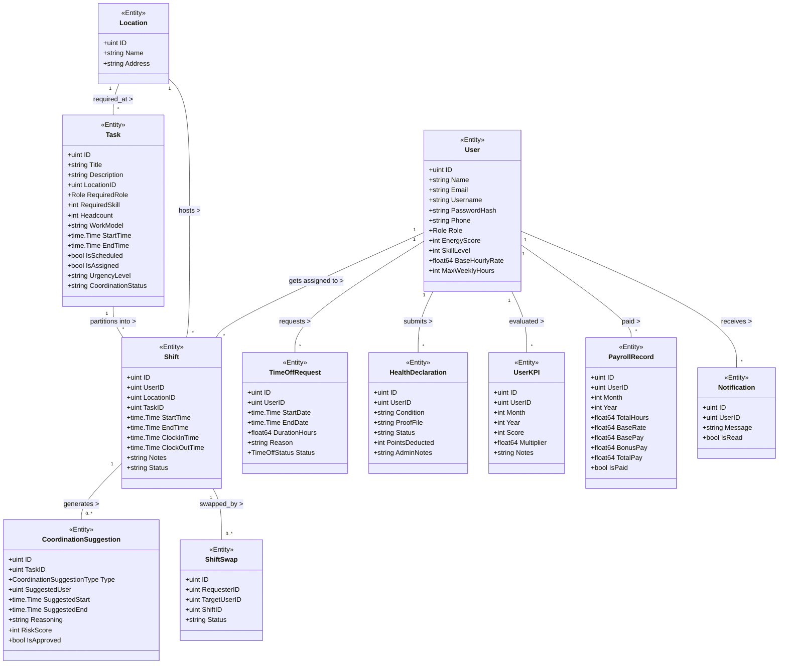
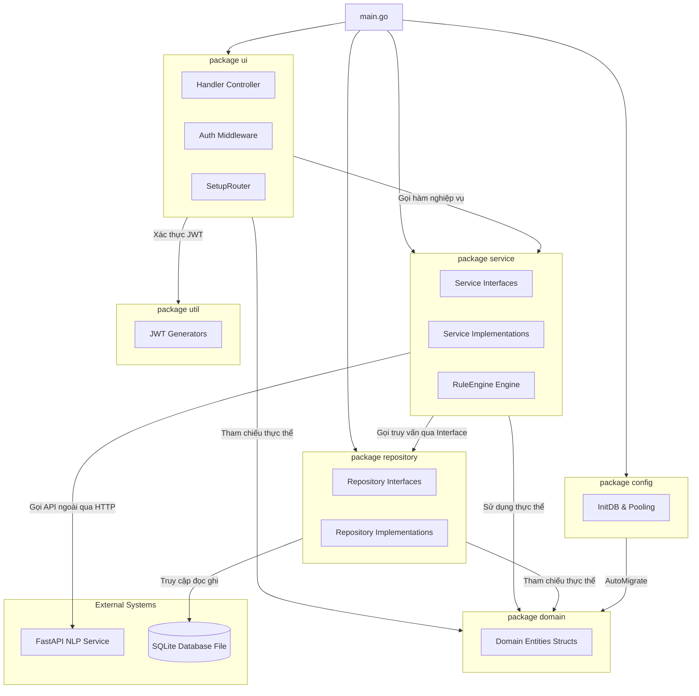

# Báo Cáo Tổng Kết Dự Án (Final Report) - Tuần 10

**Dự án:** Hệ thống Quản lý Nhân sự Theo Ca (Shift Management System)  
**Học phần:** Phân tích & Thiết kế Phần mềm  
**Ngôn ngữ triển khai:** Golang Backend, React Web Frontend, Flutter Mobile App, Python FastAPI NLP Service  

---

## 1. Giới thiệu (Introduction)

### 1.1. Bối cảnh dự án
Trong vận hành doanh nghiệp sản xuất, dịch vụ hoặc bán lẻ, việc sắp xếp ca làm việc cho nhân viên thủ công thường gặp nhiều khó khăn như: dễ gây trùng lịch, vi phạm quy định về giờ nghỉ ngơi tối thiểu giữa các ca làm việc, và mất cân bằng tải công việc. Hơn thế nữa, các hệ thống ERP truyền thống thường bỏ qua yếu tố sức khỏe thể chất và tinh thần của người lao động. Dự án **Hệ thống Quản lý Nhân sự Theo Ca** được phát triển nhằm tự động hóa việc lập lịch ca trực tối ưu, bảo vệ sức khỏe nhân viên bằng cơ chế AI chấm điểm năng lượng và hỗ trợ vận hành linh hoạt qua các ứng dụng đa nền tảng.

### 1.2. Mục tiêu hệ thống
*   **Lập lịch thông minh**: Tự động sinh lịch trực cho nhân sự dựa trên ràng buộc kỹ năng, vai trò và cân bằng tải công việc.
*   **Bảo vệ sức khỏe**: Tích hợp các thuật toán giảm ca gánh vác khi điểm năng lượng (Energy Score) của nhân viên suy giảm.
*   **Vận hành linh hoạt**: Cung cấp khả năng chấm công, đổi ca tự động (Auto-Swap), xin nghỉ phép và cảnh báo khẩn cấp khi thiếu nhân sự.

### 1.3. Thành viên dự án và Phân công công việc
Dự án được xây dựng và hoàn thiện bởi sự đóng góp chuyên môn của 3 thành viên:
*   **Vũ Xuân Mai (Chuyên trách Phát triển Cốt lõi và Bảo mật Hệ thống)**: Chịu trách nhiệm viết toàn bộ mã nguồn chính (Code), xây dựng kiến trúc kỹ thuật và thực hiện kiểm thử bảo mật chuyên sâu, đảm bảo sự ổn định và an toàn cho toàn bộ hệ thống.
*   **Trần Thị Thu Hường (Đảm bảo Chất lượng, Giám sát Vận hành & Quản lý Tài liệu)**: Đảm nhận vai trò Kiểm thử viên (Tester), thực hiện kiểm thử toàn diện các tính năng, đồng thời chịu trách nhiệm chính trong việc soạn thảo Báo cáo tổng kết dự án và viết/hoàn thiện tất cả các tài liệu của dự án từ tuần 1 đến tuần 10.
*   **Nguyễn Thị Thương (Thiết kế Giao diện và Nâng cấp Trải nghiệm Người dùng)**: Phụ trách Thiết kế giao diện trực quan (UI), nghiên cứu và tìm hiểu các phương án nâng cấp trải nghiệm người dùng (UX), và giám sát sự đồng bộ của thiết kế trong quá trình phát triển.

| Thành viên | Vai trò | Nhiệm vụ cụ thể | Trạng thái | Ghi chú |
| :--- | :--- | :--- | :--- | :--- |
| **Vũ Xuân Mai** | Chuyên trách Phát triển Cốt lõi và Bảo mật Hệ thống | - Phát triển và viết toàn bộ mã nguồn hệ thống (Golang Backend, React Web, Flutter Mobile, FastAPI NLP). - Xây dựng kiến trúc kỹ thuật và thiết lập cơ sở dữ liệu SQLite. - Thực hiện kiểm thử đơn vị, kiểm thử bảo mật chuyên sâu. | **Hoàn thành** | Phụ trách toàn bộ phần lập trình (Code) |
| **Trần Thị Thu Hường** | Đảm bảo Chất lượng, Giám sát Vận hành & Quản lý Tài liệu | - Soạn thảo và hoàn thiện Báo cáo tổng kết dự án (Final Report). - Soạn thảo và chịu trách nhiệm làm tất cả các tài liệu tuần (Weeks 1 - 10). - Thực hiện kiểm thử toàn diện các tính năng (Tester), thu thập dữ liệu và giám sát hiệu suất sản phẩm. | **Hoàn thành** | Phụ trách Báo cáo, Tài liệu & Kiểm thử |
| **Nguyễn Thị Thương** | Thiết kế Giao diện và Nâng cấp Trải nghiệm Người dùng | - Thiết kế giao diện trực quan (UI Mockup, Wireframe, Figma Prototype). - Nghiên cứu và tìm hiểu các phương án nâng cấp trải nghiệm người dùng (UX). - Giám sát sự đồng bộ của thiết kế trong quá trình phát triển. | **Hoàn thành** | Phụ trách Thiết kế UI/UX |

---

## 2. Phân tích Yêu cầu (Requirement Analysis)

Hệ thống được thiết kế và đồng bộ hóa với 36 yêu cầu chức năng (Functional Requirements - FR) và 5 yêu cầu phi chức năng (Non-Functional Requirements - NFR) cốt lõi:

### 2.1. Yêu cầu chức năng tiêu biểu
*   **FR-01 & FR-02 (Xác thực & RBAC)**: Đăng nhập bằng tài khoản/mật khẩu cấp JWT và phân quyền 3 vai trò: `admin`, `manager`, `employee`.
*   **FR-08 (Sinh lịch tự động)**: Tự động phân ca cho các nhiệm vụ dựa trên Rule Engine.
*   **FR-10 (Ràng buộc nghỉ ngơi)**: Nhân viên phải có ít nhất 11.0 giờ nghỉ ngơi giữa 2 ca làm việc liên tiếp.
*   **FR-14 & FR-15 (Đổi ca)**: Hỗ trợ nộp đơn đổi ca, tự động tìm kiếm người thay thế (Auto-Swap) hoặc chỉ định đổi ca thủ công (Assign Swap).
*   **FR-22 & FR-23 (AI Health)**: Khai báo sức khỏe bằng mô tả tiếng Việt và hình ảnh minh chứng. Dịch vụ AI NLP tự động khớp bệnh trạng và đề xuất điểm trừ năng lượng.
*   **FR-25 & FR-26 (Giới hạn sức khỏe)**: Nhân sự sức khỏe yếu (Energy Score < 50) tối đa làm 1 ca/ngày. Nhân sự sức khỏe trung bình (< 70) không làm ca nặng liên tiếp và bị giới hạn ca làm thêm giờ.
*   **FR-29 & FR-30 (Điều phối ca thiếu)**: Phát hiện ca thiếu người (`Understaffed`), tự động đề xuất phương án thay thế, làm thêm giờ hoặc dời lịch nhiệm vụ.
*   **FR-31 & FR-32 (Phân tích rủi ro)**: Tính Burnout Score dựa trên giờ làm thêm và gợi ý tối đa 3 nhân sự dự bị phù hợp.
*   **FR-34 & FR-35 (KPI & Lương)**: Đánh giá KPI tháng và tự động chốt bảng lương tổng hợp dựa trên chấm công thực tế.

---

## 3. Mô hình hóa Ca sử dụng (Use Case Modeling)

Hệ thống bao gồm 29 ca sử dụng chính (Use Cases - UC), phân bổ tương ứng cho 3 tác nhân (Actors) chính và 1 hệ thống phụ trợ:

### 3.1. Các Tác nhân (Actors)
1.  **Admin (Quản trị viên)**: Toàn quyền quản trị dữ liệu nhân sự, cấu hình ngưỡng hệ thống, duyệt tờ khai sức khỏe y khoa, duyệt đơn xin nghỉ phép và chốt tính lương.
2.  **Manager (Quản lý)**: Quản lý danh sách nhiệm vụ (Tasks), kích hoạt thuật toán sinh lịch tự động, theo dõi báo cáo kiệt sức và điều phối phục hồi ca thiếu người.
3.  **Employee (Nhân viên)**: Xem lịch biểu cá nhân, thực hiện chấm công vào/ra ca (Clock-In/Out), gửi yêu cầu đổi ca, gửi tờ khai bệnh và nộp đơn xin nghỉ phép.
4.  **FastAPI NLP Service**: Microservice hỗ trợ tính điểm tương đồng ngữ nghĩa bệnh lý.

### 3.2. Sơ đồ Use Case tổng quát

> **Nguồn:** [UseCase_Diagram_Tuan_2.md](file:///d:/Workspace/TBDD/shift-management-system/docs/week2/UseCase_Diagram_Tuan_2.md) | Đặc tả kịch bản chi tiết: [UseCase_Scenarios_Tuan_2.md](file:///d:/Workspace/TBDD/shift-management-system/docs/week2/UseCase_Scenarios_Tuan_2.md)

---

## 4. Thiết kế Hướng đối tượng (Object-Oriented Design)

Thiết kế cấu trúc tĩnh của hệ thống bao gồm 13 thực thể chính kết nối cơ sở dữ liệu quan hệ SQLite:

*   **User**: Đại diện cho tài khoản nhân sự với các thuộc tính kỹ năng, tiền lương và điểm năng lượng.
*   **Shift**: Ca làm việc cụ thể gán cho một nhân viên tại một thời điểm nhất định.
*   **Task**: Nhiệm vụ công việc cần thực hiện (yêu cầu định biên headcount, kỹ năng tối thiểu và mô hình Sequential/Parallel).
*   **Location**: Chi nhánh/địa điểm làm việc của ca trực.
*   **SystemSetting**: Ngưỡng rest time tối thiểu, ca sáng/chiều, ngưỡng điểm sức khỏe yếu/trung bình.
*   **TimeOffRequest**: Yêu cầu nghỉ phép của nhân viên.
*   **HealthDeclaration**: Đơn báo bệnh kèm đường dẫn file minh chứng.
*   **KnownCondition**: Danh mục bệnh lý định cấu hình sẵn và điểm trừ mặc định.
*   **CoordinationSuggestion**: Đề xuất điều phối ca thiếu người sinh từ AI.
*   **UserKPI**: Đánh giá hiệu suất tháng của nhân viên.
*   **PayrollRecord**: Bản ghi chốt bảng lương tổng hợp cuối tháng.
*   **Notification**: Nhật ký thông báo người dùng.
*   **ShiftSwap**: Đơn đề nghị trao đổi ca làm việc.

> **Nguồn:** [Class_Diagram.md](file:///d:/Workspace/TBDD/shift-management-system/docs/week3/Class_Diagram.md)

---

## 5. Thiết kế Tương tác (Interaction Design)

Thiết kế tương tác giữa các phân tầng được đặc tả thông qua các biểu đồ trình tự (Sequence Diagrams) tuân thủ mô hình phân tầng thực tế của hệ thống:  
**Actor** $\rightarrow$ **UI** $\rightarrow$ **Router (`router.go`)** $\rightarrow$ **Handler (`handlers.go`)** $\rightarrow$ **Service** $\rightarrow$ **Repository** $\rightarrow$ **Database (SQLite)**.

Tài liệu [Sequence_Diagram.md](file:///d:/Workspace/TBDD/shift-management-system/docs/week4/Sequence_Diagram.md) đặc tả các biểu đồ trình tự động cho các luồng nghiệp vụ cốt lõi:
1.  **UC-01 (Đăng nhập)**: Luồng kiểm tra thông tin Bcrypt và trả về Token JWT.
2.  **UC-07 (Sinh lịch tự động)**: Quy trình sinh ca nháp kết hợp kiểm tra Rule Engine.
3.  **UC-16/17 (Khai báo sức khỏe AI)**: Luồng gửi tờ khai, gọi API ngoài FastAPI NLP để tính SuggestedPoints và Admin xác duyệt.
4.  **UC-19/20 (Chấm công)**: Ghi nhận thời gian Clock-In/Clock-Out và cập nhật trạng thái ca trực `in_progress` / `completed`.

Chi tiết giao diện mockup và đặc tả trường dữ liệu được tài liệu hóa tại [UI_Mockup.md](file:///d:/Workspace/TBDD/shift-management-system/docs/week4/UI_Mockup.md).

---

## 6. Thiết kế Hành vi (Behavioral Design)

Hành vi động của hệ thống được mô hình hóa thông qua 2 loại sơ đồ chính:

### 6.1. Sơ đồ Máy Trạng thái (State Machine Diagrams)
Đặc tả vòng đời chuyển dịch trạng thái của các thực thể cốt lõi:
*   **Shift**: `scheduled` $\rightarrow$ `assigned` $\rightarrow$ `in_progress` $\rightarrow$ `completed` / `cancelled`.
*   **ShiftSwap**: `pending` $\rightarrow$ `pending_admin_assignment` $\rightarrow$ `approved` / `rejected`.
*   **HealthDeclaration**: `pending` $\rightarrow$ `approved` / `rejected`.
*   **TimeOffRequest**: `pending` $\rightarrow$ `approved` / `denied`.
*   **CoordinationSuggestion**: `unapproved` $\rightarrow$ `approved`.

Tất cả các sơ đồ máy trạng thái được tài liệu hóa chi tiết tại [State_Machine_Diagram.md](file:///d:/Workspace/TBDD/shift-management-system/docs/week5/State_Machine_Diagram.md).

### 6.2. Sơ đồ Hoạt động (Activity Diagrams)
Mô tả quy trình nghiệp vụ liên thông qua các phân tầng (swimlanes):
*   Luồng sinh lịch tự động dựa trên Rule Engine.
*   Luồng khai báo và xét duyệt sức khỏe AI NLP.
*   Luồng chấm công vào ca/ra ca thực tế.
*   Luồng tính toán chốt bảng lương tổng hợp cuối tháng.

Tất cả các sơ đồ hoạt động và bảng ánh xạ nghiệp vụ được tài liệu hóa tại [Activity_Diagram.md](file:///d:/Workspace/TBDD/shift-management-system/docs/week5/Activity_Diagram.md).

---

## 7. Kiến trúc và Mẫu Thiết kế (Architecture and Design Patterns)

### 7.1. Kiến trúc phân rã gói (Package Diagram)
Hệ thống tuân thủ mô hình Kiến trúc phân tầng 3 lớp (3-Tier Layered Architecture) được thiết kế tách biệt và phụ thuộc tuyến tính từ trên xuống:
`ui (Presentation)` $\rightarrow$ `service (Business Logic)` $\rightarrow$ `repository (Data Access)` $\rightarrow$ `domain (Shared Entities)`.

> **Nguồn:** [Package_Diagram.md](file:///d:/Workspace/TBDD/shift-management-system/docs/week6/Package_Diagram.md)

### 7.2. Các Mẫu thiết kế áp dụng trong mã nguồn (Design Patterns)
1.  **Repository Pattern**: Khai báo các Interfaces trừu tượng kết nối cơ sở dữ liệu tại [Interfaces_Design.md](file:///d:/Workspace/TBDD/shift-management-system/docs/week6/Interfaces_Design.md) và triển khai cụ thể bằng GORM SQLite tại `repository/*.go`.
2.  **Dependency Injection (DI)**: Các Services nhận Repositories thông qua hàm Constructor (Constructor Injection) và được ráp nối tập trung tại `main.go`.

Chi tiết mô tả mã nguồn, lợi ích và sơ đồ UML của các mẫu thiết kế được tài liệu hóa tại [Design_Patterns.md](file:///d:/Workspace/TBDD/shift-management-system/docs/week7/Design_Patterns.md).

---

## 8. Hiện thực hóa hệ thống (Implementation)

Cấu trúc phân rã thư mục của dự án Golang phản ánh chính xác thiết kế đóng gói:
*   `main.go`: Khởi chạy hệ thống, cấu hình tiêm phụ thuộc DI.
*   `config/`: Cấu hình cơ sở dữ liệu SQLite và thiết lập Connection Pooling.
*   `domain/`: Định nghĩa các cấu trúc Go Structs đại diện cho Schema dữ liệu.
*   `repository/`: Triển khai đọc/ghi dữ liệu thông qua GORM.
*   `service/`: Xử lý nghiệp vụ logic, tính toán điểm số và gọi API NLP.
*   `ui/`: Quản lý các route API bằng Gin-Gonic và các middleware xác thực JWT.

---

## 9. Kiểm thử (Testing)

### 9.1. Kiểm thử Đơn vị (Unit Testing)
Nhóm đã triển khai thực thi 10 ca kiểm thử đơn vị (Unit Test Cases) kiểm tra tính đúng đắn của các cấu phần logic nghiệp vụ (Rule Engine, xác thực mật khẩu, công thức tính toán lương KPI). Kết quả đạt tỷ lệ thành công **100% (Passed 10/10)**. Chi tiết ca kiểm thử và báo cáo lỗi/độ bao phủ xem tại [Unit_Test_Cases.md](file:///d:/Workspace/TBDD/shift-management-system/docs/week10/Unit_Test_Cases.md) và [Unit_Test_Report.md](file:///d:/Workspace/TBDD/shift-management-system/docs/week10/Unit_Test_Report.md).

### 9.2. Kiểm thử Tích hợp (Integration Testing)
Thực thi 10 kịch bản kiểm thử tích hợp (IT-01 đến IT-10) bao trùm các luồng giao tiếp giữa React/Flutter Clients, Go Backend Server, Python NLP Service, và cơ sở dữ liệu SQLite. Kết quả đạt trạng thái **PASS** cho toàn bộ các luồng nghiệp vụ. Chi tiết xem tại [Integration_Test.md](file:///d:/Workspace/TBDD/shift-management-system/docs/week9/Integration_Test.md).

---

## 10. Kết luận (Conclusion)

### 10.1. Kết quả đạt được
*   Xây dựng thành công hệ thống lập lịch ca trực tự động kết hợp cân bằng sức khỏe nhân sự.
*   Thiết kế hệ thống tài liệu mạch lạc, đồng bộ chặt chẽ với cấu trúc mã nguồn thực tế và tuân thủ các quy tắc thiết kế hướng đối tượng tốt (SOLID, Loose Coupling).
*   Tính năng tích hợp AI NLP tiếng Việt hoạt động ổn định giúp tự động hóa quy trình duyệt đơn sức khỏe của nhân viên.

### 10.2. Hướng phát triển tương lai
*   Nâng cấp cơ chế xác thực từ phi trạng thái (Stateless JWT) sang cơ chế quản lý trạng thái phiên làm việc (Session-based Stateful Authentication) lưu trữ phía máy chủ kết hợp cookie để nâng cao tính kiểm soát và an toàn bảo mật.
*   Tối ưu thuật toán sinh lịch tự động Rule Engine để hỗ trợ lập ca trực song song với lượng dữ liệu nhân sự lớn hơn.

---

## 11. Phụ lục (Appendix)

*   [docs/week1/SRS.md](file:///d:/Workspace/TBDD/shift-management-system/docs/week1/SRS.md): Tài liệu đặc tả yêu cầu phần mềm.
*   [docs/week2/UseCase_Scenarios_Tuan_2.md](file:///d:/Workspace/TBDD/shift-management-system/docs/week2/UseCase_Scenarios_Tuan_2.md): Đặc tả kịch bản Use Cases chi tiết.
*   [docs/week3/Class_Diagram.md](file:///d:/Workspace/TBDD/shift-management-system/docs/week3/Class_Diagram.md): Sơ đồ UML Class Diagram.
*   [docs/week3/Code_Skeleton.md](file:///d:/Workspace/TBDD/shift-management-system/docs/week3/Code_Skeleton.md): Đặc tả cấu trúc mã nguồn.
*   [docs/week4/Sequence_Diagram.md](file:///d:/Workspace/TBDD/shift-management-system/docs/week4/Sequence_Diagram.md): Thiết kế biểu đồ trình tự động.
*   [docs/week4/UI_Mockup.md](file:///d:/Workspace/TBDD/shift-management-system/docs/week4/UI_Mockup.md): Đặc tả giao diện màn hình.
*   [docs/week5/State_Machine_Diagram.md](file:///d:/Workspace/TBDD/shift-management-system/docs/week5/State_Machine_Diagram.md): Thiết kế máy trạng thái.
*   [docs/week5/Activity_Diagram.md](file:///d:/Workspace/TBDD/shift-management-system/docs/week5/Activity_Diagram.md): Quy trình nghiệp vụ.
*   [docs/week6/Package_Diagram.md](file:///d:/Workspace/TBDD/shift-management-system/docs/week6/Package_Diagram.md): Kiến trúc đóng gói & phân tầng.
*   [docs/week6/Interfaces_Design.md](file:///d:/Workspace/TBDD/shift-management-system/docs/week6/Interfaces_Design.md): Giao diện lớp nghiệp vụ và dữ liệu.
*   [docs/week7/Design_Patterns.md](file:///d:/Workspace/TBDD/shift-management-system/docs/week7/Design_Patterns.md): Đặc tả mẫu thiết kế.
*   [docs/week8/Core_Features.md](file:///d:/Workspace/TBDD/shift-management-system/docs/week8/Core_Features.md): Tính năng cốt lõi.
*   [docs/week8/Feature_Code_Mapping.md](file:///d:/Workspace/TBDD/shift-management-system/docs/week8/Feature_Code_Mapping.md): Ma trận truy vết yêu cầu.
*   [docs/week9/Integration_Design.md](file:///d:/Workspace/TBDD/shift-management-system/docs/week9/Integration_Design.md): Tài liệu thiết kế tích hợp.
*   [docs/week9/Integration_Test.md](file:///d:/Workspace/TBDD/shift-management-system/docs/week9/Integration_Test.md): Nhật ký kiểm thử tích hợp.
