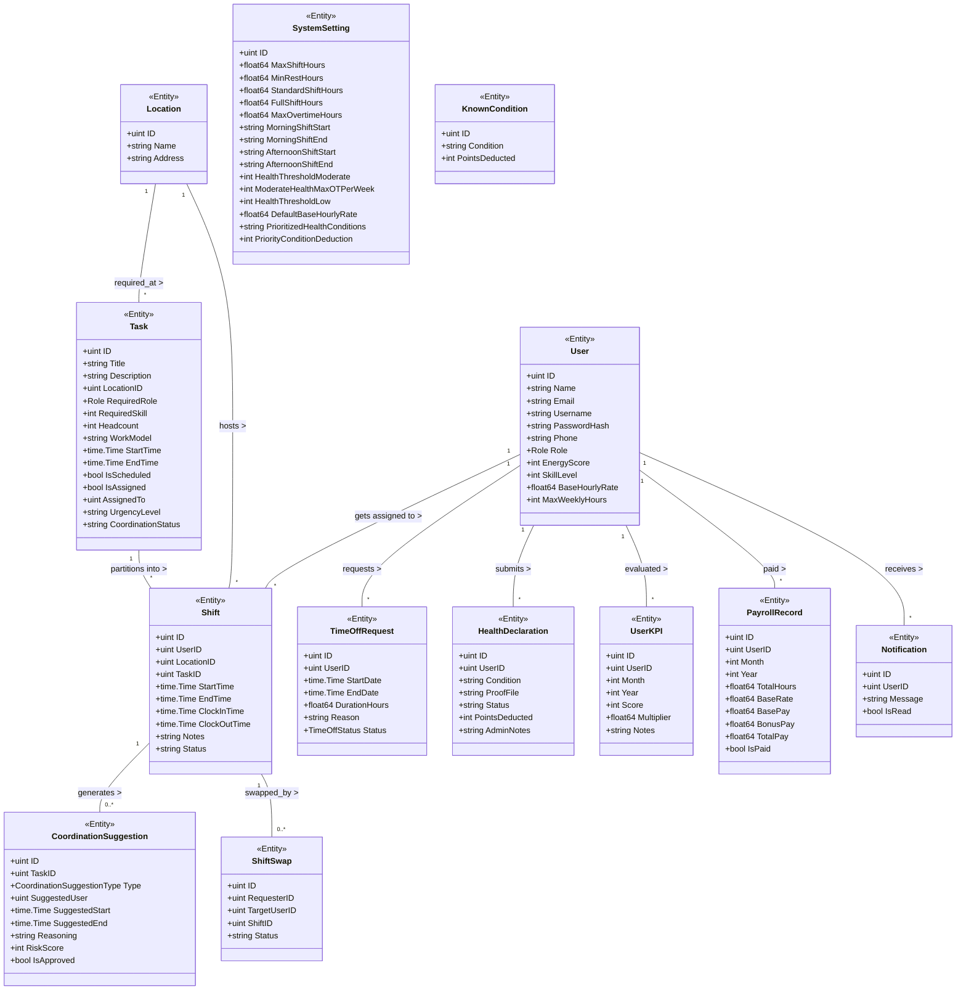

# Thiết Kế Sơ Đồ Lớp UML (Class Diagram) - Tuần 3

Tài liệu này chứa sơ đồ lớp tĩnh (UML Class Diagram) và các đặc tả về mối quan hệ giữa các lớp thực thể trong hệ thống.

---

## 1. Sơ đồ UML Class Diagram (Mermaid)

Sơ đồ dưới đây minh họa cấu trúc các lớp thực thể trong tầng Domain và mối quan hệ liên kết (multiplicity) giữa chúng:

---

## 2. Relationship Descriptions

Mô tả ngữ nghĩa các mối quan hệ liên kết giữa các lớp thực thể chính:

*   **User $\rightarrow$ Shift (Association - Liên kết)**: Một nhân sự (`User`) liên kết với danh sách các ca làm việc (`Shift`) được xếp lịch thông qua mã khóa ngoại `UserID`. Một nhân sự có thể tham gia nhiều ca trực, nhưng mỗi ca trực tại một thời điểm chỉ thuộc quyền sở hữu của một nhân sự.
*   **Location $\rightarrow$ Shift (Aggregation - Tập hợp)**: Một địa điểm/phòng ban (`Location`) tập hợp nhiều ca làm việc (`Shift`) thực thi tại đó thông qua `LocationID`. Khi một ca trực bị xóa, địa điểm làm việc vẫn tồn tại độc lập trong hệ thống.
*   **User $\rightarrow$ TimeOffRequest (Composition - Thành phần)**: Một tài khoản nhân viên sở hữu các đơn xin nghỉ phép của họ. Đây là mối quan hệ phụ thuộc tồn tại (Life-dependency); nếu nhân viên bị xóa khỏi hệ thống, toàn bộ lịch sử đơn xin nghỉ phép của họ cũng bị xóa theo.
*   **Task $\rightarrow$ Shift (Association - Liên kết)**: Một nhiệm vụ công việc (`Task`) được hệ thống chia nhỏ (phân hoạch) thành một hoặc nhiều ca trực (`Shift`) tùy thuộc vào định biên (`Headcount`) và mô hình xếp ca (`Sequential/Parallel`).
*   **Shift $\rightarrow$ CoordinationSuggestion (Association - Liên kết)**: Khi một ca trực bị thiếu nhân sự (do nghỉ phép hoặc đổi ca thất bại), hệ thống tự động sinh ra các gợi ý điều phối thay thế (`CoordinationSuggestion`) liên kết với ca làm việc đó.
*   **Shift $\rightarrow$ ShiftSwap (Association - Liên kết)**: Một ca làm việc sắp diễn ra có thể được đưa vào luồng yêu cầu trao đổi ca (`ShiftSwap`) giữa người sở hữu hiện tại và đồng nghiệp tiềm năng.

---

## 3. Multiplicity Rules

Bội số (Multiplicity) trong thiết kế cơ sở dữ liệu quy định số lượng phiên bản thực thể tham gia vào mối liên kết:

*   **User (1) $\rightarrow$ Shift (0..\*)**: Một nhân viên có thể không có ca trực nào được xếp trong tuần, hoặc có tối đa nhiều ca làm việc khác nhau nhưng phải tuân thủ ràng buộc về giờ nghỉ ngơi tối thiểu giữa 2 ca liên tiếp.
*   **User (1) $\rightarrow$ TimeOffRequest (0..\*)**: Một nhân viên có thể gửi nhiều đơn xin nghỉ phép khác nhau theo thời gian, hoặc không gửi đơn nào nếu đi làm đầy đủ.
*   **User (1) $\rightarrow$ HealthDeclaration (0..\*)**: Nhân sự có thể gửi nhiều tờ khai báo bệnh lý kèm hình ảnh chứng nhận sức khỏe khi có sự cố ốm đau đột xuất.
*   **Location (1) $\rightarrow$ Shift (0..\*)**: Một địa điểm làm việc/chi nhánh có thể tổ chức nhiều ca trực cho nhiều nhân viên, hoặc tạm thời không có ca trực nào được xếp lịch.
*   **Location (1) $\rightarrow$ Task (0..\*)**: Một địa điểm có thể yêu cầu thực hiện nhiều nhiệm vụ khác nhau, hoặc không có nhiệm vụ nào phát sinh.
*   **Task (1) $\rightarrow$ Shift (1..\*)**: Một nhiệm vụ luôn cần tối thiểu một hoặc nhiều ca trực con được tạo ra tương ứng để đáp ứng mục tiêu định biên nhân sự (`Headcount >= 1`).
*   **Shift (1) $\rightarrow$ ShiftSwap (0..\*)**: Một ca làm việc tại một thời điểm có thể không có yêu cầu đổi ca nào, hoặc có nhiều đồng nghiệp cùng nhận được lời mời đổi ca đồng thời (`pending`).
