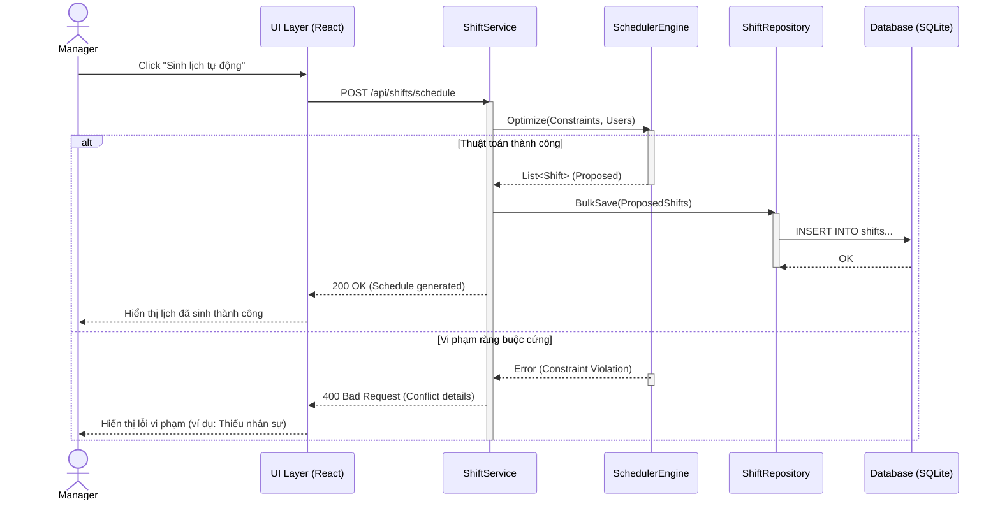
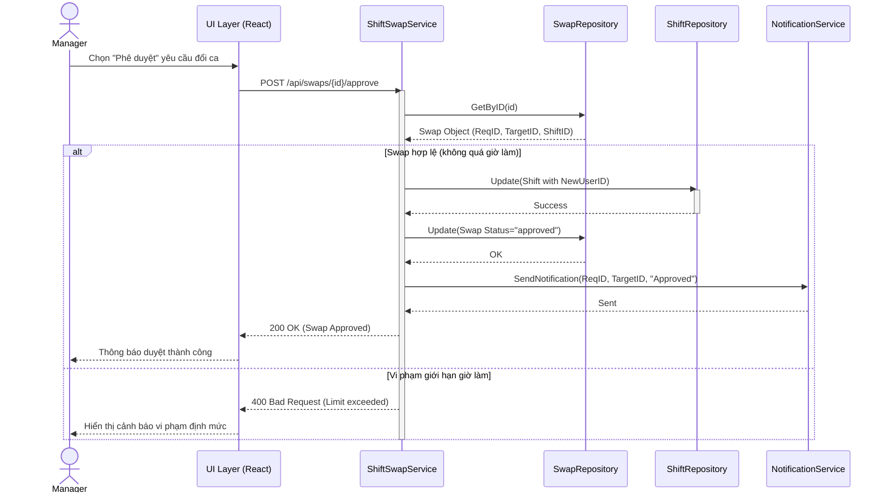
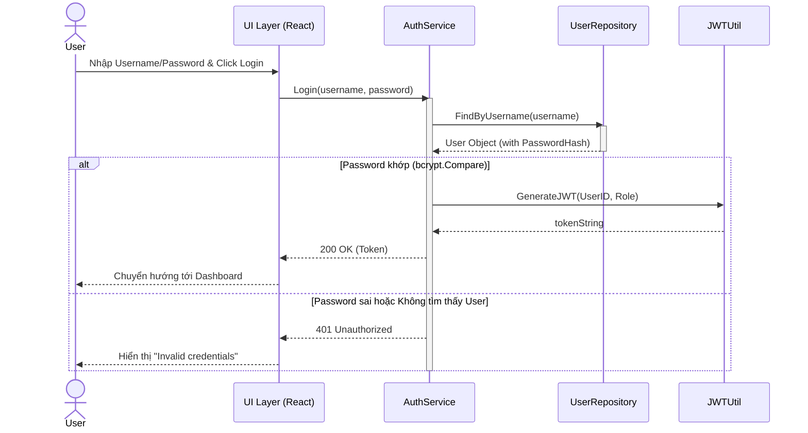
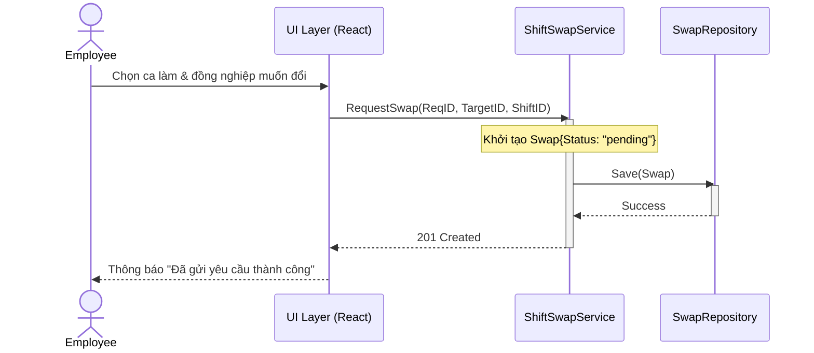
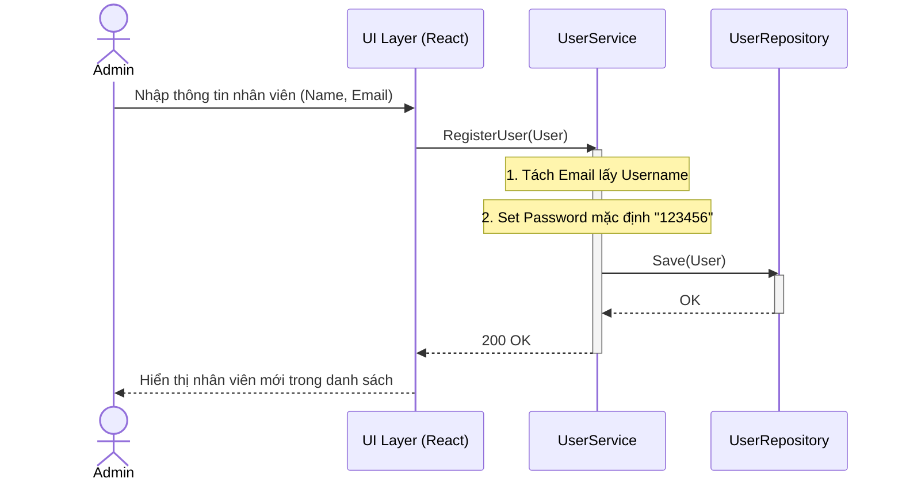
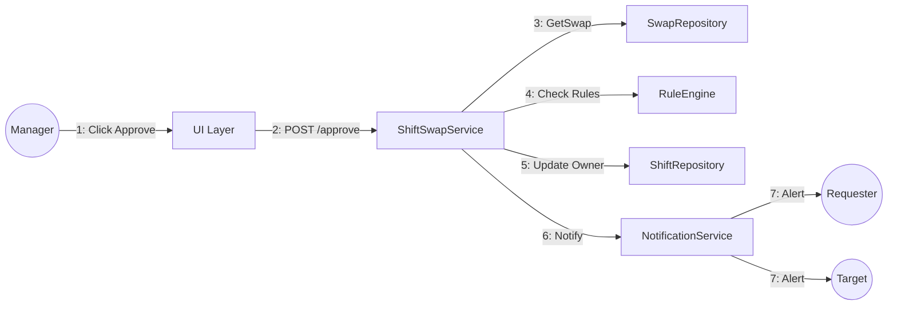

# Tài Liệu Thiết Kế Tương Tác & Giao Diện - Tuần 4

## 1. Biểu đồ Trình tự (Sequence Diagram)

### 1.1. UC-07: Sinh lịch tự động
Mô tả luồng tương tác khi Quản lý yêu cầu hệ thống tự động sắp xếp lịch dựa trên các ràng buộc.

### 1.2. UC-09: Duyệt đổi ca
Mô tả quy trình phê duyệt yêu cầu đổi ca giữa hai nhân viên.

### 1.3. UC-01: Đăng nhập
Mô tả quy trình xác thực người dùng dựa trên `AuthService.Login`.

### 1.4. UC-14: Gửi yêu cầu đổi ca
Mô tả luồng nhân viên gửi yêu cầu đổi ca thông qua `ShiftSwapService.RequestSwap`.

### 1.5. UC-02: Đăng ký nhân viên (Quản lý nhân sự)
Mô tả logic xử lý khi Admin thêm nhân viên mới qua `UserService.RegisterUser`.

## 2. Biểu đồ Cộng tác (Communication Diagram)
Sơ đồ mô tả mạng lưới kết nối giữa các đối tượng để hoàn thành chức năng **Duyệt đổi ca (UC-09)**.

## 3. Thiết kế Giao diện (UI Mockups)

### 3.1. Màn hình Đăng nhập (Login)

*Giao diện đăng nhập bảo mật (Secure Login) với thiết kế tối giản, tập trung vào trải nghiệm người dùng.*

### 3.2. Bảng điều khiển Quản lý (Admin Dashboard)

*Giao diện quản trị trung tâm bao gồm:*
- **Sidebar Điều hướng**: Truy cập nhanh vào Task Needs, Calendar, Team Members, Swap Requests.
- **Schedule Shift**: Form gán ca nhanh cho nhân viên (Select Employee, Start/End Time).
- **Upcoming Shifts**: Danh sách các ca làm việc sắp tới với trạng thái 'Scheduled' rõ ràng.
- **AI & Analytics**: Tích hợp phân tích rủi ro nghỉ việc (Attrition Risk) và kế hoạch kế nhiệm (Succession Plan).

### 3.3. Lịch cá nhân Nhân viên (Employee Schedule)

### 3.4. Form yêu cầu đổi ca (Swap Request)

### 3.5. Báo cáo & Phân tích rủi ro (Analytics Dashboard)

*Giao diện cung cấp cái nhìn về tỷ lệ nghỉ việc (Attrition) và gợi ý nhân sự thay thế (Backup Planning).*

## 4. Đánh giá tính nhất quán (Review)
- **Review Class Diagram**: Đã đối soát Sequence Diagram với mã nguồn thực tế tại `service/interfaces.go` và `repository/`. Các phương thức như `ScheduleShift`, `ApproveSwap`, `AssignUser` đã được bổ sung đầy đủ vào tài liệu Tuần 3 để đảm bảo tính khớp nối 100%.
- **UX/UI**: Hệ thống xử lý lỗi đồng bộ từ Backend lên Frontend (thể hiện qua các khối `alt` trong Sequence Diagram và các trạng thái thông báo trên Mockup).
