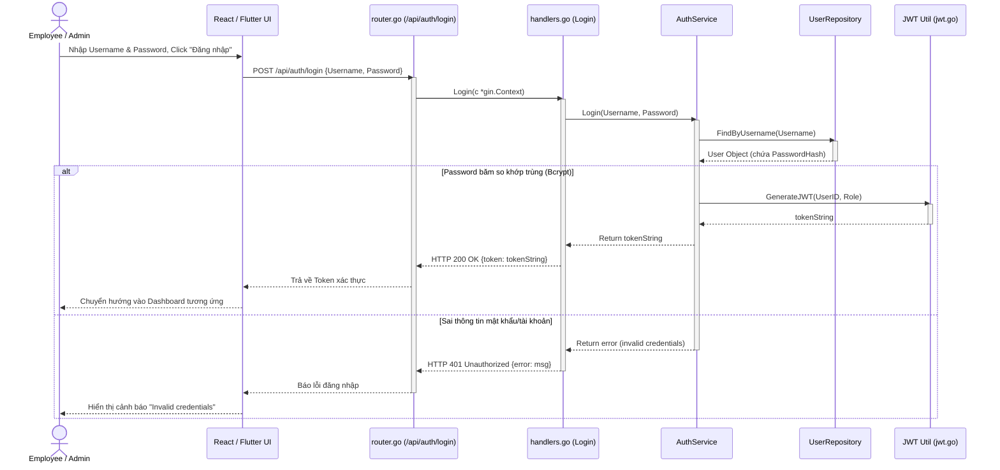
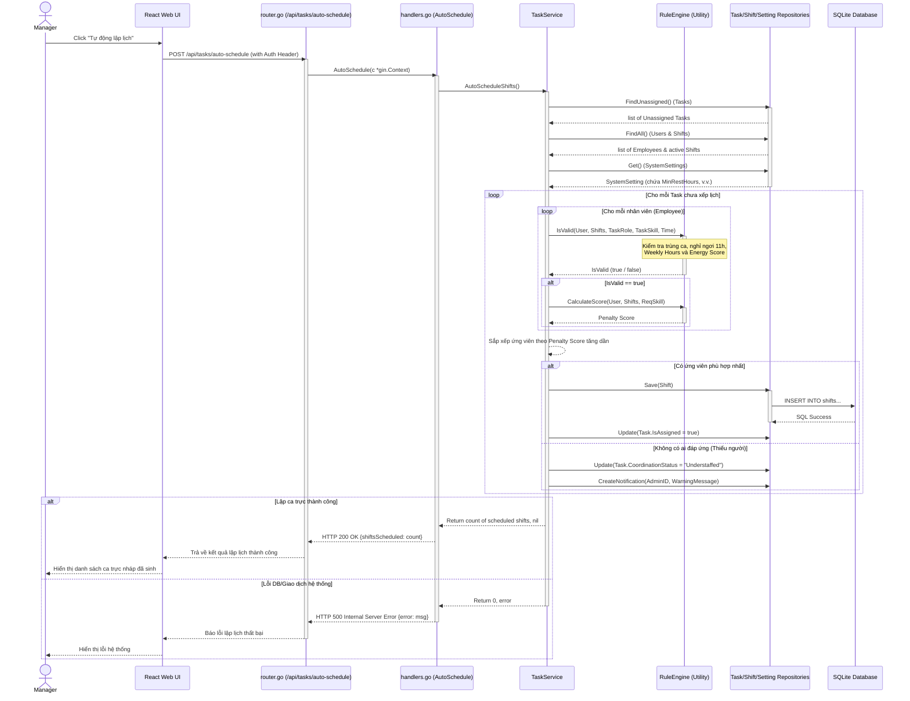
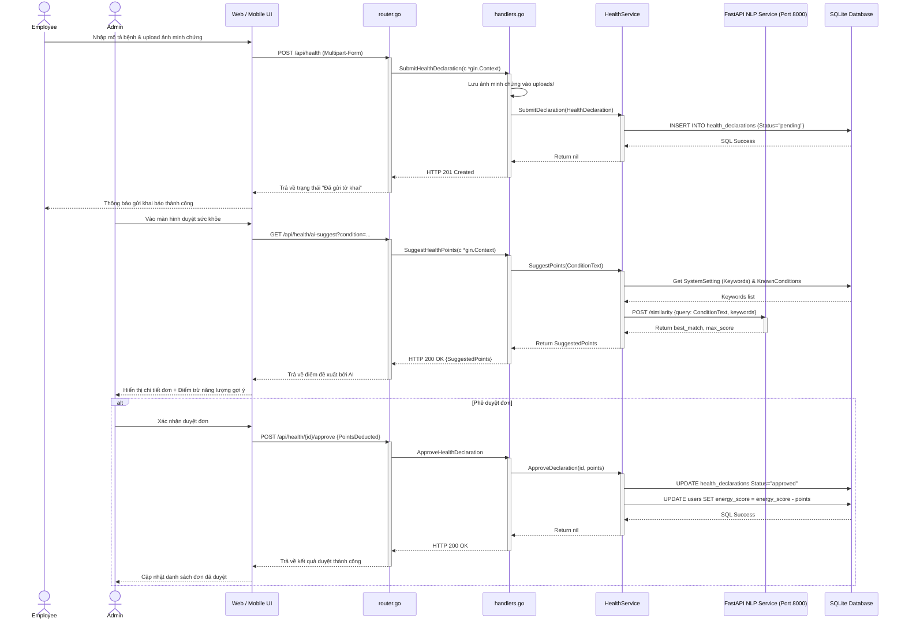
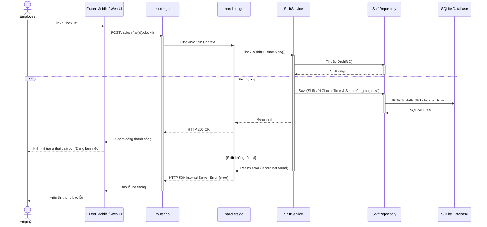

# Thiết Kế Biểu Đồ Trình Tự (Sequence Diagrams) - Tuần 4

Tài liệu này đặc tả chi tiết thiết kế tương tác giữa các phân tầng (Sequence Diagrams) cho các chức năng hoạt động thực tế trong hệ thống.

---

## 1. Biểu đồ Trình tự (Sequence Diagrams)

Tất cả các biểu đồ trình tự dưới đây tuân thủ nghiêm ngặt mô hình phân tầng thực tế của hệ thống:  
**Actor** $\rightarrow$ **UI (React Web / Flutter Mobile)** $\rightarrow$ **Router (`router.go`)** $\rightarrow$ **Handler (`handlers.go`)** $\rightarrow$ **Service** $\rightarrow$ **Repository** $\rightarrow$ **Database (SQLite)**.

### 1.1. UC-01: Đăng nhập (Login)
*   **Mục đích**: Người dùng đăng nhập hệ thống để nhận Token xác thực JWT.
*   **Đường dẫn file liên quan**:
    *   Router: [ui/router.go#L19](file:///d:/Workspace/TBDD/shift-management-system/ui/router.go#L19)
    *   Handler: [ui/handlers.go#L308-L323](file:///d:/Workspace/TBDD/shift-management-system/ui/handlers.go#L308-L323)
    *   Service: [service/auth_service.go](file:///d:/Workspace/TBDD/shift-management-system/service/auth_service.go)

---

### 1.2. UC-07: Sinh lịch tự động (Auto Schedule Shifts)
*   **Mục đích**: Tự động tạo và phân bổ ca làm việc tối ưu dựa trên Rule Engine.
*   **Đường dẫn file liên quan**:
    *   Router: [ui/router.go#L43](file:///d:/Workspace/TBDD/shift-management-system/ui/router.go#L43)
    *   Handler: [ui/handlers.go#L268-L276](file:///d:/Workspace/TBDD/shift-management-system/ui/handlers.go#L268-L276)
    *   Service: [service/task_service.go#L99-L317](file:///d:/Workspace/TBDD/shift-management-system/service/task_service.go#L99-L317)
    *   Rule Engine: [service/rule_engine.go](file:///d:/Workspace/TBDD/shift-management-system/service/rule_engine.go)

---

### 1.3. UC-16 & UC-17: Khai báo sức khỏe & Xét duyệt AI (Health Declaration with NLP analysis)
*   **Mục đích**: Nhân viên khai báo bệnh, hệ thống tự động so khớp ngữ nghĩa bằng AI NLP để gợi ý điểm trừ sức khỏe và Admin thực hiện phê duyệt.
*   **Đường dẫn file liên quan**:
    *   Router: [ui/router.go#L60-L64](file:///d:/Workspace/TBDD/shift-management-system/ui/router.go#L60-L64)
    *   Handler: [ui/handlers.go#L505-L536](file:///d:/Workspace/TBDD/shift-management-system/ui/handlers.go#L505-L536), [ui/handlers.go#L578-L621](file:///d:/Workspace/TBDD/shift-management-system/ui/handlers.go#L578-L621)
    *   Service: [service/health_service.go](file:///d:/Workspace/TBDD/shift-management-system/service/health_service.go)
    *   NLP Microservice: [nlp-service/main.py](file:///d:/Workspace/TBDD/shift-management-system/nlp-service/main.py)

---

### 1.4. UC-19 & UC-20: Chấm công (Clock-In / Clock-Out)
*   **Mục đích**: Nhân viên chấm công bắt đầu làm việc và kết thúc ca làm để làm cơ sở tính lương.
*   **Đường dẫn file liên quan**:
    *   Router: [ui/router.go#L36-L37](file:///d:/Workspace/TBDD/shift-management-system/ui/router.go#L36-L37)
    *   Handler: [ui/handlers.go#L325-L351](file:///d:/Workspace/TBDD/shift-management-system/ui/handlers.go#L325-L351)
    *   Service: [service/shift_service.go#L33-L51](file:///d:/Workspace/TBDD/shift-management-system/service/shift_service.go#L33-L51)

