# Thiết kế Giao diện Hệ thống (UI Mockup & Screen Design) - Tuần 4

Tài liệu này đặc tả chi tiết thiết kế giao diện màn hình (UI Screen Specifications) cho các chức năng chính hoạt động trong hệ thống quản lý ca trực (Shift Management System), sử dụng hình ảnh chụp thực tế từ ứng dụng web (React) dành cho Admin và ứng dụng di động (Flutter) dành cho nhân viên.

---

## 4.1 Administrator Web Interface (Giao diện Web cho Quản lý)

Giao diện Web được phát triển trên nền tảng React với thiết kế hiện đại, responsive, hỗ trợ quản lý toàn diện lịch trực, nhân sự, chấm lương và phê duyệt đơn từ.

### 1. Màn hình Đăng nhập (Web Login)

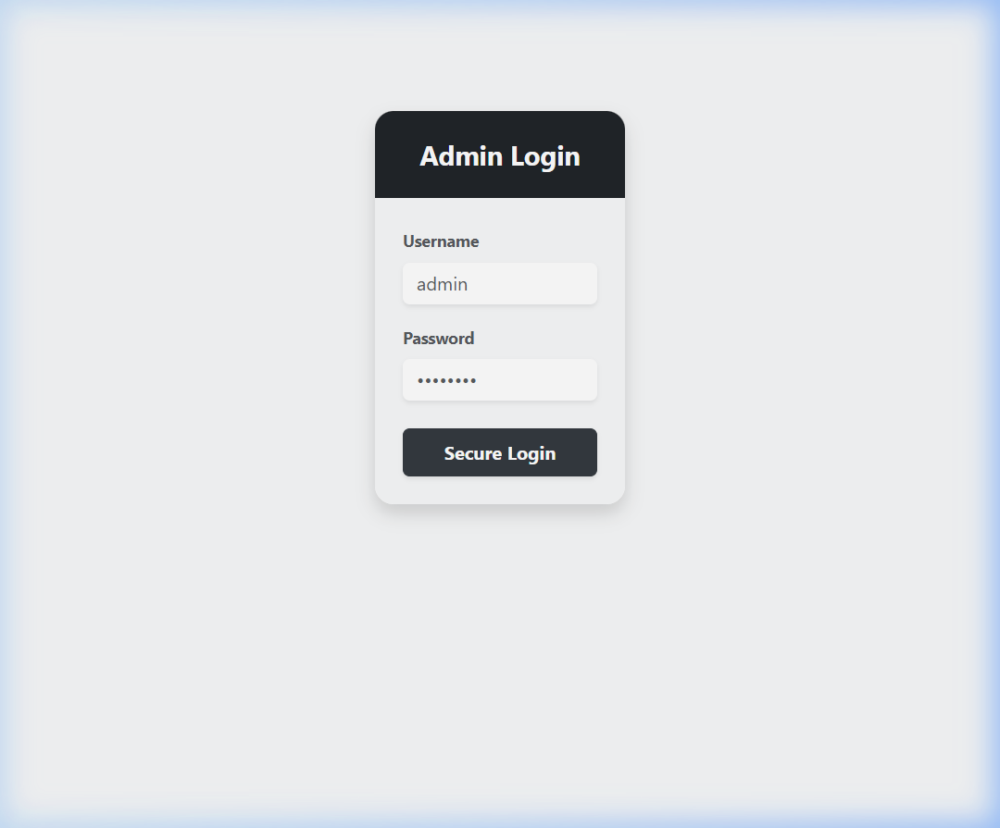

*   **Screen Purpose (Mục đích)**: Xác thực danh tính của Quản trị viên để cấp quyền truy cập vào bảng điều khiển quản trị.
*   **Main Components (Thành phần chính)**:
    *   Trường nhập tên tài khoản (`Username Input`).
    *   Trường nhập mật khẩu (`Password Input` ẩn ký tự).
    *   Nút thực thi đăng nhập (`Sign In` button).
*   **User Actions (Hành động của người dùng)**:
    *   Nhập chính xác Username và Password.
    *   Nhấp "Sign In" để đăng nhập hệ thống.
*   **Error States (Trạng thái lỗi)**:
    *   Tài khoản hoặc mật khẩu không đúng $\rightarrow$ Hiển thị Alert đỏ thông báo *"invalid credentials"*.
    *   Mất kết nối API server $\rightarrow$ Hiển thị thông báo lỗi mạng.

---

### 2. Bảng điều khiển Quản trị (Admin Dashboard)

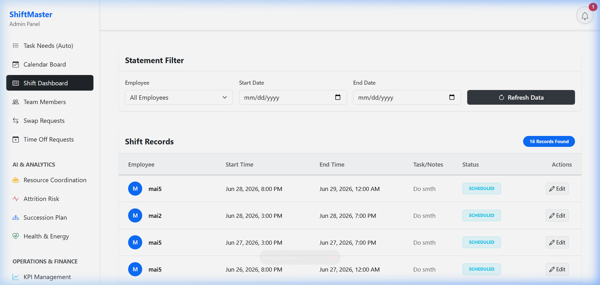

*   **Screen Purpose (Mục đích)**: Hiển thị tổng quan báo cáo vận hành, tình trạng phân công nhân sự và thanh điều hướng sidebar chuyển trang.
*   **Main Components (Thành phần chính)**:
    *   **Sidebar Navigation**: Menu điều hướng bên trái chứa các phân hệ chính (Tasks, Calendar, Shifts, Users, Swaps, Time Off, Analytics, Finance, Settings).
    *   **Upcoming Shifts List**: Bảng hiển thị thông tin các ca làm việc chuẩn bị diễn ra trong ngày.
    *   **Header Panel**: Chứa biểu tượng chuông thông báo lỗi/xung đột xếp ca (`Notification Bell`).
*   **User Actions (Hành động của người dùng)**:
    *   Nhấp các danh mục trên Sidebar để chuyển đổi View chức năng.
    *   Nhấp biểu tượng chuông để xem danh sách cảnh báo hoặc đơn chờ duyệt.
*   **Error States (Trạng thái lỗi)**:
    *   Token xác thực hết hạn $\rightarrow$ Tự động chuyển hướng người dùng về trang Login.

---

### 3. Bảng Quản lý Ca trực (Shift Management / Calendar Board)

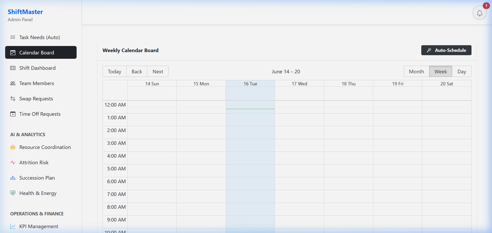

*   **Screen Purpose (Mục đích)**: Hiển thị lịch biểu ca làm việc hàng tuần trực quan dưới dạng Grid Calendar, giúp Admin dễ dàng điều phối và kiểm tra ca làm.
*   **Main Components (Thành phần chính)**:
    *   **Calendar Grid**: Bảng chia cột theo các ngày trong tuần và dòng theo các phòng ban/ca trực.
    *   **Shift Cards**: Các thẻ ca làm hiển thị Tên ca trực, Giờ làm việc, và Nhân viên được phân công.
    *   **Navigation Buttons**: Nút chuyển tuần (Next, Previous) và quay lại hôm nay (Today).
*   **User Actions (Hành động của người dùng)**:
    *   Xem lịch làm việc của toàn bộ nhân viên trong tuần.
    *   Kích hoạt lập lịch tự động bằng nút "Auto-Schedule" tại tab Quản lý Tác vụ để xếp lịch tự động chạy nền.
*   **Error States (Trạng thái lỗi)**:
    *   Nhân viên bị xếp trùng giờ hoặc vượt quá giờ làm việc tối đa $\rightarrow$ Thẻ ca trực hiển thị cảnh báo xung đột (Conflict Warning).

---

### 4. Phê duyệt Khai báo Sức khỏe (Health Declaration Management)

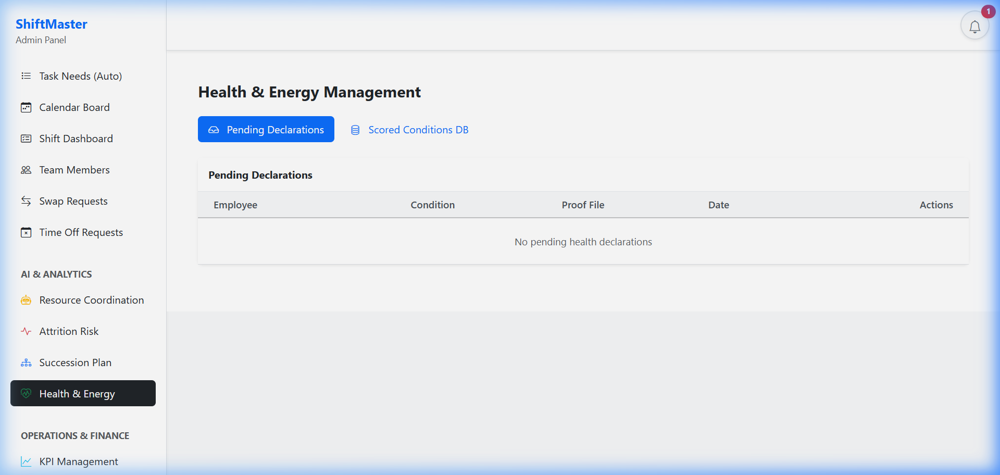

*   **Screen Purpose (Mục đích)**: Giúp Admin theo dõi, xem minh chứng y tế và duyệt đơn khai báo bệnh lý của nhân viên để hệ thống điều chỉnh điểm năng lượng.
*   **Main Components (Thành phần chính)**:
    *   **Declarations Table**: Danh sách đơn khai báo (ID, Tên nhân viên, Triệu chứng, Trạng thái duyệt).
    *   **Medical Proof Preview**: Khung hiển thị ảnh đơn thuốc hoặc giấy khám thai/bệnh án đính kèm.
    *   **Energy Deducted Slider**: Thanh trượt chỉ định điểm trừ sức khỏe (0-100) được khuyến nghị từ NLP hoặc điều chỉnh thủ công.
    *   **Approve / Reject Buttons**: Phím duyệt và từ chối đơn.
*   **User Actions (Hành động của người dùng)**:
    *   Chọn đơn khai báo cần xử lý từ danh sách.
    *   Xem ảnh minh chứng bệnh lý $\rightarrow$ Điều chỉnh slider điểm trừ $\rightarrow$ Nhấn "Approve" hoặc "Reject".
*   **Error States (Trạng thái lỗi)**:
    *   Lỗi NLP đề xuất $\rightarrow$ Hệ thống vẫn cho phép duyệt thủ công thông qua slider bình thường.

---

### 5. Quản lý Nghỉ phép (Time Off Requests)

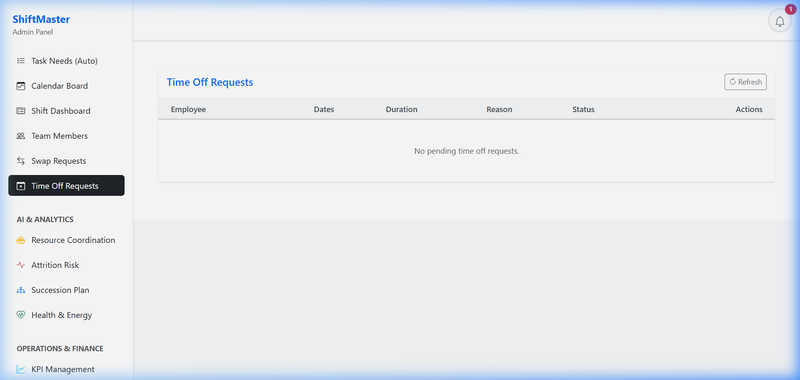

*   **Screen Purpose (Mục đích)**: Tiếp nhận và xử lý các yêu cầu nghỉ phép của nhân sự, tự động giải phóng ca trực nếu được duyệt.
*   **Main Components (Thành phần chính)**:
    *   **Requests Table**: Bảng danh sách đơn nghỉ phép (Nhân viên, Thời gian bắt đầu/kết thúc, Lý do xin nghỉ, Trạng thái).
    *   **Action Buttons**: Cột chứa phím Phê duyệt (Approve) và Từ chối (Reject) nhanh cho từng đơn.
*   **User Actions (Hành động của người dùng)**:
    *   Xem lý do và khoảng thời gian xin nghỉ phép của nhân viên.
    *   Click "Approve" để chấp nhận đơn xin nghỉ (tự động xóa bỏ các ca làm việc bị đè) hoặc "Reject" để từ chối.
*   **Error States (Trạng thái lỗi)**:
    *   Mất kết nối server $\rightarrow$ Đơn không thể cập nhật trạng thái và hiển thị alert lỗi API.

---

### 6. Tính toán Lương & KPI (Payroll Dashboard)

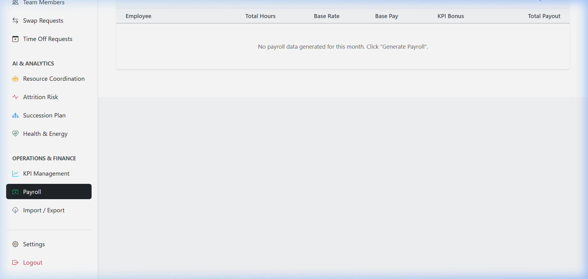

*   **Screen Purpose (Mục đích)**: Chốt bảng lương và chấm điểm hiệu suất KPI hàng tháng cho nhân viên.
*   **Main Components (Thành phần chính)**:
    *   **Period Filter**: Bộ chọn Tháng / Năm để xác định kỳ lương cần tính.
    *   **Calculate Payroll Button**: Nút thực hiện chạy thuật toán tính lương tự động.
    *   **Payroll Records Table**: Bảng chi tiết lương (Tổng giờ làm, Lương cơ bản, Lương làm thêm, Thưởng KPI, Tổng thực nhận và Trạng thái thanh toán).
*   **User Actions (Hành động của người dùng)**:
    *   Chọn Tháng/Năm $\rightarrow$ Nhấn "Calculate Payroll" để sinh dữ liệu bảng lương.
*   **Error States (Trạng thái lỗi)**:
    *   Nhân viên chưa có dữ liệu chấm công hoặc giờ trực trong kỳ $\rightarrow$ Bảng lương hiển thị tổng giờ = 0.

---

## 4.2 Employee Mobile Interface (Giao diện Cupertino cho Nhân viên)

Giao diện ứng dụng di động được phát triển bằng Flutter với phong cách Cupertino (iOS) cao cấp, mang lại trải nghiệm mượt mà, trực quan cho nhân viên khi tương tác ngoài hiện trường.

### 1. Màn hình Đăng nhập Mobile (Mobile Login)

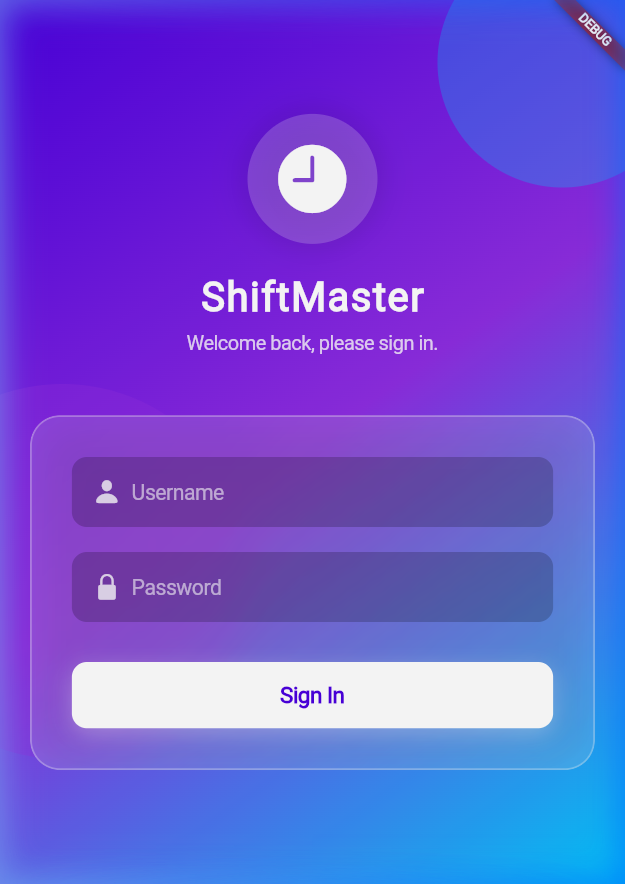

*   **Screen Purpose (Mục đích)**: Xác thực danh tính của nhân viên để đăng nhập vào ứng dụng di động cá nhân.
*   **Main Components (Thành phần chính)**:
    *   **Glassmorphic Container**: Khung đăng nhập hiệu ứng kính mờ thời thượng nằm trên nền gradient tím-xanh.
    *   Trường nhập Username (icon User) và Password (icon Lock).
    *   Nút đăng nhập nổi bật "Sign In".
*   **User Actions (Hành động của người dùng)**:
    *   Nhập thông tin Username và Password của tài khoản nhân viên.
    *   Nhấn "Sign In" để thực hiện đăng nhập.
*   **Error States (Trạng thái lỗi)**:
    *   Sai tài khoản hoặc mật khẩu $\rightarrow$ Hiển thị hộp thoại CupertinoAlertDialog thông báo *"Invalid credentials"*.

---

### 2. Màn hình Lịch biểu cá nhân (Mobile Schedule)

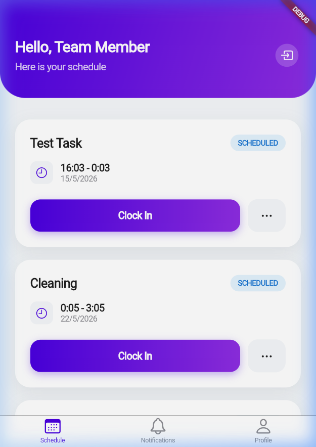

*   **Screen Purpose (Mục đích)**: Hiển thị danh sách các ca làm việc đã được phân công cho nhân viên theo thứ tự thời gian.
*   **Main Components (Thành phần chính)**:
    *   **Gradient Header**: Hiển thị thông tin chào mừng nhân viên và phím Logout nhanh.
    *   **Shifts Cards List**: Danh sách cuộn chứa thông tin chi tiết từng ca trực (Giờ làm, Ngày làm, Ghi chú, Trạng thái ca trực).
    *   **Clock In Button**: Nút điểm danh bắt đầu ca trực trên từng thẻ ca làm.
    *   **Ellipsis Menu Button**: Nút mở menu tùy chọn (Xin đổi ca / Xin nghỉ phép).
*   **User Actions (Hành động của người dùng)**:
    *   Cuộn xem các ca trực được giao trong tuần.
    *   Nhấn "Clock In" để bắt đầu làm việc.
    *   Nhấp biểu tượng 3 chấm để yêu cầu đổi ca hoặc xin nghỉ phép cho ca đó.
*   **Error States (Trạng thái lỗi)**:
    *   Không có ca trực nào được phân công $\rightarrow$ Hiển thị màn hình trống với thông báo *"No shifts assigned"*.

---

### 3. Màn hình Điểm danh ca trực (Mobile Clock In / Clock Out)

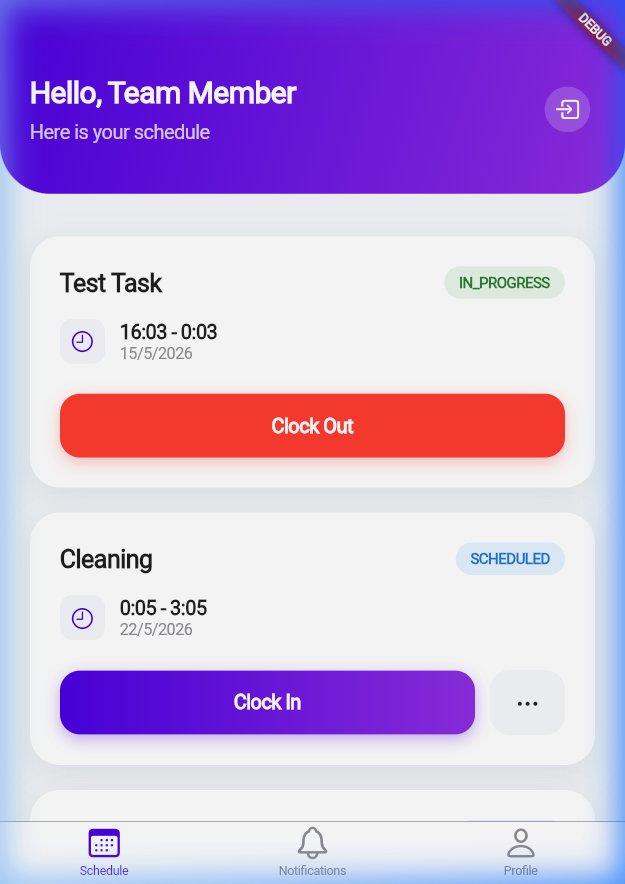

*   **Screen Purpose (Mục đích)**: Cho phép nhân viên điểm danh bắt đầu ca trực (Clock In) và chốt giờ kết thúc ca trực (Clock Out).
*   **Main Components (Thành phần chính)**:
    *   **Active Shift Card**: Thẻ ca trực hiện tại hiển thị trạng thái `IN_PROGRESS` (đang làm việc) nổi bật.
    *   **Clock Out Button**: Nút bấm màu đỏ để thực hiện điểm danh ra ca.
*   **User Actions (Hành động của người dùng)**:
    *   Nhấn nút "Clock Out" khi hoàn thành ca trực để chốt giờ công thực tế.
*   **Error States (Trạng thái lỗi)**:
    *   Điểm danh quá giờ quy định hoặc ngoài vị trí $\rightarrow$ Hiển thị thông báo cảnh báo/lỗi định vị hoặc thời gian.

---

### 4. Màn hình Khai báo Sức khỏe Mobile (Mobile Health Declaration)

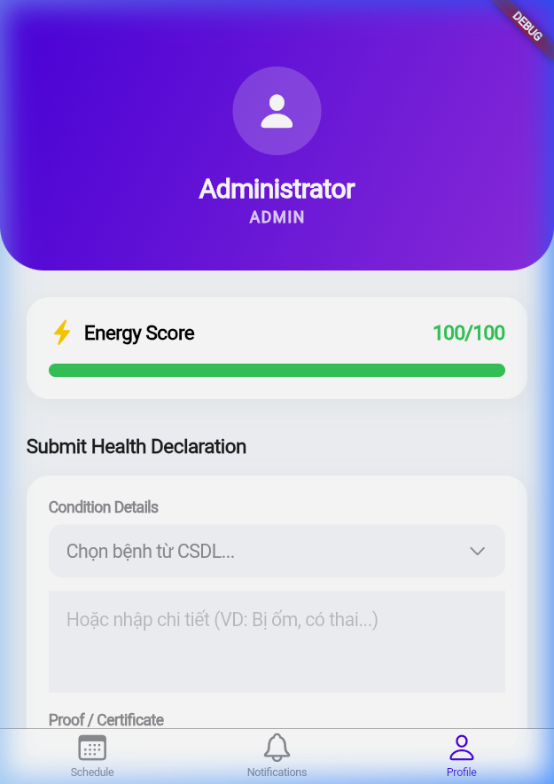

*   **Screen Purpose (Mục đích)**: Nhân viên tự khai báo các vấn đề sức khỏe/bệnh lý phát sinh và đính kèm chứng nhận y khoa để làm cơ sở giảm tải ca trực.
*   **Main Components (Thành phần chính)**:
    *   **Energy Score Card**: Khung thống kê điểm năng lượng hiện tại (0-100) kèm thanh tiến trình trực quan.
    *   **Condition Picker**: Bộ chọn bệnh lý có sẵn trong danh mục hệ thống.
    *   **Manual Input Field**: Ô nhập mô tả triệu chứng chi tiết.
    *   **Proof Image Uploader**: Nút chọn ảnh minh chứng y tế từ thư viện thiết bị.
    *   **Submit Button**: Nút "Submit Declaration".
*   **User Actions (Hành động của người dùng)**:
    *   Chọn hoặc nhập triệu chứng bệnh $\rightarrow$ Tải lên ảnh minh chứng y khoa $\rightarrow$ Nhấn "Submit Declaration".
*   **Error States (Trạng thái lỗi)**:
    *   Bỏ trống triệu chứng $\rightarrow$ Hiển thị cảnh báo bắt buộc nhập lý do sức khỏe.

---

### 5. Yêu cầu Nghỉ phép (Mobile Time Off Request Sheet)

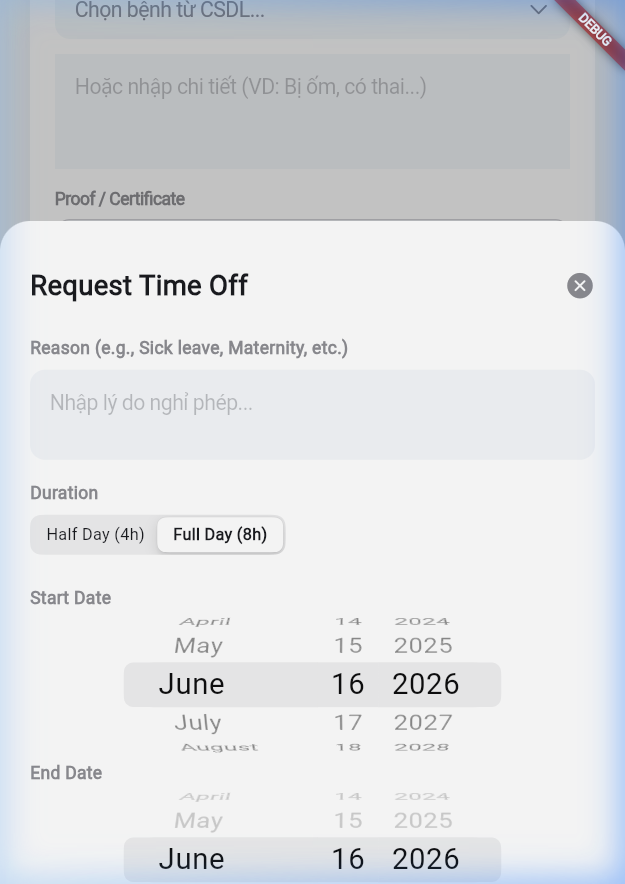

*   **Screen Purpose (Mục đích)**: Cho phép nhân viên tạo đơn xin nghỉ phép có lý do và gửi lên hệ thống phê duyệt.
*   **Main Components (Thành phần chính)**:
    *   **Cupertino Bottom Sheet**: Form xin nghỉ phép dạng trượt lên tiện lợi.
    *   **Reason Textbox**: Ô nhập lý do xin nghỉ phép.
    *   **Duration Control**: Nút chọn thời lượng nghỉ (Half Day / Full Day).
    *   **Cupertino Date Pickers**: Bộ cuộn chọn ngày bắt đầu (Start Date) và ngày kết thúc (End Date).
    *   **Submit Request Button**: Nút gửi đơn xin nghỉ.
*   **User Actions (Hành động của người dùng)**:
    *   Nhập lý do nghỉ $\rightarrow$ Chọn thời lượng nghỉ $\rightarrow$ Cuộn chọn khoảng ngày $\rightarrow$ Nhấn "Submit Request".
*   **Error States (Trạng thái lỗi)**:
    *   Nhập thiếu lý do xin nghỉ $\rightarrow$ Hiện thông báo lỗi *"Please enter a reason"*.

---

### 6. Màn hình Thông báo Mobile (Mobile Notifications)

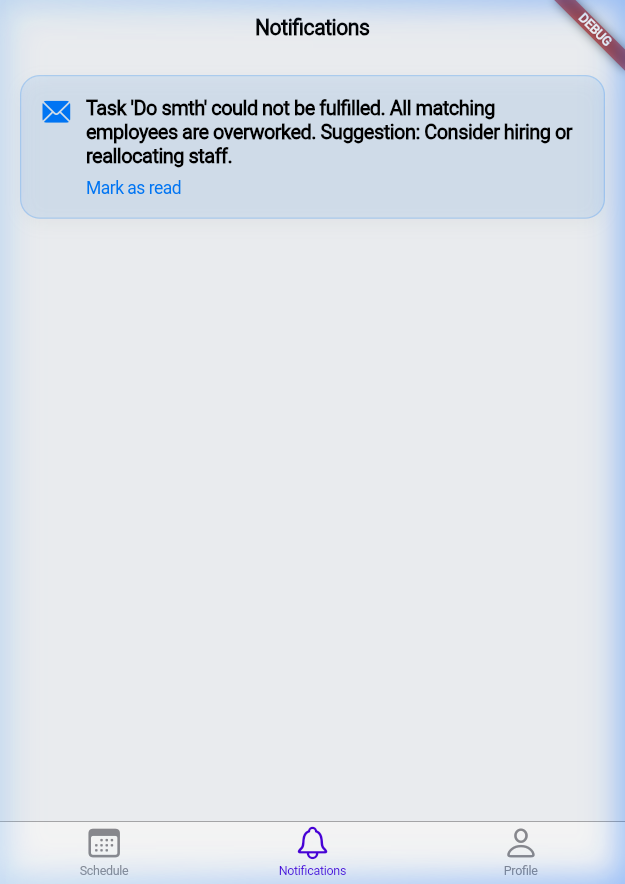

*   **Screen Purpose (Mục đích)**: Hiển thị các thông báo từ hệ thống hoặc đồng nghiệp gửi tới nhân viên (yêu cầu đổi ca, kết quả phê duyệt đơn từ).
*   **Main Components (Thành phần chính)**:
    *   **Notifications List**: Danh sách cuộn chứa các thẻ thông báo.
    *   **Notification Cards**: Thể hiện tiêu đề, nội dung tóm tắt chi tiết và mốc thời gian nhận thông báo.
*   **User Actions (Hành động của người dùng)**:
    *   Xem danh sách các thông báo mới nhận.
    *   Nhấp vào thông báo cụ thể để xem chi tiết hoặc thực hiện hành động liên quan (ví dụ: Chấp nhận/Từ chối đổi ca).
*   **Error States (Trạng thái lỗi)**:
    *   Mất kết nối mạng $\rightarrow$ Không tải được danh sách thông báo mới.
