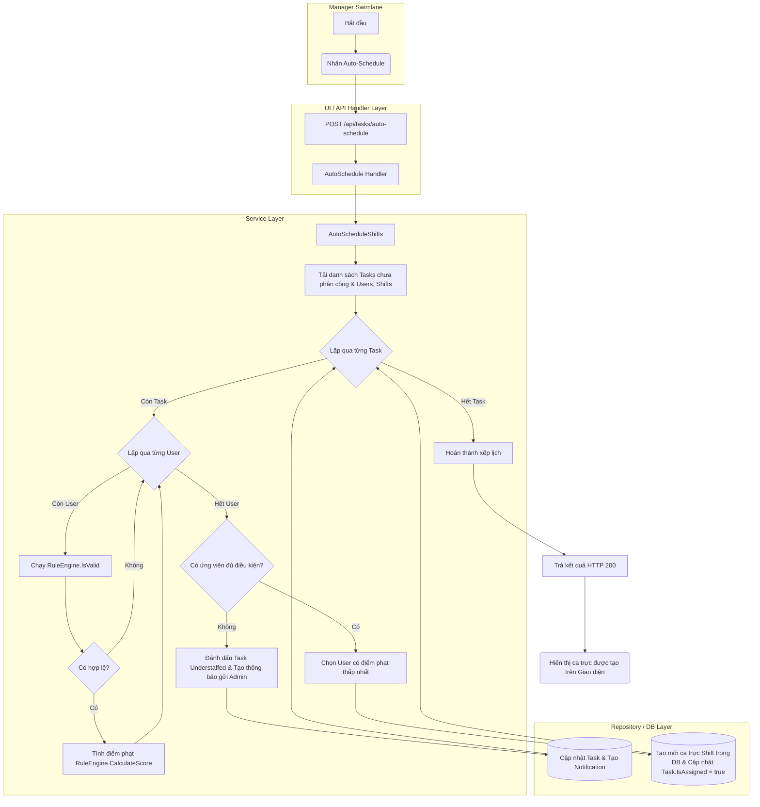
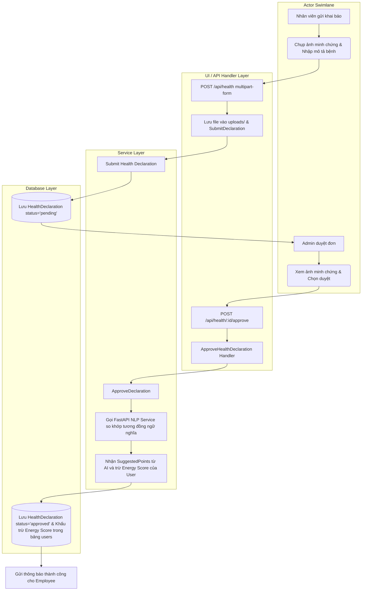
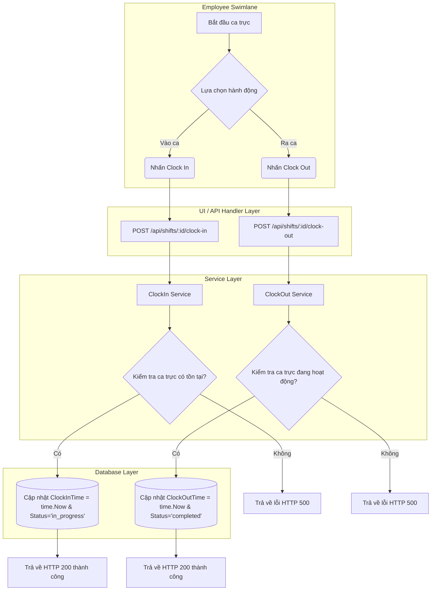
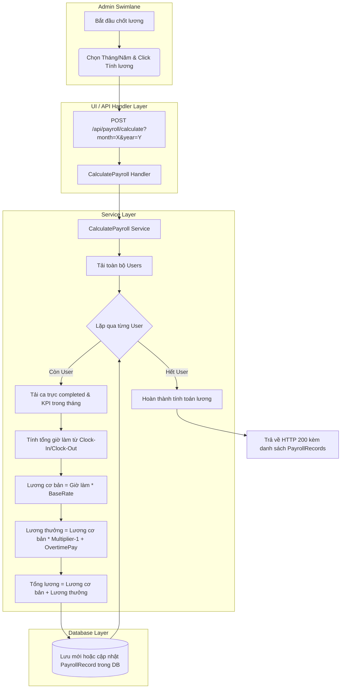

# Thiết Kế Biểu Đồ Hoạt Động (Activity Diagrams) - Tuần 5

Tài liệu này đặc tả chi tiết các biểu đồ hoạt động (Activity Diagrams) mô tả quy trình nghiệp vụ và ánh xạ luồng nghiệp vụ thực tế trong hệ thống.

---

## 1. Biểu đồ Hoạt động (Activity Diagrams)

Triển khai bằng cú pháp **Mermaid `flowchart`**, phân chia rõ ràng các phân tầng bơi (Swimlanes): **Actor** $\rightarrow$ **UI/API Layer** $\rightarrow$ **Service Layer** $\rightarrow$ **Repository & DB Layer**.

### 1.1 Luồng hoạt động Tự động Lập lịch (Auto Scheduling Workflow)

---

### 1.2 Luồng Khai báo & Duyệt sức khỏe bằng AI (AI Health Declaration Workflow)

---

### 1.3 Luồng Chấm công Vào ca/Ra ca (Clock-In / Clock-Out Workflow)

---

### 1.4 Luồng Tính lương Tháng (Payroll Calculation Workflow)

---

## 2. Ánh xạ Luồng nghiệp vụ (Business Workflow Mapping)

Bảng dưới đây ánh xạ các luồng hoạt động (Activity Diagrams) vào cấu trúc thiết kế chi tiết:

| Luồng hoạt động | Use Case ID | Service xử lý chính | Repositories tương tác | Thay đổi trạng thái thực thể (Entity State Changes) |
| :--- | :---: | :--- | :--- | :--- |
| **Tự động Lập lịch** | `UC-07` | `TaskService` | `TaskRepository`, `ShiftRepository`, `SettingRepository`, `UserRepository` | `Task.IsAssigned`: `false` $\rightarrow$ `true` `Task.CoordinationStatus`: `Pending` $\rightarrow$ `Resolved` `Shift`: Tạo mới trạng thái `scheduled`. |
| **Khai báo & Duyệt sức khỏe** | `UC-16`, `UC-17` | `HealthService` | `db *gorm.DB` trực tiếp | `HealthDeclaration.Status`: `pending` $\rightarrow$ `approved` hoặc `rejected` `User.EnergyScore`: Trừ đi điểm sức khỏe bệnh tương ứng. |
| **Chấm công Vào/Ra ca** | `UC-19`, `UC-20` | `ShiftService` | `ShiftRepository` | `Shift.Status`: `scheduled` $\rightarrow$ `in_progress` $\rightarrow$ `completed` Cập nhật giá trị `ClockInTime` và `ClockOutTime`. |
| **Tính lương Tháng** | `UC-26` | `PayrollService` | `db *gorm.DB` trực tiếp | Tạo mới thực thể `PayrollRecord` với trạng thái `IsPaid` mặc định là `false`. |
| **Phê duyệt Nghỉ phép** | `UC-27`, `UC-28` | `TimeOffService` | `db *gorm.DB` trực tiếp | `TimeOffRequest.Status`: `pending` $\rightarrow$ `approved` hoặc `denied` `Shift.Status` (nếu trùng giờ nghỉ): $\rightarrow$ `cancelled` (hoặc bị delete). |
| **Điều phối Ca thiếu người**| `UC-21`, `UC-22` | `CoordinationService`| `CoordinationRepository`, `TaskRepository`, `ShiftRepository` | `CoordinationSuggestion.IsApproved`: `false` $\rightarrow$ `true` `Task.CoordinationStatus`: `Understaffed` $\rightarrow$ `Resolved`. |
