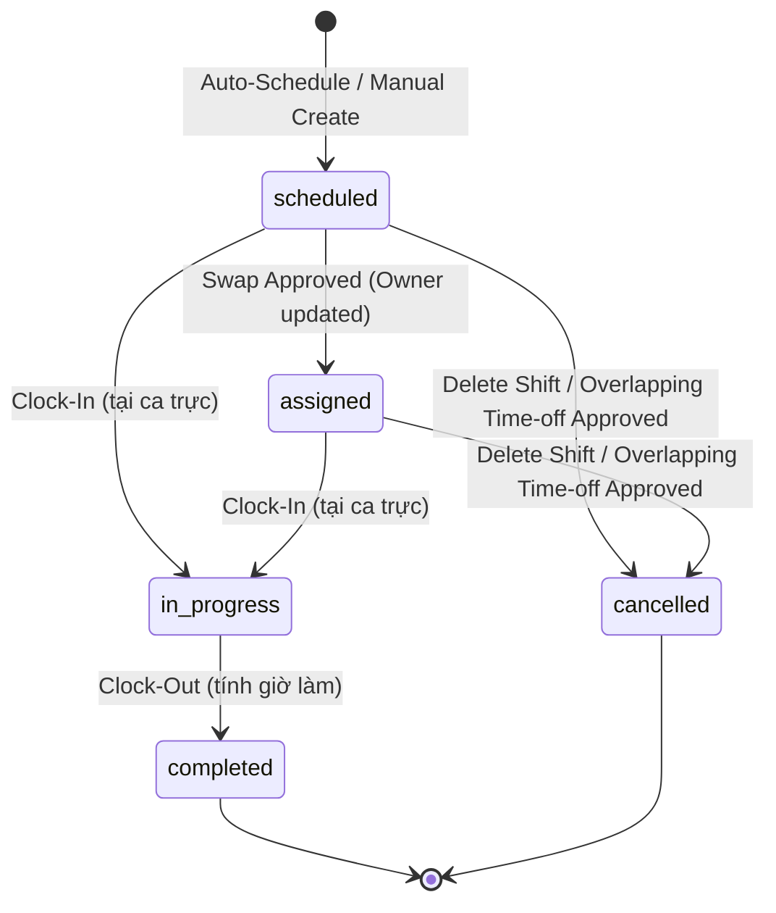
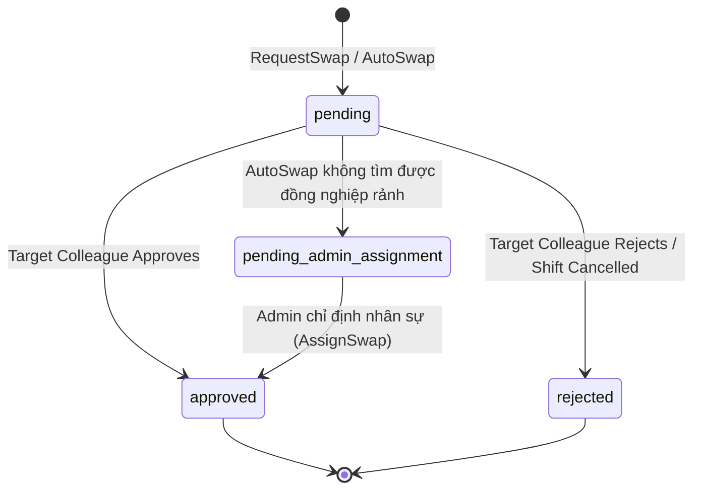
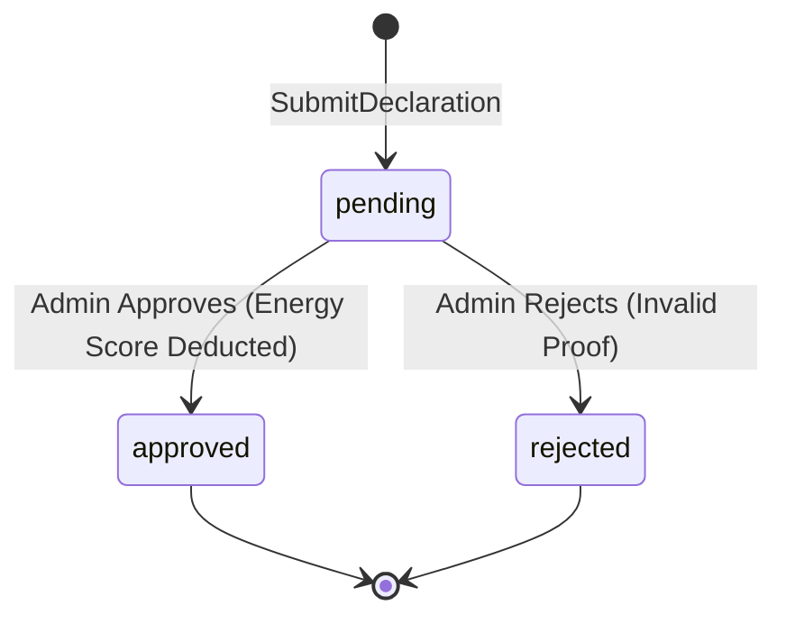
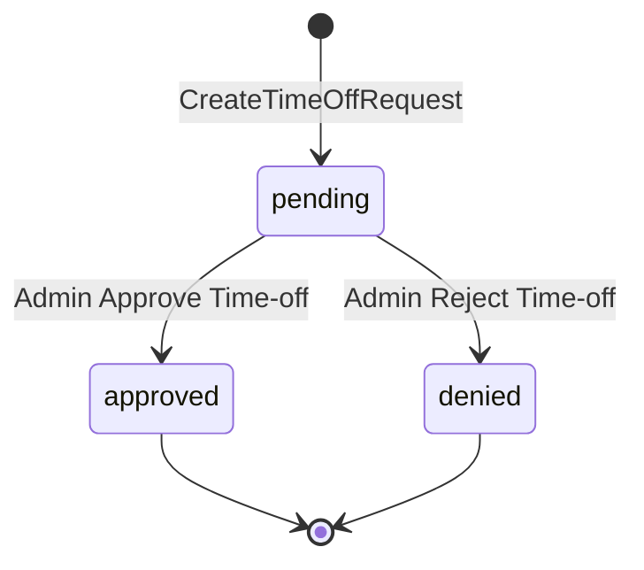
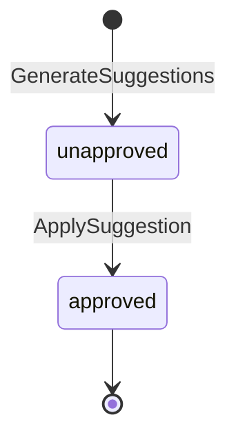

# Thiết Kế Biểu Đồ Máy Trạng Thái (State Machine Diagrams) - Tuần 5

Tài liệu này đặc tả chi tiết các biểu đồ máy trạng thái (State Machine Diagrams) mô tả quy trình chuyển đổi trạng thái của các thực thể cốt lõi trong hệ thống.

---

## 1. Biểu đồ Máy Trạng thái (State Machine Diagrams)

Tất cả các biểu đồ dưới đây được viết bằng cú pháp **Mermaid `stateDiagram-v2`**.

### 1.1 Vòng đời Ca làm việc (Shift Lifecycle)
Mô tả các trạng thái chuyển dịch của một ca làm việc từ khi lập lịch đến khi hoàn thành hoặc hủy bỏ.

*   **Các trạng thái hợp lệ**: `scheduled`, `assigned`, `in_progress`, `completed`, `cancelled`.
*   **Trạng thái ban đầu**: `[*] -> scheduled`.
*   **Trạng thái kết thúc**: `completed -> [*]`, `cancelled -> [*]`.
*   **Sự kiện kích hoạt & Điều kiện bảo vệ (Guards)**:
    *   `scheduled -> assigned`: Phê duyệt yêu cầu đổi ca (`ApproveSwap`). *Guard*: Người nhận đổi ca không vi phạm ràng buộc nghỉ ngơi 11 giờ và trùng ca.
    *   `scheduled/assigned -> in_progress`: Hành động chấm công vào ca (`ClockIn`). *Guard*: Ca trực phải thuộc về nhân viên đang đăng nhập.
    *   `in_progress -> completed`: Hành động chấm công ra ca (`ClockOut`). *Guard*: Ca trực phải ở trạng thái `in_progress`.
    *   `scheduled/assigned -> cancelled`: Admin/Manager xóa ca trực hoặc duyệt đơn nghỉ phép đè giờ ca trực.
*   **Hành động khi chuyển trạng thái (Actions)**:
    *   Khi vào `in_progress`: Ghi nhận `ClockInTime = time.Now()`.
    *   Khi vào `completed`: Ghi nhận `ClockOutTime = time.Now()`, cập nhật ca làm phục vụ tính lương.
    *   Khi vào `cancelled`: Giải phóng giờ làm của nhân viên trong tuần.
*   **Chuyển trạng thái KHÔNG hợp lệ**:
    *   `completed -> in_progress` (Đã hoàn thành không thể check-in lại).
    *   `cancelled -> completed` (Ca đã hủy không thể hoàn thành).
*   **File nguồn liên quan**: [service/shift_service.go](file:///d:/Workspace/TBDD/shift-management-system/service/shift_service.go), [domain/shift.go](file:///d:/Workspace/TBDD/shift-management-system/domain/shift.go).

---

### 1.2 Vòng đời Yêu cầu Đổi ca (ShiftSwap Lifecycle)
Mô tả trạng thái của yêu cầu trao đổi hoặc chuyển giao ca giữa các nhân viên.

*   **Các trạng thái hợp lệ**: `pending`, `pending_admin_assignment`, `approved`, `rejected`.
*   **Trạng thái ban đầu**: `[*] -> pending`.
*   **Trạng thái kết thúc**: `approved -> [*]`, `rejected -> [*]`.
*   **Sự kiện kích hoạt & Điều kiện bảo vệ (Guards)**:
    *   `pending -> pending_admin_assignment`: Hệ thống chạy AutoSwap nhưng danh sách đồng nghiệp rảnh rỗi bằng 0.
    *   `pending -> approved`: Đồng nghiệp nhấp đồng ý đổi ca. *Guard*: Thời gian hiện tại phải trước giờ bắt đầu ca làm.
    *   `pending_admin_assignment -> approved`: Admin nhấp AssignSwap chọn một nhân sự và nhấn duyệt.
    *   `pending -> rejected`: Đồng nghiệp nhấp từ chối, hoặc ca làm bị Admin/Manager xóa.
*   **Hành động khi chuyển trạng thái (Actions)**:
    *   Khi vào `approved`: Đổi `Shift.UserID` sang người nhận ca, cập nhật ghi chú ca làm, tự động chuyển các yêu cầu đổi ca trùng lặp khác của ca đó sang `rejected`.
*   **File nguồn liên quan**: [service/shift_swap_service.go](file:///d:/Workspace/TBDD/shift-management-system/service/shift_swap_service.go), [domain/shift_swap.go](file:///d:/Workspace/TBDD/shift-management-system/domain/shift_swap.go).

---

### 1.3 Vòng đời Tờ khai Sức khỏe (HealthDeclaration Lifecycle)

*   **Các trạng thái hợp lệ**: `pending`, `approved`, `rejected`.
*   **Trạng thái ban đầu**: `[*] -> pending`.
*   **Trạng thái kết thúc**: `approved -> [*]`, `rejected -> [*]`.
*   **Sự kiện kích hoạt & Điều kiện bảo vệ (Guards)**:
    *   `pending -> approved`: Admin nhấn nút duyệt đơn. *Guard*: Điểm trừ năng lượng phải là số nguyên dương hợp lệ.
    *   `pending -> rejected`: Admin nhấn từ chối đơn do ảnh chụp minh chứng mờ/không đúng bệnh.
*   **Hành động khi chuyển trạng thái (Actions)**:
    *   Khi vào `approved`: Khấu trừ điểm năng lượng của nhân sự (`User.EnergyScore = EnergyScore - PointsDeducted`).
*   **File nguồn liên quan**: [service/health_service.go](file:///d:/Workspace/TBDD/shift-management-system/service/health_service.go), [domain/health.go](file:///d:/Workspace/TBDD/shift-management-system/domain/health.go).

---

### 1.4 Vòng đời Yêu cầu Nghỉ phép (TimeOffRequest Lifecycle)

*   **Các trạng thái hợp lệ**: `pending` (`StatusPending`), `approved` (`StatusApproved`), `denied` (`StatusDenied`).
*   **Sự kiện kích hoạt & Điều kiện bảo vệ (Guards)**:
    *   `pending -> approved`: Admin nhấn duyệt đơn xin nghỉ phép. *Guard*: Ngày bắt đầu phải nhỏ hơn ngày kết thúc.
*   **Hành động khi chuyển trạng thái (Actions)**:
    *   Khi vào `approved`: Quét tìm tất cả các ca trực trùng lặp thời gian nghỉ phép của nhân sự đó, thực hiện **xóa ca trực** và cập nhật trạng thái nhiệm vụ `Task.IsAssigned = false` để hệ thống tự động lập lịch lại.
*   **File nguồn liên quan**: [service/time_off_service.go](file:///d:/Workspace/TBDD/shift-management-system/service/time_off_service.go), [domain/time_off_request.go](file:///d:/Workspace/TBDD/shift-management-system/domain/time_off_request.go).

---

### 1.5 Vòng đời Gợi ý Điều phối (CoordinationSuggestion Lifecycle)

*   **Các trạng thái hợp lệ**: `unapproved` (`IsApproved = false`), `approved` (`IsApproved = true`).
*   **Sự kiện kích hoạt**:
    *   `unapproved -> approved`: Quản lý nhấn chấp nhận gợi ý thay thế hoặc dời lịch của AI.
*   **Hành động khi chuyển trạng thái (Actions)**:
    *   Tạo ca làm mới cho nhân sự thay thế (`Replacement`/`Overtime`) hoặc dời lịch thực thi nhiệm vụ sang ngày hôm sau (`Reschedule`). Cập nhật `Task.CoordinationStatus = "Resolved"`.
*   **File nguồn liên quan**: [service/coordination_service.go](file:///d:/Workspace/TBDD/shift-management-system/service/coordination_service.go), [domain/coordination.go](file:///d:/Workspace/TBDD/shift-management-system/domain/coordination.go).
