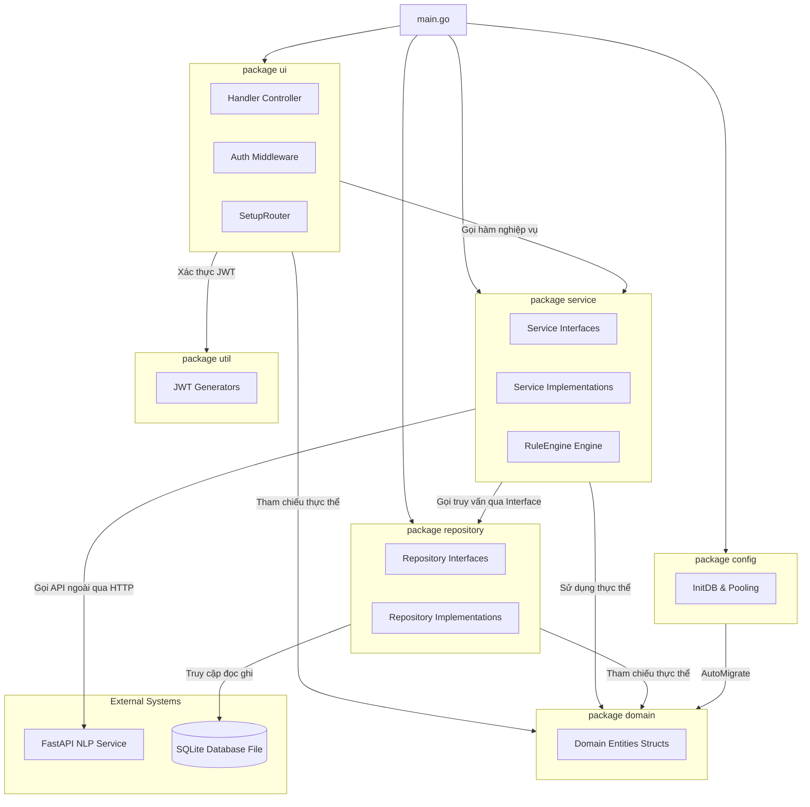

# Thiết Kế Phân Tách Gói & Kiến Trúc Phân Tầng (Package Diagram) - Tuần 6

Tài liệu này đặc tả cấu trúc phân tách gói (Package Diagram), giải thích kiến trúc phân tầng (Layered Architecture), quy tắc phụ thuộc giữa các gói và sơ đồ ánh xạ mã nguồn thực tế.

---

## 1. Sơ đồ Đóng gói & Phân rã Gói (Package Diagram)

Dưới đây là sơ đồ Mermaid mô tả các gói phần mềm trong dự án Golang và mối liên kết phụ thuộc giữa chúng:



---

## 2. Giải thích Kiến trúc Phân tầng (Layered Architecture)

Hệ thống được thiết kế theo mô hình kiến trúc phân tầng cổ điển (3-Tier Layered Architecture) nhằm đảm bảo nguyên tắc tách biệt mối quan tâm (Separation of Concerns):

1.  **Tầng Trình diễn / Giao diện (Presentation Layer - `ui`)**:
    *   *Nhiệm vụ*: Nhận các yêu cầu HTTP REST API, kiểm tra phiên làm việc (Middleware JWT), phân tích dữ liệu yêu cầu (JSON/Multipart), chuyển tiếp dữ liệu đến tầng Service xử lý và định dạng dữ liệu phản hồi JSON.
    *   *Ràng buộc*: Chỉ được phép phụ thuộc trực tiếp vào tầng `service` và `domain`. Không được phép thao tác trực tiếp với Database hoặc Repository.
2.  **Tầng Nghiệp vụ (Business Logic Layer - `service`)**:
    *   *Nhiệm vụ*: Thực thi các thuật toán tối ưu hóa lịch biểu, tính lương, xếp hạng KPI, so khớp đổi ca và gọi API ngữ nghĩa từ microservice AI NLP.
    *   *Ràng buộc*: Giao tiếp với tầng cơ sở dữ liệu gián tiếp thông qua các **Repository Interfaces** để tăng tính linh hoạt và dễ dàng kiểm thử (Unit Testing).
3.  **Tầng Trung gian dữ liệu (Data Access Layer - `repository`)**:
    *   *Nhiệm vụ*: Thực hiện trực tiếp các câu lệnh SQL CRUD thông qua thư viện GORM trên Database SQLite.
    *   *Ràng buộc*: Không chứa logic nghiệp vụ và chỉ trả về dữ liệu thô dưới dạng các thực thể thuộc tầng `domain`.
4.  **Tầng Thực thể chung (Domain Layer - `domain`)**:
    *   *Nhiệm vụ*: Định nghĩa cấu trúc dữ liệu chung của toàn bộ hệ thống.
    *   *Ràng buộc*: Đây là gói dùng chung (Shared Package) được import bởi cả 3 tầng trên, hoàn toàn độc lập và không phụ thuộc ngược lại bất kỳ gói nào khác.

---

## 3. Các Quy tắc Phụ thuộc (Dependency Rules)

*   **Không phụ thuộc vòng (No Circular Dependencies)**: Các gói phụ thuộc tuyến tính theo chiều từ trên xuống dưới: `ui` $\rightarrow$ `service` $\rightarrow$ `repository` $\rightarrow$ `domain`. Không có gói nào ở tầng dưới import ngược lại gói ở tầng trên.
*   **Dependency Injection (Tiêm phụ thuộc)**: Các Service không tự khởi tạo Repository mà nhận thông qua hàm Constructor (ví dụ: `NewShiftService(repo repository.ShiftRepository)`). Việc này giúp giảm tính liên kết cứng (Loose Coupling) và cho phép dễ dàng thay thế bằng các Mock Repository khi thực hiện Unit Test.
*   **Phụ thuộc đối ngoại**:
    *   `FastAPI NLP Service` là một hệ thống bên ngoài chạy độc lập trên cổng `8000`. Tầng `service` (cụ thể là `HealthService`) chỉ phụ thuộc vào nó qua giao tiếp API HTTP mạng thay vì import trực tiếp mã nguồn.

---

## 4. Sơ đồ Ánh xạ cấu trúc mã nguồn (Source Code Mapping)

Cấu trúc phân tách thư mục của dự án Golang phản ánh chính xác thiết kế đóng gói:

```text
d:\Workspace\TBDD\shift-management-system\
├── main.go                     (Khởi chạy hệ thống, cấu hình tiêm phụ thuộc DI)
├── config/                     (Cấu hình DB SQLite và Connection Pooling)
│   └── config.go
├── domain/                     (Domain Package - Chứa các Entity Models)
│   ├── user.go
│   ├── shift.go
│   ├── task.go
│   └── ...
├── repository/                 (Repository Package - Chứa các DB Interfaces & Impls)
│   ├── interfaces.go           (Khai báo toàn bộ Interfaces Repository)
│   ├── user_repository.go
│   ├── shift_repository.go
│   └── ...
├── service/                    (Service Package - Chứa các Logic Nghiệp vụ & Rule Engine)
│   ├── interfaces.go           (Khai báo toàn bộ Interfaces Service)
│   ├── rule_engine.go          (Quy tắc cứng lập lịch, thời gian nghỉ ngơi)
│   ├── task_service.go
│   └── ...
└── ui/                         (Presentation Package - Chứa API Route & Controllers)
    ├── router.go               (Đăng ký Endpoint và nhóm xác thực)
    ├── middleware.go           (JWT Middleware)
    └── handlers.go             (HTTP Controllers)
```
