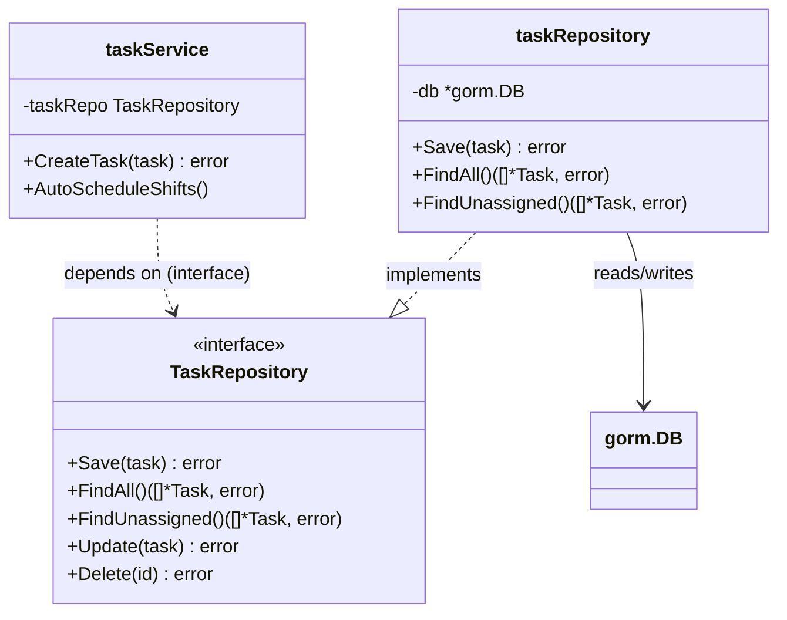
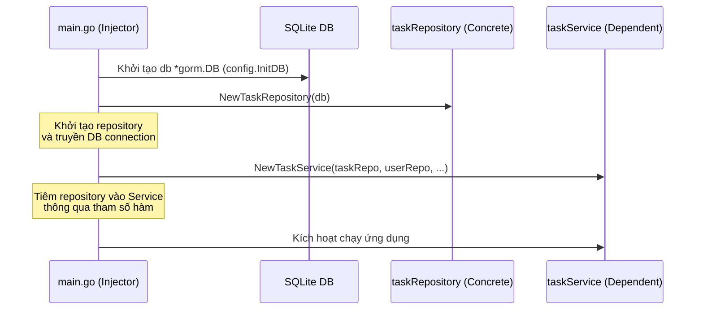

# Tài Liệu Thiết Kế Mẫu Thiết Kế (Design Patterns) - Tuần 7

Tài liệu này phân tích chi tiết các mẫu thiết kế (Design Patterns) được áp dụng trực tiếp trong mã nguồn hệ thống để giải quyết các bài toán về tính cô lập, dễ kiểm thử (Unit Testing) và quản lý phụ thuộc hiệu quả.

---

## 1. Mẫu Thiết Kế Repository (Repository Pattern)

### 1.1. Ý đồ (Intent)
Trừu tượng hóa việc truy cập và thao tác với cơ sở dữ liệu SQLite/GORM khỏi logic nghiệp vụ của tầng Service. Mẫu thiết kế này tạo ra một lớp đệm (Interface) giữa tầng nghiệp vụ và tầng lưu trữ dữ liệu thực tế, giúp mã nguồn tầng nghiệp vụ độc lập hoàn toàn với việc cơ sở dữ liệu được triển khai như thế nào.

### 1.2. Vấn đề giải quyết (Problem solved)
Trong các dự án sử dụng thư viện ORM như GORM, mã nguồn truy vấn cơ sở dữ liệu dễ bị trộn lẫn vào tầng nghiệp vụ (Service Layer). Điều này gây ra hai vấn đề lớn:
1.  **Chặt chẽ (Tight Coupling)**: Khi cấu trúc cơ sở dữ liệu hoặc công nghệ DB thay đổi (ví dụ: chuyển từ SQLite sang PostgreSQL hoặc SQL thuần), toàn bộ Service phải được viết lại.
2.  **Khó khăn trong việc viết Unit Test**: Không thể kiểm thử logic nghiệp vụ (ví dụ: thuật toán lập lịch, tính lương) một cách độc lập mà không phải cấu hình cơ sở dữ liệu thật kết nối chạy bên dưới.

### 1.3. Các bên tham gia (Participants)
*   **Repository Interface**: Khai báo các hành vi truy vấn và lưu trữ dữ liệu thô (`UserRepository`, `ShiftRepository`, `TaskRepository`, v.v.).
*   **Concrete Repository**: Lớp cài đặt cụ thể của Interface sử dụng GORM/SQLite (`userRepository`, `shiftRepository`, `taskRepository`, v.v.).
*   **Context / Client**: Tầng Service (`taskService`, `shiftService`, v.v.) gọi các phương thức thông qua Interface để lấy hoặc ghi dữ liệu.
*   **Data Store**: SQLite Database (được kết nối thông qua thực thể `gorm.DB`).

### 1.4. Các tệp nguồn liên quan (Related Files)
*   **Interface**: [repository/interfaces.go](file:///d:/Workspace/TBDD/shift-management-system/repository/interfaces.go)
*   **Implementations**:
    *   [repository/user_repository.go](file:///d:/Workspace/TBDD/shift-management-system/repository/user_repository.go)
    *   [repository/shift_repository.go](file:///d:/Workspace/TBDD/shift-management-system/repository/shift_repository.go)
    *   [repository/task_repository.go](file:///d:/Workspace/TBDD/shift-management-system/repository/task_repository.go)
*   **Client**: [service/task_service.go](file:///d:/Workspace/TBDD/shift-management-system/service/task_service.go)

### 1.5. Cách thức xuất hiện trong mã nguồn (How it appears in source code)

Tầng Repository định nghĩa Interface trừu tượng trong [repository/interfaces.go](file:///d:/Workspace/TBDD/shift-management-system/repository/interfaces.go):
```go
type UserRepository interface {
	Save(user *domain.User) error
	FindAll() ([]*domain.User, error)
	FindByID(id uint) (*domain.User, error)
	FindByUsername(username string) (*domain.User, error)
	Update(user *domain.User) error
	Delete(id uint) error
}
```

Và cài đặt cụ thể trong [repository/user_repository.go](file:///d:/Workspace/TBDD/shift-management-system/repository/user_repository.go):
```go
type userRepository struct {
	db *gorm.DB
}

func NewUserRepository(db *gorm.DB) UserRepository {
	return &userRepository{db: db}
}

func (r *userRepository) Save(user *domain.User) error {
	return r.db.Create(user).Error
}
```

### 1.6. Sơ đồ UML (UML Diagram)


### 1.7. Lợi ích mang lại (Benefits)
*   **Khả năng bảo trì**: Việc chuyển đổi công nghệ ORM hoặc hệ quản trị DB (ví dụ từ SQLite sang PostgreSQL) chỉ yêu cầu sửa đổi ở tầng Repository, hoàn toàn không ảnh hưởng tới code nghiệp vụ trong tầng Service.
*   **Độc lập kiểm thử**: Dễ dàng tạo các lớp giả lập (Mock/Stub Repository) để viết Unit Test cho tầng nghiệp vụ mà không cần cài đặt hoặc khởi động cơ sở dữ liệu thật.

---

## 2. Mẫu Thiết Kế Tiêm Phụ Thuộc (Dependency Injection - DI)

### 2.1. Ý đồ (Intent)
Cung cấp các thành phần phụ thuộc (Dependencies) của một đối tượng từ bên ngoài vào (Constructor Injection) thay vì để bản thân đối tượng đó tự chịu trách nhiệm khởi tạo hoặc tìm kiếm phụ thuộc của mình. Đây là một cách triển khai của nguyên lý Inversion of Control (IoC).

### 2.2. Vấn đề giải quyết (Problem solved)
Khi các lớp nghiệp vụ tự khởi tạo hoặc tự tìm kiếm các tài nguyên cần thiết (như kết nối DB, API Client, các Repository cụ thể), mã nguồn sẽ gặp các vấn đề:
1.  **Tight Coupling (Liên kết chặt)**: Lớp nghiệp vụ bị gắn chặt vào một cài đặt cụ thể của đối tượng phụ thuộc.
2.  **Khó khăn trong việc kiểm thử**: Không thể thay thế phụ thuộc bằng các đối tượng Mock trong môi trường Test.
3.  **Vi phạm Single Responsibility Principle**: Lớp nghiệp vụ vừa phải thực hiện logic nghiệp vụ, vừa phải quản lý vòng đời và cách khởi tạo của các lớp phụ thuộc.

### 2.3. Các bên tham gia (Participants)
*   **Dependency (Interface)**: Giao diện phụ thuộc cần có (`TaskRepository`, `UserRepository`, `ShiftRepository`, v.v.).
*   **Dependent / Client**: Đối tượng cần được cung cấp phụ thuộc (`taskService`, `shiftService`, `swapService`, v.v.).
*   **Injector / Assembler**: Nơi lắp ráp và tiêm phụ thuộc vào Client. Trong hệ thống, [main.go](file:///d:/Workspace/TBDD/shift-management-system/main.go) đóng vai trò là Injector.

### 2.4. Các tệp nguồn liên quan (Related Files)
*   **Assembler**: [main.go](file:///d:/Workspace/TBDD/shift-management-system/main.go)
*   **Dependent**: [service/task_service.go](file:///d:/Workspace/TBDD/shift-management-system/service/task_service.go) (phương thức `NewTaskService`).

### 2.5. Cách thức xuất hiện trong mã nguồn (How it appears in source code)

Trong [service/task_service.go](file:///d:/Workspace/TBDD/shift-management-system/service/task_service.go), hàm constructor yêu cầu các Repository Interfaces làm tham số đầu vào:
```go
type taskService struct {
	taskRepo          repository.TaskRepository
	userRepo          repository.UserRepository
	shiftRepo         repository.ShiftRepository
	settingRepo       repository.SettingRepository
	notificationService NotificationService
}

func NewTaskService(tr repository.TaskRepository, ur repository.UserRepository, sr repository.ShiftRepository, setRepo repository.SettingRepository, notifService NotificationService) TaskService {
	return &taskService{
		taskRepo:          tr,
		userRepo:          ur,
		shiftRepo:         sr,
		settingRepo:       setRepo,
		notificationService: notifService,
	}
}
```

Tại [main.go](file:///d:/Workspace/TBDD/shift-management-system/main.go), bộ cấu hình Injector thực hiện kết nối cơ sở dữ liệu, khởi tạo Repositories và tiêm chúng vào Constructor:
```go
func main() {
	// Khởi tạo Database
	config.InitDB()

	// Setup Repositories
	userRepo := repository.NewUserRepository(config.DB)
	shiftRepo := repository.NewShiftRepository(config.DB)
	taskRepo := repository.NewTaskRepository(config.DB)
	settingRepo := repository.NewSettingRepository(config.DB)

	// Dependency Injection: Tiêm Repo vào Constructor Service
	taskService := service.NewTaskService(taskRepo, userRepo, shiftRepo, settingRepo, notificationService)
}
```

### 2.6. Sơ đồ UML (UML Diagram)


### 2.7. Lợi ích mang lại (Benefits)
*   **Linh hoạt cấu hình**: Dễ dàng thay thế cài đặt cơ sở dữ liệu thật bằng cài đặt DB Mock khi chạy test.
*   **Code sạch và mạch lạc**: Các Service chỉ tập trung thực hiện logic nghiệp vụ mà không cần biết cách khởi tạo hay vòng đời của các phụ thuộc.
*   **Tái sử dụng tài nguyên**: Các Repositories sử dụng chung kết nối DB duy nhất được quản lý tập trung ở `main.go`.

---

## 3. Ghi chú cấu trúc thiết kế (Design Notes)

> [!NOTE]
> **Strategy Pattern** was considered but not documented as an implemented pattern because the code currently uses conditional branching instead of a formal Strategy interface.
> *(Mẫu thiết kế Strategy đã được xem xét nhưng không được tài liệu hóa như một mẫu thiết kế đã cài đặt vì mã nguồn hiện tại đang sử dụng rẽ nhánh có điều kiện (conditional branching `if-else` trên trường `WorkModel`) thay vì triển khai một Strategy interface chính thức).*
