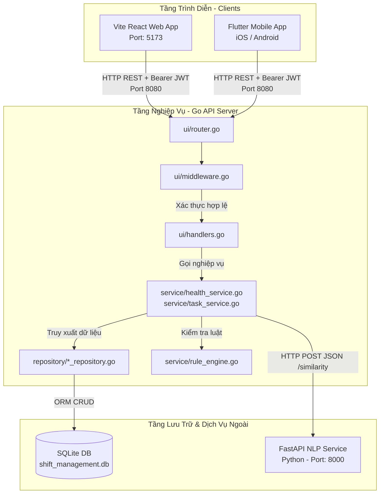
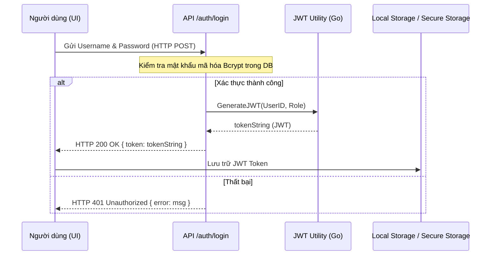
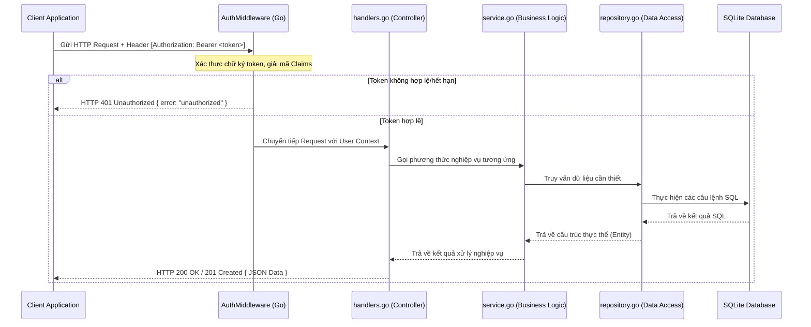

# Thiết Kế Tích Hợp Hệ Thống (Integration Design) - Tuần 9

Tài liệu này đặc tả chi tiết thiết kế tích hợp giữa các thành phần trong **Hệ thống Quản lý Nhân sự Theo Ca**, bao gồm các kênh tích hợp giao diện (Web React, Mobile Flutter), tích hợp cơ sở dữ liệu (SQLite GORM), tích hợp dịch vụ phụ trợ AI NLP, luồng xác thực, định dạng trao đổi dữ liệu API và cơ chế xử lý lỗi hệ thống.

---

## 1. Sơ đồ Tích hợp Tổng thể (System Integration Diagram)

Sơ đồ dưới đây mô tả mối liên kết và phương thức giao tiếp giữa các thành phần vật lý và logic trong hệ thống:



---

## 2. Các Thành phần Tích hợp Chi tiết (Integration Components)

### 2.1. Tích hợp React Web ↔ Backend
*   **Mô tả**: Vite React Web Client gửi các yêu cầu API HTTP REST tới Go Backend Server (mặc định tại `http://localhost:8080/api`).
*   **Cơ chế bảo mật & CORS**:
    *   Hệ thống sử dụng thư viện `github.com/gin-contrib/cors` trên Go Backend để cho phép Web Client từ các origin khác nhau (ví dụ: `http://localhost:5173`) truy cập API.
    *   Cấu hình CORS cho phép các Headers quan trọng: `Origin`, `Content-Length`, `Content-Type`, và `Authorization`.
*   **Trao đổi dữ liệu**: Các request/response đều sử dụng định dạng JSON chuẩn. Riêng nghiệp vụ khai báo sức khỏe (Health Declaration) đính kèm tệp bằng chứng hình ảnh sử dụng định dạng `Multipart/Form-Data`.

### 2.2. Tích hợp Flutter Mobile ↔ Backend
*   **Mô tả**: Thiết bị di động (Flutter Client) giao tiếp với Go Backend qua giao thức HTTP REST.
*   **Xử lý mạng**:
    *   Để test trên máy ảo Android, URL cơ sở được trỏ tới IP của máy chủ host (`http://10.0.2.2:8080/api`) hoặc IP WiFi mạng nội bộ.
    *   Client sử dụng package `dio` hoặc `http` để thực hiện các cuộc gọi API.
*   **Quản lý Session**: Token xác thực JWT sau khi đăng nhập thành công được lưu trữ an toàn trong bộ nhớ thiết bị (`flutter_secure_storage` hoặc `shared_preferences`) để tự động gán vào Header của các request sau.

### 2.3. Tích hợp Backend ↔ Cơ sở dữ liệu SQLite
*   **Mô tả**: Tầng Repository của Go Backend tích hợp trực tiếp với tệp cơ sở dữ liệu `shift_management.db` thông qua thư viện GORM (`gorm.io/driver/sqlite`).
*   **Connection Pooling (Tập hợp kết nối)**:
    *   Để giải quyết hạn chế khóa ghi tuần tự của SQLite và tránh tình trạng deadlock trong các phiên lập lịch tự động lớn, hệ thống thiết lập giới hạn kết nối tại [config/config.go](file:///d:/Workspace/TBDD/shift-management-system/config/config.go):
        *   `SetMaxIdleConns(10)`: Tối đa 10 kết nối rảnh trong pool.
        *   `SetMaxOpenConns(100)`: Giới hạn tối đa 100 kết nối mở đồng thời.
        *   `SetConnMaxLifetime(time.Hour)`: Thời gian sống tối đa của một kết nối.
*   **Đồng bộ lược đồ**: Hệ thống kích hoạt `DB.AutoMigrate` lúc khởi chạy để tự động sinh và cập nhật cấu trúc bảng dữ liệu trong SQLite.

### 2.4. Tích hợp Backend ↔ NLP Service
*   **Mô tả**: Go Backend (`HealthService`) kết nối với Python FastAPI NLP Service qua mạng để thực hiện phân tích tương đồng ngữ nghĩa bệnh trạng.
*   **Quy trình gọi dịch vụ**:
    1.  Nhân viên gửi mô tả bệnh trạng (ví dụ: *"Tôi bị sốt xuất huyết nặng"*).
    2.  `HealthService` thực hiện một HTTP POST request tới `http://localhost:8000/similarity` với payload:
        ```json
        {
          "query": "Tôi bị sốt xuất huyết nặng",
          "keywords": ["sốt xuất huyết", "cảm cúm", "tai nạn"]
        }
        ```
    3.  NLP Service tính toán độ tương đồng Cosine Similarity dựa trên Word Embedding và phản hồi kết quả:
        ```json
        {
          "best_match": "sốt xuất huyết",
          "score": 0.89
        }
        ```
    4.  `HealthService` nhận kết quả, tự động tính toán điểm trừ năng lượng tương ứng theo cấu hình KnownCondition của bệnh lý tốt nhất được khớp.

---

## 3. Luồng Xác thực & Luồng Yêu cầu API (Auth & API Flows)

### 3.1. Luồng Xác thực JWT (Authentication Flow)
Mô tả quy trình đăng nhập và lưu vết token của người dùng:



### 3.2. Luồng Yêu cầu API chuẩn (API Request/Response Flow)
Quy trình xử lý một yêu cầu API yêu cầu xác thực JWT:



---

## 4. Cơ chế Xử lý lỗi (Error Handling Flow)

Hệ thống quản lý lỗi tập trung để đảm bảo tính nhất quán của API và bảo mật mã nguồn bên trong:

1.  **Phát hiện lỗi ở tầng Database**: 
    Tầng Repository sử dụng thư viện GORM để thực hiện truy vấn. Nếu có lỗi phát sinh (ví dụ: `gorm.ErrRecordNotFound`), lỗi sẽ được trả về trực tiếp cho tầng Service.
2.  **Định nghĩa lỗi ở tầng Service**:
    Tầng Service nhận lỗi từ DB hoặc kiểm tra các ràng buộc nghiệp vụ (Rule Engine) vi phạm, sau đó đóng gói lại lỗi dưới dạng một đối tượng lỗi rõ ràng (ví dụ: `errors.New("overlapping shift detected")`).
3.  **Xử lý và Định dạng ở tầng UI Handler**:
    Tầng Handler (`ui/handlers.go`) kiểm tra lỗi nhận được từ Service và chuyển đổi thành mã trạng thái HTTP thích hợp trước khi trả về cho Client.
    *   **Định dạng phản hồi lỗi chuẩn**:
        ```json
        {
          "error": "Mô tả chi tiết nguyên nhân lỗi hệ thống hoặc vi phạm luật"
        }
        ```
    *   **Ánh xạ HTTP Status Codes**:
        *   `400 Bad Request`: Lỗi định dạng dữ liệu đầu vào (JSON không hợp lệ, thiếu trường bắt buộc).
        *   `401 Unauthorized`: Token JWT bị thiếu, không hợp lệ hoặc hết hạn.
        *   `403 Forbidden`: Người dùng không có vai trò phù hợp để thực thi tác vụ.
        *   `404 Not Found`: Không tìm thấy bản ghi (User, Task, Shift) yêu cầu.
        *   `500 Internal Server Error`: Lỗi hệ quản trị cơ sở dữ liệu SQLite bị khóa, lỗi truyền thông API ngoài, hoặc lỗi runtime của Server.
